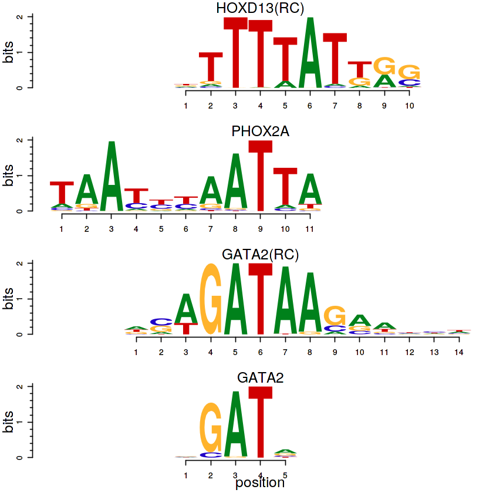

Transzkripciós faktorok
=======================

A sejtműködés, génexpresszió szabályozásában központi szerepet játszanak
a transzkripciós faktorok (TF). Ezeknek a DNS-hez való kötődése központi
mozzanat a transzkripció folyamatában. A TF-ek nukleinsavhoz való
kapcsolódása meghatározott szekvenciákon (*trancription factor binding
site, TFBS*) történhet meg. Azonban azt is tudjuk, hogy ugyanazon TF nem
feltétlenül teljesen azonos TFBS-ekhez kapcsolódik a DNS különböző
szakaszain. Ezeket a nem teljesen egységes bázissorrendű szekvenciákat
motif-nak nevezik a szakirodalomban.

A `MEF2 <https://en.wikipedia.org/wiki/Mef2>`__ transzkripciós faktor
esetén például az ismert kötőhelyek szekvenciája (Wasserman & Sandelin,
2004) az alábbi táblázatban látható:

+--------+-----+-----+-----+-----+-----+-----+-----+-----+-----+------+------+------+------+------+
| TFBS   |     |     |     |     |     |     |     |     |     |      |      |      |      |      |
+========+=====+=====+=====+=====+=====+=====+=====+=====+=====+======+======+======+======+======+
| 1      | G   | A   | C   | C   | A   | A   | A   | T   | A   | A    | G    | G    | C    | A    |
+--------+-----+-----+-----+-----+-----+-----+-----+-----+-----+------+------+------+------+------+
| 2      | G   | A   | C   | C   | A   | A   | A   | T   | A   | A    | G    | G    | C    | A    |
+--------+-----+-----+-----+-----+-----+-----+-----+-----+-----+------+------+------+------+------+
| 3      | T   | G   | A   | C   | T   | A   | T   | A   | A   | A    | A    | G    | G    | A    |
+--------+-----+-----+-----+-----+-----+-----+-----+-----+-----+------+------+------+------+------+
| 4      | T   | G   | A   | C   | T   | A   | T   | A   | A   | A    | A    | G    | G    | A    |
+--------+-----+-----+-----+-----+-----+-----+-----+-----+-----+------+------+------+------+------+
| 5      | T   | G   | C   | C   | A   | A   | A   | A   | G   | T    | G    | G    | T    | C    |
+--------+-----+-----+-----+-----+-----+-----+-----+-----+-----+------+------+------+------+------+
| 6      | C   | A   | A   | C   | T   | A   | T   | C   | T   | T    | G    | G    | G    | C    |
+--------+-----+-----+-----+-----+-----+-----+-----+-----+-----+------+------+------+------+------+
| 7      | C   | A   | A   | C   | T   | A   | T   | C   | T   | T    | G    | G    | G    | C    |
+--------+-----+-----+-----+-----+-----+-----+-----+-----+-----+------+------+------+------+------+
| 8      | C   | T   | C   | C   | T   | T   | A   | C   | A   | T    | G    | G    | G    | C    |
+--------+-----+-----+-----+-----+-----+-----+-----+-----+-----+------+------+------+------+------+
| i:     | 1   | 2   | 3   | 4   | 5   | 6   | 7   | 8   | 9   | 10   | 11   | 12   | 13   | 14   |
+--------+-----+-----+-----+-----+-----+-----+-----+-----+-----+------+------+------+------+------+

Ismert transzkripciós faktorok további lehetséges kötődési helyének
meghatározásával (predikciójával) foglalkozó kutatásokban alkalmazott
bioinformatikai elemzések ezekből az ismert TFBS-szekvenciákból indulnak
ki. Kézenfekvő megközelítés lenne, hogy az ismert TFBS-szekvenciák
konszenzusát használják a predikcióhoz.

.. code:: r

    library(Biostrings)
    
    TFBSs.seqs = c('GACCAAATAAGGCA', 'GACCAAATAAGGCA', 'TGACTATAAAAGGA', 'TGACTATAAAAGGA', 
                   'TGCCAAAAGTGGTC','CAACTATCTTGGGC', 'CAACTATCTTGGGC', 'CTCCTTACATGGGC')
    
    TFBSs = DNAStringSet(TFBSs.seqs)
    
    consensusString(TFBSs)

.. raw:: html

    'BRMCWAWHWWRGSM'

A konszenzus-szekvencia a nyolc kiindulási szekvencia
információtartalmát ugyan sűrítette egyetlen
`IUPAC-kódolású <https://www.bioinformatics.org/sms/iupac.html>`__
szekvenciába, de egyúttal jelentősen csökkentette is az általa tárolt
információt. Így növelve a kötési hely predikciójának megbízhatóságát.
Pontosabb modelt jelent, ha a szekvencia minden pozíciójára vonatkozó
nukleotidgyakorisági mátrixot (*position frequency matrix, PFM*)
használunk:

.. code:: r

    consensusMatrix(TFBSs, baseOnly=TRUE)

.. raw:: html

    <table>
    <tbody>
    	<tr><th scope=row>A</th><td>0</td><td>4</td><td>4</td><td>0</td><td>3</td><td>7</td><td>4</td><td>3</td><td>5</td><td>4</td><td>2</td><td>0</td><td>0</td><td>4</td></tr>
    	<tr><th scope=row>C</th><td>3</td><td>0</td><td>4</td><td>8</td><td>0</td><td>0</td><td>0</td><td>3</td><td>0</td><td>0</td><td>0</td><td>0</td><td>2</td><td>4</td></tr>
    	<tr><th scope=row>G</th><td>2</td><td>3</td><td>0</td><td>0</td><td>0</td><td>0</td><td>0</td><td>0</td><td>1</td><td>0</td><td>6</td><td>8</td><td>5</td><td>0</td></tr>
    	<tr><th scope=row>T</th><td>3</td><td>1</td><td>0</td><td>0</td><td>5</td><td>1</td><td>4</td><td>2</td><td>2</td><td>4</td><td>0</td><td>0</td><td>1</td><td>0</td></tr>
    	<tr><th scope=row>other</th><td>0</td><td>0</td><td>0</td><td>0</td><td>0</td><td>0</td><td>0</td><td>0</td><td>0</td><td>0</td><td>0</td><td>0</td><td>0</td><td>0</td></tr>
    </tbody>
    </table>

A consensusMatrix()-függvény által létrehozott PFM első négy sora
tartalmazza az A, C, G, T bázisokra vonatkozó gyakorisági értékeket.

.. code:: r

    pfm.count = consensusMatrix(TFBSs, baseOnly=T)[1:4,]

A TFBSTools-csomag (Tan & Lenhard, 2016) tartalmaz speciális objek
tumokat és függvényeket, amelyek segítségével könnyen dolgozhatunk a
TFBS-elemzésekben.

.. code:: r

    library(TFBSTools)
    
    pfm = PFMatrix(name='MEF2', profileMatrix=pfm.count)
    
    pfm

.. parsed-literal::

    An object of class PFMatrix
    ID: Unknown
    Name: MEF2
    Matrix Class: Unknown
    strand: +
    Tags: 
    list()
    Background: 
       A    C    G    T 
    0.25 0.25 0.25 0.25 
    Matrix: 
      [,1] [,2] [,3] [,4] [,5] [,6] [,7] [,8] [,9] [,10] [,11] [,12] [,13] [,14]
    A    0    4    4    0    3    7    4    3    5     4     2     0     0     4
    C    3    0    4    8    0    0    0    3    0     0     0     0     2     4
    G    2    3    0    0    0    0    0    0    1     0     6     8     5     0
    T    3    1    0    0    5    1    4    2    2     4     0     0     1     0

Vannak esetek, amikor a PFM-et nem gyakorisági értékekkel használják,
hanem az egyes pozíciókban előforduló nukleotidok valószínűségével:

:math:`p(b,i) = \cfrac{f_{b,i}+s(b)}{N+ \sum_{b'\in\{A,C,G,T\}}s(b')}\ ,`

ahol :math:`f_{b,i}` a :math:`b` nukleotid gyakorisága az :math:`i`
pozícióban; :math:`N` a szekvenciák száma; :math:`p(b,i)` a :math:`b`
nukleotid :math:`i` pozícióban való előfordulásának korrigált
valószínűsége; :math:`s(b)` ún. pseudocount-függvény. Az átszámítást az
alábbiak szerint végezhetjük:

.. code:: r

    pseudocount = sqrt(length(TFBSs.seqs))
    pfm.prob = toPWM(pfm, type='prob', pseudocounts=pseudocount)
    pfm.prob

.. parsed-literal::

    An object of class PWMatrix
    ID: Unknown
    Name: MEF2
    Matrix Class: Unknown
    strand: +
    Pseudocounts: 2.828427
    Tags: 
    list()
    Background: 
       A    C    G    T 
    0.25 0.25 0.25 0.25 
    Matrix: 
            [,1]       [,2]       [,3]       [,4]       [,5]       [,6]       [,7]
    A 0.06530097 0.43469903 0.43469903 0.06530097 0.34234952 0.71174758 0.43469903
    C 0.34234952 0.06530097 0.43469903 0.80409709 0.06530097 0.06530097 0.06530097
    G 0.25000000 0.34234952 0.06530097 0.06530097 0.06530097 0.06530097 0.06530097
    T 0.34234952 0.15765048 0.06530097 0.06530097 0.52704855 0.15765048 0.43469903
            [,8]       [,9]      [,10]      [,11]      [,12]      [,13]      [,14]
    A 0.34234952 0.52704855 0.43469903 0.25000000 0.06530097 0.06530097 0.43469903
    C 0.34234952 0.06530097 0.06530097 0.06530097 0.06530097 0.25000000 0.43469903
    G 0.06530097 0.15765048 0.06530097 0.61939806 0.80409709 0.52704855 0.06530097
    T 0.25000000 0.25000000 0.43469903 0.06530097 0.06530097 0.15765048 0.06530097

| Az eredményből látható, hogy a ``PFMatrix`` típusú objektumból egy
  ``PWMatrix``-objektum jött létre a ``toPWM()``-fügvénnyel, aminek a
  ``pseudocounts`` argumentumának Wasserman & Sandelin (2004)
  ajánlásának megfelelően a TFBS szekvenciák számának négyzetgyökét
  adtuk meg. A pseudocount értéke ettől eltérő is lehet.
| Gyakori, hogy a PFM-et ún. *position weight matrix*-ként (PWM)
  használják, amit neveznek *position-specific scoring matrix*\ nak
  (PSSM) is. Annak ellenére, hogy ebben a csomagban ezt az eredményként
  mátrixot ``PWMatrix``-nak nevezik, ez valójában még egy PFM. A PWM
  adott nukleotid, adott pozícióbeli megfigyelt és a várható
  háttér-valószínűségének :math:`log_2` transzformált hányadosa:

$W\_{b,i} = :raw-latex:`\log`\_2:raw-latex:`\cfrac{p(b,i)}{p(b)}` , $

ahol :math:`p(b)` a :math:`b` nukleotid előfordulásának
háttér-valószínűsége; :math:`p(b,i)` a :math:`b` nukleotid :math:`i`
pozícióbeli előfordulásának korrigált valószínűsége; :math:`W_{b,i}` a
:math:`b` nukleotid :math:`i` pozícióbeli PWM-értéke. Az előző
``toPWM()``-függvény ``type='log2probratio'`` beállításával hozhatjuk
létre:

.. code:: r

    pwm = toPWM(pfm, type='log2probratio', pseudocounts=pseudocount)
    pwm

.. parsed-literal::

    An object of class PWMatrix
    ID: Unknown
    Name: MEF2
    Matrix Class: Unknown
    strand: +
    Pseudocounts: 2.828427
    Tags: 
    list()
    Background: 
       A    C    G    T 
    0.25 0.25 0.25 0.25 
    Matrix: 
            [,1]       [,2]       [,3]      [,4]       [,5]       [,6]       [,7]
    A -1.9367518  0.7980888  0.7980888 -1.936752  0.4535419  1.5094376  0.7980888
    C  0.4535419 -1.9367518  0.7980888  1.685442 -1.9367518 -1.9367518 -1.9367518
    G  0.0000000  0.4535419 -1.9367518 -1.936752 -1.9367518 -1.9367518 -1.9367518
    T  0.4535419 -0.6651985 -1.9367518 -1.936752  1.0760078 -0.6651985  0.7980888
            [,8]       [,9]      [,10]     [,11]     [,12]      [,13]      [,14]
    A  0.4535419  1.0760078  0.7980888  0.000000 -1.936752 -1.9367518  0.7980888
    C  0.4535419 -1.9367518 -1.9367518 -1.936752 -1.936752  0.0000000  0.7980888
    G -1.9367518 -0.6651985 -1.9367518  1.308939  1.685442  1.0760078 -1.9367518
    T  0.0000000  0.0000000  0.7980888 -1.936752 -1.936752 -0.6651985 -1.9367518

A PWM alapján, adott szekvenciára kiszámolható egy összestett pontszám
(*site score*), ami nagy számú és reprezentatív TFBS szekvencia esetén
arányos a kötődési energiával (King & Roth, 2003).

:math:`S = \sum_{i=1}^w W_{l_i,i}\ ,`

ahol :math:`S` a szekvencia PWM-pontszáma; :math:`l_i` az :math:`i`
pozícióban lévő nukleotid; :math:`w` a PWM szélessége. Például a fenti
PWM alapján a ``TTACATAAGTAGTC`` szekvenciára számított pontszám:

.. code:: r

    m = Matrix(pwm)
    iseq = 'TTACATAAGTAGTC'
    site.score = c()
    
    for(i in 1:nchar(iseq)){
      s = substr(iseq, i, i)
      site.score = c(site.score, m[s, i])
    }
    site.score

.. raw:: html

    <dl class=dl-horizontal>
    	<dt>T</dt>
    		<dd>0.453541876358618</dd>
    	<dt>T</dt>
    		<dd>-0.665198492276212</dd>
    	<dt>A</dt>
    		<dd>0.798088785639378</dd>
    	<dt>C</dt>
    		<dd>1.68544162076245</dd>
    	<dt>A</dt>
    		<dd>0.453541876358618</dd>
    	<dt>T</dt>
    		<dd>-0.665198492276212</dd>
    	<dt>A</dt>
    		<dd>0.798088785639378</dd>
    	<dt>A</dt>
    		<dd>0.453541876358618</dd>
    	<dt>G</dt>
    		<dd>-0.665198492276212</dd>
    	<dt>T</dt>
    		<dd>0.798088785639378</dd>
    	<dt>A</dt>
    		<dd>0</dd>
    	<dt>G</dt>
    		<dd>1.68544162076245</dd>
    	<dt>T</dt>
    		<dd>-0.665198492276212</dd>
    	<dt>C</dt>
    		<dd>0.798088785639378</dd>
    </dl>

.. code:: r

    sum(site.score)

.. raw:: html

    5.26307004405342

A szekvencia összesített pontszámának abszolút érteke nem sokat mond
arról, hogy a többi, már ismert kötőhely szekvenciájához hogyan
viszonyul. Ezért az a szokás, hogy a PWM alapján számított legkisebb és
legnagyobb összesített szekvencia pontszám alapján létrehozott
eloszláshoz hasonlítják a vizsgált szekvencia összpontszámát. A példában
szereplő PWM esetén az 5.26-os érték azt jelenti, hogy az összes
lehetséges szekvencia 78%-a kisebb összesített pontszámmal rendelkezik.
A PWM további fontos jellemzője az információtartalom profil
(information content profile, IC, Schneider et al. (1986)). Az IC-t
bitekben fejezik ki és a DNS-szekvencia esetében az értéke 0 és 2 bit
között változhat. Egy olyan i pozícióban, ahol mindegyik nukleotid
egyforma valószínűséggel fordulhat elő az IC = 0, míg egy olyan
:math:`i` pozícióban, ahol egyetlen nukleotid fordulhat elő az
:math:`IC = 2` (Bembom, 2017).

:math:`IC_i = 2 + \sum_b p_{b,i}\log_2 p_{b,i}\ ,`

ahol IC i az i pozíció információ tartalma; a pb,i a b nukleotid i
pozícióbeli korrigált valószínűsége. Azok a pozíciók, amelyek erősen
konzervatívak és így kis toleranciával rendelkeznek a helyettesítésre
vonatkozóan, magas IC-értékűek, míg a nagy helyettesítési toleranciájú
pozíciók alacsony IC-értékűek (Bembom, 2017). A PFMatrix-ból ICMatrixot
hozhatunk létre a toICM()-függvénnyel (A pseudocounts argumentumnak itt
azért adtunk 0 értéket, hogy a Wasserman & Sandelin (2004) által
bemutatott ábrát rekonstruáljuk):

.. code:: r

    icm = toICM(pfm, pseudocounts=0)
    icm

.. parsed-literal::

    An object of class ICMatrix
    ID: Unknown
    Name: MEF2
    Matrix Class: Unknown
    strand: +
    Pseudocounts: 0
    Schneider correction: FALSE
    Tags: 
    list()
    Background: 
       A    C    G    T 
    0.25 0.25 0.25 0.25 
    Matrix: 
           [,1]       [,2] [,3] [,4]      [,5]      [,6] [,7]      [,8]       [,9]
    A 0.0000000 0.29718047  0.5    0 0.3920872 1.2743811  0.5 0.1645207 0.43825316
    C 0.1645207 0.00000000  0.5    2 0.0000000 0.0000000  0.0 0.1645207 0.00000000
    G 0.1096805 0.22288535  0.0    0 0.0000000 0.0000000  0.0 0.0000000 0.08765063
    T 0.1645207 0.07429512  0.0    0 0.6534787 0.1820544  0.5 0.1096805 0.17530126
      [,10]     [,11] [,12]      [,13] [,14]
    A   0.5 0.2971805     0 0.00000000   0.5
    C   0.0 0.0000000     0 0.17530126   0.5
    G   0.0 0.8915414     2 0.43825316   0.0
    T   0.5 0.0000000     0 0.08765063   0.0

A PWM-ek grafikus reprezentációjának általánosan használt eszköze az ún.
sequence logo (Schneider & Stephens, 1990). A logók a szekvencia
mindegyik pozíciójára a négy nukleotidot jelölő betűhalmot tartalmaz. Az
oszlop magassága a pozíció IC-jével, míg az egyes betűk magassága a
nukleotid adott pozícióbeli relatív gyakoriságával arányos. A
seqLogo()-függvénnyel létrehozhatunk szekvencialogokat. Ha a függvény
ic.scale argumentumának TRUE értéket adunk, akkor a nukleotidoknak
megfelelő oszlopok magassága az IC-vel arányos lesz.

.. code:: r

    seqLogo(icm, ic.scale=T)

Ha ugyanennek az argumentumnak FALSE értéket adunk, akkor a logo
oszlopai egyforma magasságúak lesznek és a betűk mérete a nukleotidok
előfordulásának valószínűségét jelzi.

.. code:: r

    seqLogo(icm, ic.scale=F)

Motif-adatbázisok
-----------------

MotifDb
~~~~~~~

Az ismert motif-ok jelenleg nem állnak rendelkezésre egyetlen szabad
felhasználású forrásból, ezért gyűjtötték össze a különböző források,
különböző liszenszelésű adatait a MotifDb-csomagba (Shannon, 2017). Az
adatbázisból elérhető motifokra vonatkozó leíró inforációkat az alábbiak
szerint kérdezhetjük le.

.. code:: r

    library(MotifDb)
    
    MotifDb

.. parsed-literal::

    See system.file("LICENSE", package="MotifDb") for use restrictions.

.. parsed-literal::

    MotifDb object of length 8369
    | Created from downloaded public sources: 2013-Aug-30
    | 8369 position frequency matrices from 13 sources:
    |         cispb_1.02:  874
    |    FlyFactorSurvey:  614
    |        HOCOMOCOv10: 1066
    |              HOMER:  332
    |               hPDI:  437
    |        JASPAR_2014:  592
    |        JASPAR_CORE:  459
    |         jaspar2016: 1209
    |          jolma2013:  843
    |             ScerTF:  196
    |            stamlab:  683
    |       SwissRegulon:  684
    |           UniPROBE:  380
    | 52 organism/s
    |           Hsapiens: 4094
    |          Mmusculus: 1251
    |      Dmelanogaster: 1147
    |        Scerevisiae:  876
    |          Athaliana:  351
    |           Celegans:   67
    |              other:  583
    Scerevisiae-cispb_1.02-M0001_1.02 
    Scerevisiae-cispb_1.02-M0002_1.02 
    Scerevisiae-cispb_1.02-M0003_1.02 
    Csativa-cispb_1.02-M0004_1.02 
    Athaliana-cispb_1.02-M0005_1.02 
    ...
    Mmusculus-UniPROBE-Zfp740.UP00022 
    Mmusculus-UniPROBE-Zic1.UP00102 
    Mmusculus-UniPROBE-Zic2.UP00057 
    Mmusculus-UniPROBE-Zic3.UP00006 
    Mmusculus-UniPROBE-Zscan4.UP00026 

Az adatbázisban elérhető mezők listája:

.. code:: r

    colnames(values(MotifDb))

.. raw:: html

    <ol class=list-inline>
    	<li>'providerName'</li>
    	<li>'providerId'</li>
    	<li>'dataSource'</li>
    	<li>'geneSymbol'</li>
    	<li>'geneId'</li>
    	<li>'geneIdType'</li>
    	<li>'proteinId'</li>
    	<li>'proteinIdType'</li>
    	<li>'organism'</li>
    	<li>'sequenceCount'</li>
    	<li>'bindingSequence'</li>
    	<li>'bindingDomain'</li>
    	<li>'tfFamily'</li>
    	<li>'experimentType'</li>
    	<li>'pubmedID'</li>
    </ol>

A motifok többféle eljárással kérdezhetők le az adatbázisból, a
legegyszerűb a query()-függvény használata, pl. az összes humán motif
kiolvasása:

.. code:: r

    query(MotifDb, 'Hsapiens')

.. parsed-literal::

    MotifDb object of length 4094
    | Created from downloaded public sources: 2013-Aug-30
    | 4094 position frequency matrices from 10 sources:
    |         cispb_1.02:  313
    |        HOCOMOCOv10:  640
    |               hPDI:  437
    |        JASPAR_2014:  117
    |        JASPAR_CORE:   66
    |         jaspar2016:  442
    |          jolma2013:  710
    |            stamlab:  683
    |       SwissRegulon:  684
    |           UniPROBE:    2
    | 1 organism/s
    |           Hsapiens: 4094
    Hsapiens-jolma2013-BCL6B 
    Hsapiens-jolma2013-CTCF 
    Hsapiens-jolma2013-EGR1 
    Hsapiens-jolma2013-EGR1-2 
    Hsapiens-jolma2013-EGR2 
    ...
    Hsapiens-SwissRegulon-ZNF784.SwissRegulon 
    Hsapiens-SwissRegulon-ZNF8.SwissRegulon 
    Hsapiens-SwissRegulon-ZSCAN4.SwissRegulon 
    Hsapiens-UniPROBE-Sox4.UP00401 
    Hsapiens-UniPROBE-Oct_1.UP00399 

Ha több szempotot is szeretnénk érvényesíteni a lekérdezésben, akkor
egymásba ágyazott query()-ket használhatunk:

.. code:: r

    mot1 = query(query(query(MotifDb, 'Hsapiens'), 'JASPAR_2014'), 'MEF2')
    mot1

.. parsed-literal::

    MotifDb object of length 2
    | Created from downloaded public sources: 2013-Aug-30
    | 2 position frequency matrices from 1 source:
    |        JASPAR_2014:    2
    | 1 organism/s
    |           Hsapiens:    2
    Hsapiens-JASPAR_2014-MEF2C-MA0497.1 
    Hsapiens-JASPAR_2014-MEF2A-MA0052.2 

A kiválasztott motifhoz tartozó mátrix(ok) az alábbi szerint
olvasható(k) ki a mot1-objektumból:

.. code:: r

    as.list(mot1)

.. raw:: html

    <dl>
    	<dt>$`Hsapiens-JASPAR_2014-MEF2C-MA0497.1`</dt>
    		<dd><table>
    <thead><tr><th></th><th scope=col>1</th><th scope=col>2</th><th scope=col>3</th><th scope=col>4</th><th scope=col>5</th><th scope=col>6</th><th scope=col>7</th><th scope=col>8</th><th scope=col>9</th><th scope=col>10</th><th scope=col>11</th><th scope=col>12</th><th scope=col>13</th><th scope=col>14</th><th scope=col>15</th></tr></thead>
    <tbody>
    	<tr><th scope=row>A</th><td>0.3191489   </td><td>0.33182435  </td><td>0.19511091  </td><td>0.1729289   </td><td>0.0000000   </td><td>0.73155274  </td><td>0.77229516  </td><td>0.953825260 </td><td>0.9646899049</td><td>0.966500679 </td><td>0.02535084  </td><td>0.98551381  </td><td>0.17609778  </td><td>0.44137619  </td><td>0.45676777  </td></tr>
    	<tr><th scope=row>C</th><td>0.1453146   </td><td>0.06835672  </td><td>0.08872793  </td><td>0.6392033   </td><td>0.4459031   </td><td>0.11588954  </td><td>0.01448619  </td><td>0.000000000 </td><td>0.0000000000</td><td>0.000000000 </td><td>0.02806700  </td><td>0.00000000  </td><td>0.05432322  </td><td>0.37845179  </td><td>0.20371209  </td></tr>
    	<tr><th scope=row>G</th><td>0.3060208   </td><td>0.25939339  </td><td>0.37211408  </td><td>0.0353101   </td><td>0.0000000   </td><td>0.03349932  </td><td>0.10909914  </td><td>0.039384337 </td><td>0.0009053871</td><td>0.001810774 </td><td>0.00000000  </td><td>0.01448619  </td><td>0.75645088  </td><td>0.06699864  </td><td>0.05703938  </td></tr>
    	<tr><th scope=row>T</th><td>0.2295156   </td><td>0.34042553  </td><td>0.34404708  </td><td>0.1525577   </td><td>0.5540969   </td><td>0.11905840  </td><td>0.10411951  </td><td>0.006790403 </td><td>0.0344047080</td><td>0.031688547 </td><td>0.94658216  </td><td>0.00000000  </td><td>0.01312811  </td><td>0.11317338  </td><td>0.28248076  </td></tr>
    </tbody>
    </table>
    </dd>
    	<dt>$`Hsapiens-JASPAR_2014-MEF2A-MA0052.2`</dt>
    		<dd><table>
    <thead><tr><th></th><th scope=col>1</th><th scope=col>2</th><th scope=col>3</th><th scope=col>4</th><th scope=col>5</th><th scope=col>6</th><th scope=col>7</th><th scope=col>8</th><th scope=col>9</th><th scope=col>10</th><th scope=col>11</th><th scope=col>12</th><th scope=col>13</th><th scope=col>14</th><th scope=col>15</th></tr></thead>
    <tbody>
    	<tr><th scope=row>A</th><td>0.3265445   </td><td>0.1147318   </td><td>0.07875085  </td><td>0.0000000   </td><td>0.863543788 </td><td>0.68431772  </td><td>0.93890020  </td><td>0.917854718 </td><td>0.94365241  </td><td>0.00407332  </td><td>0.9993211134</td><td>0.15682281  </td><td>0.3985064   </td><td>0.35980991  </td><td>0.2342159   </td></tr>
    	<tr><th scope=row>C</th><td>0.1004752   </td><td>0.1011541   </td><td>0.80040733  </td><td>0.3211134   </td><td>0.046164291 </td><td>0.00000000  </td><td>0.00000000  </td><td>0.003394433 </td><td>0.00000000  </td><td>0.00000000  </td><td>0.0000000000</td><td>0.03326544  </td><td>0.4290563   </td><td>0.27766463  </td><td>0.3048201   </td></tr>
    	<tr><th scope=row>G</th><td>0.2572980   </td><td>0.4243041   </td><td>0.02172437  </td><td>0.0000000   </td><td>0.009504413 </td><td>0.08078751  </td><td>0.02647658  </td><td>0.000000000 </td><td>0.00000000  </td><td>0.00000000  </td><td>0.0000000000</td><td>0.78750849  </td><td>0.0760353   </td><td>0.07467753  </td><td>0.1378140   </td></tr>
    	<tr><th scope=row>T</th><td>0.3156823   </td><td>0.3598099   </td><td>0.09911745  </td><td>0.6788866   </td><td>0.080787508 </td><td>0.23489477  </td><td>0.03462322  </td><td>0.078750849 </td><td>0.05634759  </td><td>0.99592668  </td><td>0.0006788866</td><td>0.02240326  </td><td>0.0964019   </td><td>0.28784793  </td><td>0.3231500   </td></tr>
    </tbody>
    </table>
    </dd>
    </dl>

A mátrixokat az adatbázis PFM formában tárolja, mégpedig úgy, hogy a
mátrix mindegyik oszlopához, vagyis a motif szekvenciájának pozíciójához
tartozó értékeket egyre normálja. Amennyiben a mátrix létrehozásához
felhasznált szekvenciák száma ismert, akkor azt a sequenceCount mezőből
olvashatjuk ki:

.. code:: r

    as.matrix(values(mot1))

.. raw:: html

    <table>
    <thead><tr><th scope=col>providerName</th><th scope=col>providerId</th><th scope=col>dataSource</th><th scope=col>geneSymbol</th><th scope=col>geneId</th><th scope=col>geneIdType</th><th scope=col>proteinId</th><th scope=col>proteinIdType</th><th scope=col>organism</th><th scope=col>sequenceCount</th><th scope=col>bindingSequence</th><th scope=col>bindingDomain</th><th scope=col>tfFamily</th><th scope=col>experimentType</th><th scope=col>pubmedID</th></tr></thead>
    <tbody>
    	<tr><td>MEF2C            </td><td>MA0497.1         </td><td>JASPAR_2014      </td><td>MEF2C            </td><td>4208             </td><td>ENTREZ           </td><td>Q06413           </td><td>UNIPROT          </td><td>Hsapiens         </td><td>2209             </td><td>NA               </td><td>Other Alpha-Helix</td><td>MADS             </td><td>ChIP-seq         </td><td>7559475          </td></tr>
    	<tr><td>MEF2A            </td><td>MA0052.2         </td><td>JASPAR_2014      </td><td>MEF2A            </td><td>4205             </td><td>ENTREZ           </td><td>Q02078           </td><td>UNIPROT          </td><td>Hsapiens         </td><td>1473             </td><td>NA               </td><td>Other Alpha-Helix</td><td>MADS             </td><td>ChIP-seq         </td><td>1748287          </td></tr>
    </tbody>
    </table>

Ennek felhasználásával előállítható pl. az első eredeti gyakorisági
mátrix (PFM):

.. code:: r

    pfm1 = round(as.numeric(values(mot1)$sequenceCount[1])*as.list(mot1)[[1]])
    pfm1

.. raw:: html

    <table>
    <thead><tr><th></th><th scope=col>1</th><th scope=col>2</th><th scope=col>3</th><th scope=col>4</th><th scope=col>5</th><th scope=col>6</th><th scope=col>7</th><th scope=col>8</th><th scope=col>9</th><th scope=col>10</th><th scope=col>11</th><th scope=col>12</th><th scope=col>13</th><th scope=col>14</th><th scope=col>15</th></tr></thead>
    <tbody>
    	<tr><th scope=row>A</th><td>705 </td><td>733 </td><td>431 </td><td> 382</td><td>   0</td><td>1616</td><td>1706</td><td>2107</td><td>2131</td><td>2135</td><td>  56</td><td>2177</td><td> 389</td><td>975 </td><td>1009</td></tr>
    	<tr><th scope=row>C</th><td>321 </td><td>151 </td><td>196 </td><td>1412</td><td> 985</td><td> 256</td><td>  32</td><td>   0</td><td>   0</td><td>   0</td><td>  62</td><td>   0</td><td> 120</td><td>836 </td><td> 450</td></tr>
    	<tr><th scope=row>G</th><td>676 </td><td>573 </td><td>822 </td><td>  78</td><td>   0</td><td>  74</td><td> 241</td><td>  87</td><td>   2</td><td>   4</td><td>   0</td><td>  32</td><td>1671</td><td>148 </td><td> 126</td></tr>
    	<tr><th scope=row>T</th><td>507 </td><td>752 </td><td>760 </td><td> 337</td><td>1224</td><td> 263</td><td> 230</td><td>  15</td><td>  76</td><td>  70</td><td>2091</td><td>   0</td><td>  29</td><td>250 </td><td> 624</td></tr>
    </tbody>
    </table>

JASPAR2014, JASPAR2016
~~~~~~~~~~~~~~~~~~~~~~

A TFBSTools-könyvtár objektumaival való munkához létrehoztak JASPAR3
adatbázisokat (Tan, 2014, 2015). A JASPAR 2016 a 2014-hez képest több
TF-kötő profilt tartalmaz, a korábbi adatokat frissítették benne,
illetve 130 TFFM is van már benne (Mathelier et al., 2016). A 2014-es
adatbázisból az összes motif lekérdezése:

.. code:: r

    library(JASPAR2014)
    
    opts = list()
    getMatrixSet(JASPAR2014, opts)

.. parsed-literal::

    PFMatrixList of length 593
    names(593): MA0004.1 MA0006.1 MA0008.1 MA0009.1 ... MA0599.1 MA0600.1 MA0113.2

A 2016-os adatbázisban elérhető motifok:

.. code:: r

    library(JASPAR2016)
    
    getMatrixSet(JASPAR2016, opts)

.. parsed-literal::

    PFMatrixList of length 1082
    names(1082): MA0004.1 MA0006.1 MA0010.1 MA0011.1 ... MA1096.1 MA1097.1 MA1098.1

A TFBSTools-könyvtár getMatrixSet()-függvény második paraméterével
állíthatjuk be a lekérdezési szempontokat, így a korábban használt
motif-ot az alábbi szerint olvashatjuk ki:

.. code:: r

    opts = list(species=9606, name='MEF2A', all_versions=TRUE)
    qres = getMatrixSet(JASPAR2016, opts)
    qres

.. parsed-literal::

    PFMatrixList of length 3
    names(3): MA0052.1 MA0052.2 MA0052.3

Mivel a lekérdezés eredménye egy lista, ezért annak elemeit így
írathatjuk ki:

.. code:: r

    qres[[1]]

.. parsed-literal::

    An object of class PFMatrix
    ID: MA0052.1
    Name: MEF2A
    Matrix Class: Other Alpha-Helix
    strand: +
    Tags: 
    $comment
    [1] "-"
    
    $family
    [1] "MADS"
    
    $medline
    [1] "1748287"
    
    $pazar_tf_id
    [1] "TF0000034"
    
    $tax_group
    [1] "vertebrates"
    
    $tfe_id
    [1] "145"
    
    $type
    [1] "SELEX"
    
    $collection
    [1] "CORE"
    
    $species
              9606 
    "Homo sapiens" 
    
    $acc
    [1] "EAX02249"
    
    Background: 
       A    C    G    T 
    0.25 0.25 0.25 0.25 
    Matrix: 
      [,1] [,2] [,3] [,4] [,5] [,6] [,7] [,8] [,9] [,10]
    A    1    0   57    2    9    6   37    2   56     6
    C   50    0    1    1    0    0    0    0    0     0
    G    0    0    0    0    0    0    0    0    2    50
    T    7   58    0   55   49   52   21   56    0     2

A JASPAR2014-csomagban van egy JASPAR2014SitesSeqs-objektum is, aminek a
segítségével egyszerűen lekérdezhető a motifok kiindulási szekvenciái:

.. code:: r

    JASPAR2014SitesSeqs$MA0052.1

.. parsed-literal::

      A DNAStringSet instance of length 58
         width seq                                              names               
     [1]    26 ATGTGGGCTATTTATAGAAATTTCAG                       MA0052	MEF2A	1
     [2]    26 GGAGTCGCCTCTTAACTATTTATAGA                       MA0052	MEF2A	2
     [3]    26 AATGCGCGATGCACTATTTATAGTTC                       MA0052	MEF2A	3
     [4]    27 CTATTTATAGCTAGGACGAGTCGTTCC                      MA0052	MEF2A	4
     [5]    26 ACGCTTATTAAGTCTATTTATAGCCT                       MA0052	MEF2A	5
     ...   ... ...
    [54]    26 GAAATTCTGATTTATATTTAGACTCC                       MA0052	MEF2A	54
    [55]    26 ATTTAACCCGAGTTACTTATAACTGC                       MA0052	MEF2A	55
    [56]    25 GTTGGACGTGATGCTATTTTAGACA                        MA0052	MEF2A	56
    [57]    26 TGTTACTATTTTAGTCCGAGTACTGT                       MA0052	MEF2A	57
    [58]    26 ATCGGAAGGAAGTTGATCTATTTATA                       MA0052	MEF2A	58

Motifok, szekvenciák összehasonlítása
-------------------------------------

PFM-eket összehasonlíthatjuk a TFBSTools-könyvtár
PFMSimilarity()-függvényével (Sandelin et al., 2003):

.. code:: r

    pfmORIG = qres[[1]]
    PFMSimilarity(pfmORIG, pfmORIG)

.. raw:: html

    <dl class=dl-horizontal>
    	<dt>score</dt>
    		<dd>20</dd>
    	<dt>relScore</dt>
    		<dd>100</dd>
    </dl>

A score itt látható 100%-os egyezés (relScore) esetén a szekvencia
hosszának kétszerese. Ha egy apró módosítást végzünk az egyik mátrixon,
akkor az alábbi eredményt kapjuk:

.. code:: r

    tmp = Matrix(pfmORIG)
    tmp[2,2] = 1000
    tmp[4,2] = 22
    pfmALT = PFMatrix(profileMatrix = tmp)
    PFMSimilarity(pfmORIG, pfmALT)

.. raw:: html

    <dl class=dl-horizontal>
    	<dt>score</dt>
    		<dd>18.0851783752441</dd>
    	<dt>relScore</dt>
    		<dd>90.4258918762207</dd>
    </dl>

Ugyanezzel a függvénnyel összehasonlíthatunk egy PFM-et és egy
IUPAC-szekvenciát is, pl. a PFM-et és annak konszenzus szekvenciáját:

.. code:: r

    library(seqLogo)
    pwmORIG = toPWM(pfmORIG, type='prob')
    pwmALT = toPWM(pfmALT, type='prob')
    seq = makePWM(Matrix(pwmORIG))@consensus
    seq

.. raw:: html

    'CTATTTATAG'

.. code:: r

    PFMSimilarity(pfmORIG, seq)

.. raw:: html

    <dl class=dl-horizontal>
    	<dt>score</dt>
    		<dd>19.5939350128174</dd>
    	<dt>relScore</dt>
    		<dd>97.9696750640869</dd>
    </dl>

PWM-ek összehasonlítására a TFBSTools-könyvtár
PWMSimilarity()-függvényével három különböző módszeret használhatunk.
Normalizált euklideszi távolság:

.. code:: r

    PWMSimilarity(pwmORIG, pwmALT, method='Euclidean')

.. raw:: html

    0.0971307194997194

A statisztika értéke 0 és 1 között változhat, a 0 teljes egyezőséget, az
1 teljes eltérést jelent.

Pearson-korreláció:

.. code:: r

    PWMSimilarity(pwmORIG, pwmALT, method='Pearson')

.. raw:: html

    0.868643513314515

A statisztika értéke -1 és 1 között változhat, az 1 teljes egyezőséget,
a −1 teljes eltérést jelent.

Kullback-Leibler eltérés (Linhart et al., 2008):

.. code:: r

    PWMSimilarity(pwmORIG, pwmALT, method='KL')

.. raw:: html

    0.461662978178489

A két PWM eloszlásának eltérését vizsgáljuk ezzel a mértékkel, értéke 0
− 1 között változhat, a 0 erős hasonlóságot, az 1 nagy eltérést jelez.

PWM keresése szekvenciában
--------------------------

A searchSeq()-függvénnyel vizsgálhatjuk, hogy a PWM-ünk mely
DNS-szakaszra illeszkedik. Ha a fenti példa konszenzusszekvenciáját
beillesztjük egy véletlen szekvenciába, az alábbi eredményt kapjuk:

.. code:: r

    set.seed(20)
    rnd.seq.str = paste(sample(c('A', 'C', 'G', 'T'), 30, replace=TRUE), collapse='')
    seq.str = paste(substr(rnd.seq.str, 1, 10), seq, substr(rnd.seq.str, 11, 30), sep='')
    seq.str

.. raw:: html

    'TTCGTTAACCCTATTTATAGGTAGACCACTCACACATTAG'

.. code:: r

    seq.dns = DNAString(seq.str)
    siteset = searchSeq(pwmORIG, seq.dns, seqname='teszt', strand='*', min.score=0.8)
    siteset

.. parsed-literal::

    An object of class SiteSet with 2 site sequences
      seqname source feature start end    score strand frame
    1   teszt   TFBS    TFBS    11  20 8.877551      +     .
    2   teszt   TFBS    TFBS    11  20 7.414966      -     .
                                                attributes
    1 TF=MEF2A;class=Other Alpha-Helix;sequence=CTATTTATAG
    2 TF=MEF2A;class=Other Alpha-Helix;sequence=CTATAAATAG

A min.score-argumentumban meghatározhatjuk, hogy a PWM és a vizsgált
szekvencia között milyen mértékű eltérés fogadható még el, 0 − 1 vagy 0
− 100% közötti érték lehet. A PWM-ből létrehozható szekvenciák minimális
és maximális összesített pontszámából számított eloszlásnak az
illeszkedő szakaszok szűrésére használt percentilis határértéket
jelenti.

A függvény eredménye egy SiteSet-objektum, azonban, ha az első
argumentuma nem PWMatrix, hanem PWMatrixList, akkor
SiteSetList-objektumot kapunk vissza.

.. code:: r

    qres.pwm = toPWM(qres, type='prob')
    siteset = searchSeq(qres.pwm, seq.dns, seqname='teszt', strand='*', min.score=0.8)
    siteset

.. parsed-literal::

    SiteSetList of length 3
    names(3): MA0052.1 MA0052.2 MA0052.3

A PWM szekvenciával való összehasonlítására használhatjuk a
Biostrings-csomag függvényeit is:

.. code:: r

    pwm.B = PWM(Matrix(pfmORIG))
    pwm.B

.. raw:: html

    <table>
    <tbody>
    	<tr><th scope=row>A</th><td>0.03016684</td><td>0.0000000 </td><td>0.10184813</td><td>0.04118415</td><td>0.06768201</td><td>0.06033369</td><td>0.09379254</td><td>0.04118415</td><td>0.10151784</td><td>0.06033369</td></tr>
    	<tr><th scope=row>C</th><td>0.09940363</td><td>0.0000000 </td><td>0.03016684</td><td>0.03016684</td><td>0.00000000</td><td>0.00000000</td><td>0.00000000</td><td>0.00000000</td><td>0.00000000</td><td>0.00000000</td></tr>
    	<tr><th scope=row>G</th><td>0.00000000</td><td>0.0000000 </td><td>0.00000000</td><td>0.00000000</td><td>0.00000000</td><td>0.00000000</td><td>0.00000000</td><td>0.00000000</td><td>0.04118415</td><td>0.09940363</td></tr>
    	<tr><th scope=row>T</th><td>0.06311563</td><td>0.1021727 </td><td>0.00000000</td><td>0.10118162</td><td>0.09902686</td><td>0.10013519</td><td>0.08327179</td><td>0.10151784</td><td>0.00000000</td><td>0.04118415</td></tr>
    </tbody>
    </table>

.. code:: r

    res.B = matchPWM(pwm.B, seq.dns, with.score=TRUE, min.score=0.8)
    res.B

.. parsed-literal::

      Views on a 40-letter DNAString subject
    subject: TTCGTTAACCCTATTTATAGGTAGACCACTCACACATTAG
    views:
        start end width
    [1]    11  20    10 [CTATTTATAG]

A Biostrings-csomagra épülően a PWMEnrich-csomag (Stojnic & Diez, 2015)
további lehetőségeket nyújt PWM-ek szekvenciákra való illeszkedésének
vizsgálatában. A csomag függvényeivel többek között azt vizsgálhatjuk (a
Clover-hez hasonlóan (https: //zlab.bu.edu/clover/), hogy egy adott
szekcvenciában mely motif-ok vannak felülreprezentálva. Ahogy korábban
láttuk a motif-oknak valamely szekvenciára való kötődését használhatjuk
a TFBS predikciójára. Azonban a fent bemutatott módszer, illetve a
legtöbb, a szakirodalomban fellelhető eljárás esetén meg kell
határoznunk valamilyen a motif és a szekvencia hasonlóságára vonatkozó
határértéket. Ahogy Frith et al. (2004) bemutatja, ha ez az érték
alacsony, akkor sok nem „valódi” TF-et azonosíthatunk, mint olyat, ami a
kérdéses szekvenciához kötődhet. Ha pedig túl magas, akkor „valóban”
kötödő TF-eket veszíthetünk el. Azonkívűl ezek az eljárások nem kezelik
azt, ha egy TF az adott szekvencián egynél több TFBS-el rendelkezik,
illetve azt sem, hogy a teljes genomban vagy egy-egy kromoszómán milyen
valószínűséggel kötődhet. Frith et al. (2004) által bemutatott
megközelítésben a TF-ekre vonatkozóan egy nagyobb genomszakaszra, vagy a
teljes genomra meghatározzuk, hogy milyen ún. nyers pontszámmal (raw
score) kötődnek. Majd a vizsgált szekvenciára is meghatározzuk ezt a
pontszámot. Így a háttér ismeretében becsülhető, hogy milyen
valószínűséggel kötődhet a TF a vizsgált szekvencián olyan (vagy annál
nagyobb) nyers pontszámmal, amilyet számoltunk rá. Frith et al. (2004)
szerint a p < 0.01 valószínűséggel kötődő TF-ek esetén alaposan
feltételezhető, hogy az adott szakaszon felülreprezentált
(over-represented), míg ha a p > 0.99, akkor alulreprezentált
(under-represented). Továbbá, ha ilyen felül- vagy alulreprezentáltságot
tapasztalunk, akkor annak funkcionális szerepe lehet. Mondjuk, hogy egy
a humán 8. kromoszómán lévő szekvenciára kötődő TF-eket szeretnénk
azonosítani. Ráadásul nem az összes ismert TF-re vagyunk kiváncsiak,
hanem csak néhányra. Először a TF-eket kell megfelelő formátumba
alakítani:

.. code:: r

    library(TFBSTools)
    library(JASPAR2016)
    
    opts = list(
      species=9606,
      name=c('AR', 'ETV1', 'FOXA1', 'GATA2', 'HOXB13', 'NKX3-1'),
      all_versions=TRUE
    )
    
    TF.set = getMatrixSet(JASPAR2016, opts)
    lst = as.list(TF.set)
    TF.lst = lapply(lst, Matrix)
    names(TF.lst) = paste(as.character(lapply(lst, name)), names(TF.lst), sep='_')

A 8. humán kromoszómára lesz szükségünk a háttér létrehozásához, azonban
mivel a szekvencia tartalmaz N-eket, ezeket ki kell törölnünk a
továbbiakban használt függvényekhez. Ezt – többek között – tehetjük az
alábbiak szerint:

.. code:: r

    library(BSgenome.Hsapiens.UCSC.hg19)
    
    chr8 = as.character(BSgenome.Hsapiens.UCSC.hg19$chr8)
    lst = strsplit(chr8, 'N')
    lst = lst[[1]]
    lst = lst[which(lapply(lst, nchar)!=0)]
    chr8 = DNAStringSet(unlist(lst))

A PWMEnrich-könyvtár makePWMLognBackground()-függvényével hozhatunk
létre saját lognormális háttér eloszlást valamely szekvenciá(k)ra, itt a
8. kromoszómára:

.. code:: r

    library(PWMEnrich)
    
    bg.logn = makeBackground(motifs=TF.lst, bg.seq=chr8, type='logn', algorithm='human')

A motifok szekvencián belüli alul- vagy felülreprezentáltságát ezek után
az alábbiak szerint vizsgálhatjuk:

.. code:: r

    myseq = DNAString('TGCGTTCTCTTGGAGACTCTCTATTTGCCCCTCTCTTTTACAG')
    res = motifEnrichment(myseq, bg.logn)
    rpt = sequenceReport(res, 1)
    rpt

.. parsed-literal::

    Scanning sequence 1 / 1

.. parsed-literal::

    Calculating motif enrichment scores ...

.. parsed-literal::

    An object of class 'MotifEnrichmentReport':
      rank          target              id    raw.score   p.value
    1    1  FOXA1_MA0148.1  FOXA1_MA0148.1 0.3001255927 0.3072201
    2    2     AR_MA0007.2     AR_MA0007.2 0.0400636241 0.3281074
    3    3  FOXA1_MA0148.2  FOXA1_MA0148.2 0.2398628307 0.3330050
    4    4  FOXA1_MA0148.3  FOXA1_MA0148.3 0.0020333381 0.5656657
    5    5  GATA2_MA0036.2  GATA2_MA0036.2 0.0002374392 0.6262785
    6    6 NKX3-1_MA0124.1 NKX3-1_MA0124.1 0.0250463314 0.7531180
    7    7   ETV1_MA0761.1   ETV1_MA0761.1 0.0002927674 0.9671194
    8    8 HOXB13_MA0901.1 HOXB13_MA0901.1 0.0005775918 0.9709271
    9    9  GATA2_MA0036.1  GATA2_MA0036.1 0.0426125957 0.9991309

Az eredményeket a plot()-függvénnyel vizualizálhatjuk is. A listából és
az ábráról az látható, hogy egyedül a GATA2\_MA0036.1 tekinthető
alulreprezentáltnak.

.. code:: r

    plot(rpt)

„de novo” motif-azonosítás
--------------------------

Új motifok keresésére a TFBSTools-csomag is tartalmaz függvényt
(runMEME), ami a MEME-t (http://meme-suite.org/) használja. Ehhez képest
újabb és talán hatékonyabb módszert fejlsztett Li (2009), amit az
rGADEM-csomag (Droit et al., 2014) segítségével alkalmazhatunk az R-en
belül. A vizsgálatokból (pl. ChIP-seq) származó szekvencákat az alábbiak
szerint elemezhetjük motif-tartalmukra vonatkozóan.

Az elemzésekhez szükségünk van a szekvenciákra, amelyeket az itt
bemutatott példában FASTA-fájlban tárolunk, az állomány első három sora
így néz ki:

::

    >FOXA1 _ 1
    CTACAGCTGTTCCTTGTCATCAGCCTGGGGGTGGGTAGTATTTTGATCTTAACGATGCCTGTTTGTTTACTCTGAGCTAGTCTTAGTGTAAGAGTCACCTC
    TCTATGTACATAGAAACCGTTGTCCTTTATTGACAGAAGCCCTGGAGATGGGTCCCCATGTGACTGTAGGGTTCCTGAAACCTGGCAGGCCACTCTGCTTG
    >FOXA1 _ 10
    TTATTCTGATGTGGTTTTGCGGTTATACAGTAAGCAGCACTGCTTATGTGGACATGGTGTACTTTCAGTTTCTGAAAGTGAGTCATGTTGACTTTCCTCTG
    AGGAGTAAGAGTGACCCTTGCTTAAAAGGACAACATGACTAGAAGGAAGAAACACCAGAGGCCACCAGGACCAGAATGTTTACCAATGTAGGCAGTCACTA
    >FOXA1 _ 11
    AAAGGAGAAACACAGCCAAATAATAAAACAATATCTTCTGTAAGTAAAGAGTACACCCCTGTTTACCTGGTCGCCACTGTTTATTCTGAAAGACTACACTA
    AGCAAATACTGAGCCTGACAGCTAGGCTGGAGGGGAGGGGTCTCTAGGCCACAAAGGTGCAAAGCCCTCTTTCAGATCCATCTCCACCATTTCCCTTCAGG

Az R-ben így olvassunk be a szekvenciákat és alakítjuk át Biostrings
objektummá:

.. code:: r

    library(rGADEM)
    
    fasta.file = system.file('extdata/Test_100.fasta', package='rGADEM')
    seqs = readDNAStringSet(fasta.file, 'fasta')
    seqs

.. parsed-literal::

      A DNAStringSet instance of length 49
         width seq                                              names               
     [1]   202 CTACAGCTGTTCCTTGTCATCAG...ACCTGGCAGGCCACTCTGCTTG FOXA1 _ 1
     [2]   202 TTATTCTGATGTGGTTTTGCGGT...TTACCAATGTAGGCAGTCACTA FOXA1 _ 10
     [3]   202 AAAGGAGAAACACAGCCAAATAA...ATCTCCACCATTTCCCTTCAGG FOXA1 _ 11
     [4]   202 TGTACCCCCCCAATATTTCATGA...AACACTGAGCCTGGCATTCCAA FOXA1 _ 12
     [5]   202 TTTAAGACTGCCACCTGAAATCA...AGAAGACGGGTTGAGCGAGTCA FOXA1 _ 13
     ...   ... ...
    [45]   202 ATTAGTTCATGCCAGGCAGGGTT...GTGGTTTGGAAACACCCTCATG FOXA1 _ 5
    [46]   202 CCAGAGCCACCACAGCCAGGCCT...CCTGAAAACACCTGCTGTTTAA FOXA1 _ 6
    [47]   202 CAGATCAGAGCCTGGGAGCGGGC...AGGGAAGGGAGCTGTGGGAGGA FOXA1 _ 7
    [48]   202 GGAATGTGATTTACCCAGATAAA...AAACATGTCCACATGGAACCTG FOXA1 _ 8
    [49]   202 GGCTTTTCCAAGAACAATAGTGT...TAAAGTCGGGTTGGTCCTTGGC FOXA1 _ 9

Továbbá szükség van a referenciaként szolgáló genomra:

.. code:: r

    library(BSgenome.Hsapiens.UCSC.hg19)
    
    Hsapiens

.. parsed-literal::

    Human genome:
    # organism: Homo sapiens (Human)
    # provider: UCSC
    # provider version: hg19
    # release date: Feb. 2009
    # release name: Genome Reference Consortium GRCh37
    # 93 sequences:
    #   chr1                  chr2                  chr3                 
    #   chr4                  chr5                  chr6                 
    #   chr7                  chr8                  chr9                 
    #   chr10                 chr11                 chr12                
    #   chr13                 chr14                 chr15                
    #   ...                   ...                   ...                  
    #   chrUn_gl000235        chrUn_gl000236        chrUn_gl000237       
    #   chrUn_gl000238        chrUn_gl000239        chrUn_gl000240       
    #   chrUn_gl000241        chrUn_gl000242        chrUn_gl000243       
    #   chrUn_gl000244        chrUn_gl000245        chrUn_gl000246       
    #   chrUn_gl000247        chrUn_gl000248        chrUn_gl000249       
    # (use 'seqnames()' to see all the sequence names, use the '$' or '[[' operator
    # to access a given sequence)

A két forrásállományt a GADEM-függvénnyel elemezhetjük:

.. code:: r

    gadem.res = GADEM(seqs, genome=Hsapiens)

.. parsed-literal::

    top 3  4, 5-mers: 10 28 52
    top 3  4, 5-mers: 8 24 44

.. code:: r

    gadem.res

.. parsed-literal::

    	Object of class 'gadem' 
    	This object has the following slots: 
    	motifs,pwm,consensus,align,name,seq,chr,start,end,strand,seqID,pos,pval,fastaHeader

A számítások eredményeként az „új motifra” vonatkozóan létrejött
objektumból többek között kiolvasható a PWM:

.. code:: r

    getPWM(gadem.res)

.. raw:: html

    <strong>$AGGGCAAACAC</strong> = <table>
    <thead><tr><th></th><th scope=col>1</th><th scope=col>2</th><th scope=col>3</th><th scope=col>4</th><th scope=col>5</th><th scope=col>6</th><th scope=col>7</th><th scope=col>8</th><th scope=col>9</th><th scope=col>10</th><th scope=col>11</th></tr></thead>
    <tbody>
    	<tr><th scope=row>A</th><td>0.4679</td><td>0.3542</td><td>0.4427</td><td>0.0005</td><td>0.0005</td><td>0.7206</td><td>0.9985</td><td>0.9859</td><td>0.0005</td><td>0.9985</td><td>0.2532</td></tr>
    	<tr><th scope=row>C</th><td>0.0510</td><td>0.1900</td><td>0.0131</td><td>0.0005</td><td>0.3416</td><td>0.2784</td><td>0.0005</td><td>0.0005</td><td>0.7458</td><td>0.0005</td><td>0.2658</td></tr>
    	<tr><th scope=row>G</th><td>0.0131</td><td>0.3416</td><td>0.0384</td><td>0.9985</td><td>0.0005</td><td>0.0005</td><td>0.0005</td><td>0.0131</td><td>0.0005</td><td>0.0005</td><td>0.2532</td></tr>
    	<tr><th scope=row>T</th><td>0.4679</td><td>0.1142</td><td>0.5058</td><td>0.0005</td><td>0.6574</td><td>0.0005</td><td>0.0005</td><td>0.0005</td><td>0.2532</td><td>0.0005</td><td>0.2279</td></tr>
    </tbody>
    </table>

A gadem.res-objektumból közvetlenül létrehozhatunk szekvencialogot az
rGADEM-könyvtár saját plot()-függvényével, azonban ez nem túl rugalmas,
így az ábrázolásban inkább érdemes a seqLogo-könyvtár függvényét
használni:

.. code:: r

    pwm.m = getPWM(gadem.res)[[1]]
    seqLogo::seqLogo(pwm.m)

motifStack
~~~~~~~~~~

Több motif együttes ábrázolására hozták létre a motifStack-csomagot (Ou
& Zhu, 2017). A csomag függvényei nagy rugalmasságot nyújtanak a
vizualizációra, ezek közül egy egyszerűbb példa azt mutatja be, hogy
egymással valamilyen szintű hasonlóságot mutató motifokat hogyan tudjuk
megjeleníteni:

.. code:: r

    opts = list(species=9606, name=c('GATA2', 'PHOX2A', 'HOXD13'), all_versions=T)
    qres = getMatrixSet(JASPAR2016, opts)
    
    library(motifStack)
    
    pfm.lst = list()
    for(i in length(qres):1){
      mo = qres[[i]]
      m = Matrix(mo)
      pfm.lst[[i]] = new("pfm", mat=pcm2pfm(m), name=name(mo))
    }
    
    pfm.lst = DNAmotifAlignment(pfm.lst, threshold=0.8)
    plotMotifLogoStack(pfm.lst)

TFBS-en belüli SNP-k hatásának predikciója
------------------------------------------

Ahogy a genomban általánosságban, úgy a TF-kötőhelyeken is bekövetkeznek
szekvenciális változások. Ennek ismeretében könnyen merül fel az a
kérdés, hogy ezek a változások hogyan befolyásolják a génexpressziót? A
kérdés megválaszolásához kapcsolódó motifbreakR-csomag (Coetzee et al.,
2015) segítséget nyújt annak eldöntésében, hogy a
polimorfizmus/mutációkörüli szekvencia jó kötést biztosít-e, illetve,
hogy a megváltozott allél információvesztéssel, vagy -nyereséggel jár-e.

Polimorfizmus adatok
~~~~~~~~~~~~~~~~~~~~

Szekvencia polimorfizmusokra, variánsokra vonatkozóan számos adatbázis
áll rendelkezésre. Ilyen pl. az NCBI dbSNP-je, amelyből a
Bioconductor-on elérhetünk számos verziót:

.. code:: r

    library(BSgenome)
    
    available.SNPs()

.. raw:: html

    <ol class=list-inline>
    	<li>'SNPlocs.Hsapiens.dbSNP.20101109'</li>
    	<li>'SNPlocs.Hsapiens.dbSNP.20120608'</li>
    	<li>'SNPlocs.Hsapiens.dbSNP141.GRCh38'</li>
    	<li>'SNPlocs.Hsapiens.dbSNP142.GRCh37'</li>
    	<li>'SNPlocs.Hsapiens.dbSNP144.GRCh37'</li>
    	<li>'SNPlocs.Hsapiens.dbSNP144.GRCh38'</li>
    	<li>'SNPlocs.Hsapiens.dbSNP149.GRCh38'</li>
    	<li>'SNPlocs.Hsapiens.dbSNP150.GRCh38'</li>
    	<li>'XtraSNPlocs.Hsapiens.dbSNP141.GRCh38'</li>
    	<li>'XtraSNPlocs.Hsapiens.dbSNP144.GRCh37'</li>
    	<li>'XtraSNPlocs.Hsapiens.dbSNP144.GRCh38'</li>
    </ol>

Míg az SNPlocs-állományok csak SNP-ket (single nucleotide-polymorphism)
tartalmaznak, addig az XtraSNPlocs-állományokban további molekuláris
változatok (pl. in-del, multinucleotide-polymorphism) találhatók. Az
SNPlocs-állományokból több módon lekérdezhetők SNP-k, pl. azonosító
alapján:

.. code:: r

    library(SNPlocs.Hsapiens.dbSNP150.GRCh38)
    
    snpsById(SNPlocs.Hsapiens.dbSNP150.GRCh38, 'rs7837328', ifnotfound='drop')

.. parsed-literal::

    GPos object with 1 position and 2 metadata columns:
          seqnames       pos strand |   RefSNP_id alleles_as_ambig
             <Rle> <integer>  <Rle> | <character>      <character>
      [1]        8 127410882      * |   rs7837328                R
      -------
      seqinfo: 25 sequences (1 circular) from GRCh38.p7 genome

Az rs7837328 azonosítójú SNP a lekérdezés szerint a 8. kromoszómán
helyezkedik el, és vagy A vagy G lehet. Az SNP-azonosítót használhatjuk
az rs előtag nélkül is, akár karakterként, akár egész számként.
Lekérdezhetjük azt is, hogy egy adott szekvenciaszakasz tartalmaz-e
ismert SNP-t. Ehhez először létre kell hoznunk egy GRanges-objektumot
amit kereshetünk a SNP-adatbázisban:

.. code:: r

    gr = GRanges(
      seqnames=c('8'),
      ranges=IRanges(127410880, 127410885),
      strand=c('*')
    )
    
    snpsByOverlaps(SNPlocs.Hsapiens.dbSNP150.GRCh38, ranges=gr)

.. parsed-literal::

    GPos object with 1 position and 2 metadata columns:
          seqnames       pos strand |   RefSNP_id alleles_as_ambig
             <Rle> <integer>  <Rle> | <character>      <character>
      [1]        8 127410882      * |   rs7837328                R
      -------
      seqinfo: 25 sequences (1 circular) from GRCh38.p7 genome

Az XtraSNPlocs-állományokból hasonlóan olvashatunk ki adatokat. A 8.
kromoszómán azonosított variánsok pl.:

.. code:: r

    q = snpsBySeqname(
        XtraSNPlocs.Hsapiens.dbSNP144.GRCh38, 
        'ch8', 
        columns=c('RefSNP_id', 'snpClass')
    )
    
    q

.. parsed-literal::

    GRanges object with 606507 ranges and 2 metadata columns:
               seqnames                 ranges strand |   RefSNP_id snpClass
                  <Rle>              <IRanges>  <Rle> | <character> <factor>
           [1]      ch8         [61481, 61482]      + | rs200678772   in-del
           [2]      ch8         [61793, 61793]      + | rs752636065   in-del
           [3]      ch8         [70901, 70901]      + | rs201602045   in-del
           [4]      ch8         [70950, 70950]      + | rs767986677   in-del
           [5]      ch8         [73088, 73088]      + | rs750775551   in-del
           ...      ...                    ...    ... .         ...      ...
      [606503]      ch8 [145076006, 145076005]      + | rs145524841   in-del
      [606504]      ch8 [145076464, 145076463]      + | rs199775790   in-del
      [606505]      ch8 [145077216, 145077215]      + | rs200565575   in-del
      [606506]      ch8 [145078174, 145078173]      + | rs574365224   in-del
      [606507]      ch8 [145078175, 145078174]      + | rs539896939   in-del
      -------
      seqinfo: 25 sequences (1 circular) from GRCh38.p2 genome

A variánsok típusainak megoszlása a 8. kromoszómán:

.. code:: r

    table(elementMetadata(q)$snpClass)

.. parsed-literal::

    
                          in-del                 heterozygous 
                          596293                            0 
                  microsatellite                  named-locus 
                             215                            0 
                    no-variation                        mixed 
                               0                            0 
    multinucleotide-polymorphism 
                            9999 

Irodalomjegyzék
---------------

Bembom, O. (2017). seqLogo: Sequence logos for DNA sequence alignments.
R package version 1.42.0.

Coetzee, S. G., Coetzee, G. A., & Hazelett, D. J. (2015). motifbreakR:
an R/Bioconductor package for predicting variant effects at
transcription factor binding sites. Bioinformatics, 31(23), 3847–3849.

Droit, A., Gottardo, R., Robertson, G., & Li, L. (2014). rGADEM: de novo
motif discovery. R package version 2.24.0.

Frith, M. C., Fu, Y., Yu, L., Chen, J., Hansen, U., & Weng, Z. (2004).
Detection of functional DNA motifs via statistical over-representation.
Nucleic Acids Research, 32(4), 1372–1381.

King, O. D. & Roth, F. P. (2003). A non-parametric model for
transcription factor binding sites. Nucleic Acids Res, 31, e116.

Li, L. (2009). GADEM: A Genetic Algorithm Guided Formation of Spaced
Dyads Coupled with an EM Algorithm for Motif Discovery. Journal of
Computational Biology, 16(2), 317–329.

Linhart, C., Halperin, Y., & Shamir, R. (2008). Transcription factor and
microRNA motif discovery: the Amadeus platform and a compendium of
metazoan target sets. Genome research, 18(7), 1180–1189.

Mahony, S., Auron, P. E., & Benos, P. V. (2007). DNA familial binding
profiles made easy: comparison of various motif alignment and clustering
strategies. PLoS Computational Biology, 3(3), e61.

Mahony, S. & Benos, P. V. (2007). STAMP: a web tool for exploring
DNA-binding motif similarities. Nucleic Acid Research, 35, W253–258.

Mathelier, A., Fornes, O., Arenillas, D. J., Chen, C., Denay, G., Lee,
J., Shi, W., Shyr, C., Tan, G., Worsley-Hunt, R., Zhang, A. W., Parcy,
F., Lenhard, B., Sandelin, A., & Wasserman, W. W. (2016). JASPAR 2016: a
major expansion and update of the open-access database of transcription
factor binding profiles. Nucleic Acids Research, 44(Database-Issue),
110–115.

Mathelier, A. & Wasserman, W. W. (2013). The next generation of
transcription factor binding site prediction. PLOS Computational
Biology, 9(9), 1–18.

Mercier, E. & Gottardo, R. (2014). MotIV: Motif Identification and
Validation. R package version 1.32.0.

Ou, J. & Zhu, L. J. (2017). motifStack: Plot stacked logos for single or
multiple DNA, RNA and amino acid sequence. R package version 1.20.1.

Sandelin, A., Höglund, A., Lenhard, B., & Wasserman, W. W. (2003).
Integrated analysis of yeast regulatory sequences for biologically
linked clusters of genes. Functional & Integrative Genomics, 3(3),
125–134.

Schneider, T. D. & Stephens, R. R. (1990). A New Way to Display
Consensus Sequences. Nucleic Acid Research, 18, 6097–6100.

Schneider, T. D., Stormo, G. D., Gold, L., & Ehrenfeucht, A. (1986).
Information content of binding sites on nucleotide sequences. Journal of
Molecular Biology, 188, 415–431.

Shannon, P. (2017). MotifDb: An Annotated Collection of Protein-DNA
Binding Sequence Motifs. R package version 1.18.0.

Stojnic, R. & Diez, D. (2015). PWMEnrich: PWM enrichment analysis. R
package version 4.12.0.

Tan, G. (2014). JASPAR2014: Data package for JASPAR. R package version
1.12.0.

Tan, G. (2015). JASPAR2016: Data package for JASPAR 2016. R package
version 1.4.0.

Tan, G. & Lenhard, B. (2016). TFBSTools: an R/Bioconductor package for
transcription factor binding site analysis. Bioinformatics, 32,
1555–1556.

Wasserman, W. W. & Sandelin, A. (2004). Applied bioinformatics for the
identification of regulatory elements. Nature Reviews Genetics, 5,
276–287.

Session info
------------

.. code:: r

    sessionInfo()

.. parsed-literal::

    R version 3.4.3 (2017-11-30)
    Platform: x86_64-pc-linux-gnu (64-bit)
    Running under: Ubuntu 16.04.4 LTS
    
    Matrix products: default
    BLAS: /usr/local/lib/R/lib/libRblas.so
    LAPACK: /usr/local/lib/R/lib/libRlapack.so
    
    locale:
     [1] LC_CTYPE=en_US.UTF-8       LC_NUMERIC=C              
     [3] LC_TIME=hu_HU.UTF-8        LC_COLLATE=en_US.UTF-8    
     [5] LC_MONETARY=hu_HU.UTF-8    LC_MESSAGES=en_US.UTF-8   
     [7] LC_PAPER=hu_HU.UTF-8       LC_NAME=C                 
     [9] LC_ADDRESS=C               LC_TELEPHONE=C            
    [11] LC_MEASUREMENT=hu_HU.UTF-8 LC_IDENTIFICATION=C       
    
    attached base packages:
     [1] grid      stats4    parallel  stats     graphics  grDevices utils    
     [8] datasets  methods   base     
    
    other attached packages:
     [1] XtraSNPlocs.Hsapiens.dbSNP144.GRCh38_0.99.12
     [2] rGADEM_2.26.0                               
     [3] PWMEnrich_4.14.0                            
     [4] BSgenome.Hsapiens.UCSC.hg19_1.4.0           
     [5] seqLogo_1.44.0                              
     [6] JASPAR2016_1.6.0                            
     [7] JASPAR2014_1.14.0                           
     [8] MotifDb_1.20.0                              
     [9] TFBSTools_1.16.0                            
    [10] SNPlocs.Hsapiens.dbSNP150.GRCh38_0.99.20    
    [11] BSgenome_1.46.0                             
    [12] rtracklayer_1.38.3                          
    [13] Biostrings_2.46.0                           
    [14] XVector_0.18.0                              
    [15] GenomicRanges_1.30.3                        
    [16] GenomeInfoDb_1.14.0                         
    [17] IRanges_2.12.0                              
    [18] S4Vectors_0.16.0                            
    [19] BiocGenerics_0.24.0                         
    
    loaded via a namespace (and not attached):
     [1] httr_1.3.1                  Biobase_2.38.0             
     [3] VGAM_1.0-5                  bit64_0.9-7                
     [5] jsonlite_1.5                splines_3.4.3              
     [7] R.utils_2.6.0               gtools_3.5.0               
     [9] blob_1.1.1                  GenomeInfoDbData_1.0.0     
    [11] Rsamtools_1.30.0            DirichletMultinomial_1.20.0
    [13] pillar_1.2.1                RSQLite_2.1.0              
    [15] lattice_0.20-35             uuid_0.1-2                 
    [17] digest_0.6.15               colorspace_1.3-2           
    [19] Matrix_1.2-13               R.oo_1.21.0                
    [21] plyr_1.8.4                  XML_3.98-1.10              
    [23] pkgconfig_2.0.1             zlibbioc_1.24.0            
    [25] xtable_1.8-2                GO.db_3.5.0                
    [27] scales_0.5.0                gdata_2.18.0               
    [29] BiocParallel_1.12.0         tibble_1.4.2               
    [31] annotate_1.56.2             KEGGREST_1.18.1            
    [33] ggplot2_2.2.1               SummarizedExperiment_1.8.1 
    [35] repr_0.12.0                 TFMPvalue_0.0.6            
    [37] lazyeval_0.2.1              splitstackshape_1.4.4      
    [39] magrittr_1.5                crayon_1.3.4               
    [41] memoise_1.1.0               poweRlaw_0.70.1            
    [43] evaluate_0.10.1             R.methodsS3_1.7.1          
    [45] CNEr_1.14.0                 BiocInstaller_1.28.0       
    [47] data.table_1.10.4-3         tools_3.4.3                
    [49] hms_0.4.2                   matrixStats_0.53.1         
    [51] stringr_1.3.0               munsell_0.4.3              
    [53] DelayedArray_0.4.1          AnnotationDbi_1.40.0       
    [55] compiler_3.4.3              evd_2.3-2                  
    [57] caTools_1.17.1              rlang_0.2.0                
    [59] RCurl_1.95-4.10             pbdZMQ_0.3-2               
    [61] IRkernel_0.8.12.9000        bitops_1.0-6               
    [63] gtable_0.2.0                DBI_0.8                    
    [65] reshape2_1.4.3              R6_2.2.2                   
    [67] GenomicAlignments_1.14.2    bit_1.1-12                 
    [69] readr_1.1.1                 stringi_1.1.7              
    [71] IRdisplay_0.4.4             Rcpp_0.12.16               
    [73] png_0.1-7                  

