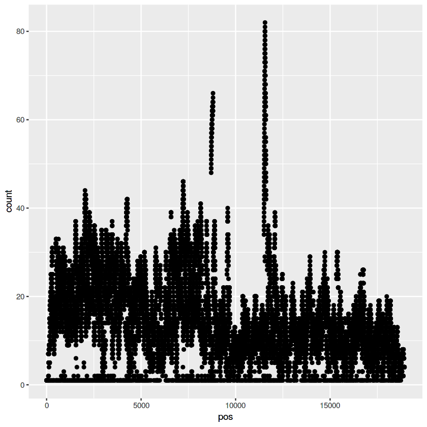
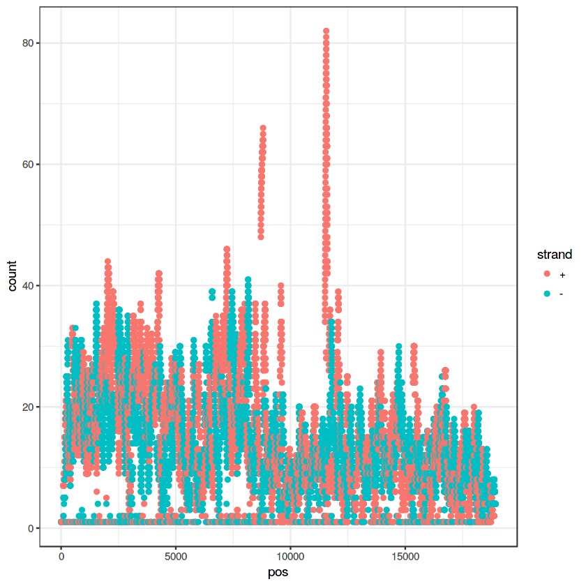
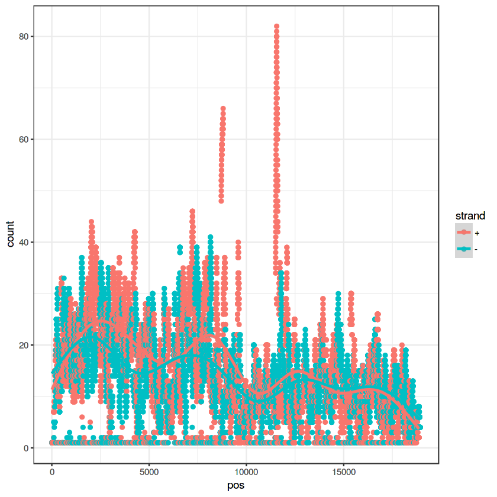
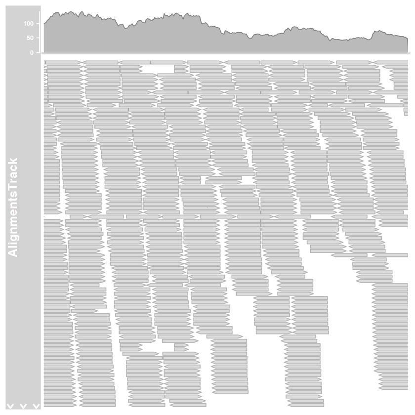
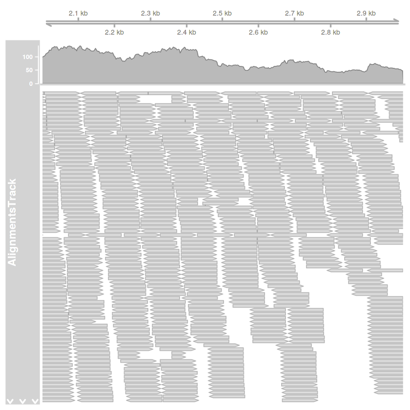
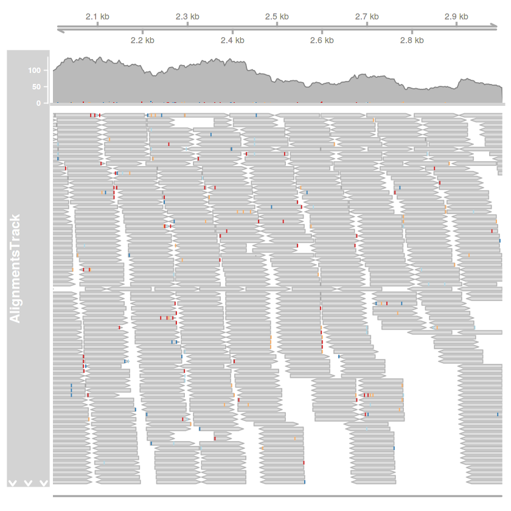
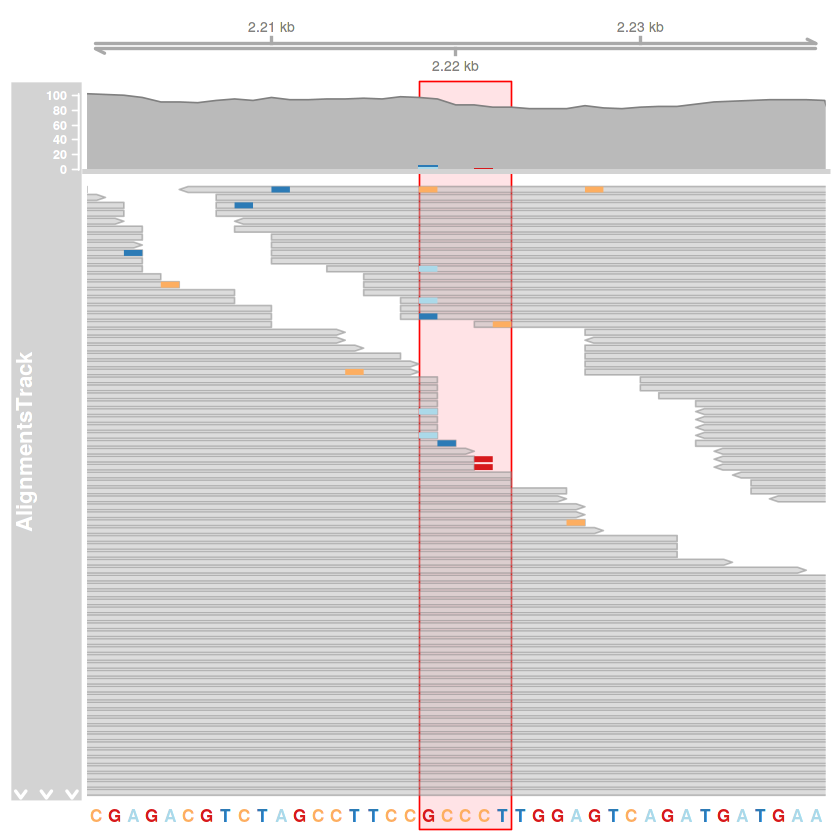
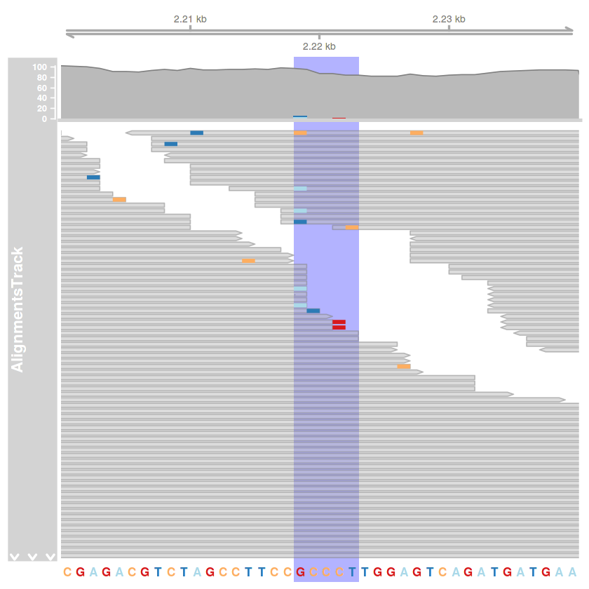

NGS
===

https://www.youtube.com/watch?v=9vNBYyHedLg

https://www.youtube.com/watch?v=ToKUGz\_YhC4

https://www.youtube.com/watch?v=9YxExTSwgPM

.. figure:: https://assets.illumina.com/content/dam/illumina-marketing/images/product/supporting-data-and-figures/nextera-mate-pair-library-prep-kit-web-graphic.png
   :alt: 

Short Reads
-----------

SRA
~~~

https://www.ncbi.nlm.nih.gov/sra/docs/

példa: SRR1660257: https://www.ncbi.nlm.nih.gov/sra/?term=SRR1660257

https://www.ncbi.nlm.nih.gov/geo/

https://www.ebi.ac.uk/ena

.. code:: bash

    %%bash 
    
    export PATH=$PATH:/usr/local/ncbi/sra-tools/bin
    
    mkdir gyak06
    cd gyak06
    
    fastq-dump SRR1660257

.. parsed-literal::

    Read 1015290 spots for SRR1660257
    Written 1015290 spots for SRR1660257

.. code:: bash

    %%bash 
    
    cd gyak06
    
    ls -lh

.. parsed-literal::

    total 267M
    -rw-rw-r-- 1 sn sn 267M ápr    3 11:18 SRR1660257.fastq

.. code:: bash

    %%bash 
    
    cd gyak06
    
    head SRR1660257.fastq

.. parsed-literal::

    @SRR1660257.1 1 length=100
    GTAATCTTAGATTCAAGTAATCCATATAATTAAATCCTGGTTTCATTGATTTGAGGCTGAGCTTTTCCATGAAGCAATCTGAAGAAAAACTAAAAGACAA
    +SRR1660257.1 1 length=100
    CBCFFFFFHHHHHJJIJHIJJJJJJJJJJJJJJJJJJJJJGIJJJJJJJJJJJIJJJJJIJJJJJJJJJJJJJJJIJJJJJJHHGHHHFFFFCEECDDDD
    @SRR1660257.2 2 length=100
    CAAGAGCACTGACTTCCTGGACCCCGCCACCACAACAAGTCCCCAAAACCACAGCGAGACCGCTGGCAACAACAACACTCATCACCAAGATACCGGAGAA
    +SRR1660257.2 2 length=100
    CCCFFFFFHHHHHJJJJJJJJJJJJJJJJJJJJIJJJJJIJJJJJJJIJJJJJJHHFFDDDDDDDDDDDDDDDDDDDDDDDDDDDDDDDDDDDDDDDDDD
    @SRR1660257.3 3 length=100
    GCCCAAGATTGATCGAGGTTGGGTATGTGTTTTTCAGCTTCAAGATGGTAAAACACTTGGACTCAAAATTTGAGCCAATCTCCCTTCCCTCCGAAAGAGG

FASTQ
~~~~~

http://support.illumina.com/content/dam/illumina-support/help/BaseSpaceHelp\_v2/Content/Vault/Informatics/Sequencing\_Analysis/BS/swSEQ\_mBS\_FASTQFiles.htm

https://en.wikipedia.org/wiki/FASTQ\_format

Minden readhez négy sor tartozik: - az első sorban van a read
azonosítója, illetve lehet még hozzá tartozó leírás - a második sorban
van a read nyers nukleotidsora - a harmadik + jellel kezdődő sor a jel
után lehet üres vagy a read azonosítóját is tartalmazhatja - a negyedik
sorban az egyes nukleotidok leolvasási minőségére vonatkozó kódolás
(részletek 74. lapon: Csaba Ortutay, Zsuzsanna Ortutay: Molecular Data
Analysis Using R. 2017, Wiley-Blackwell, ISBN: 978-1-119-16502-6.
https://www.wiley.com/en-hu/Molecular+Data+Analysis+Using+R-p-9781119165026)

BAM-ban tárolva:
https://gatkforums.broadinstitute.org/gatk/discussion/5990/what-is-ubam-and-why-is-it-better-than-fastq-for-storing-unmapped-sequence-data

CSFASTA
~~~~~~~

ABi SOLiD sequencer:
http://cutadapt.readthedocs.io/en/stable/colorspace.html

CSFASTA-file

::

    # Title: s0205_20110422_FRAG_BC_miRNA_MeDIP
    >1_5_224_F3
    T.222200232103..132..030.020..000.00
    >1_5_656_F3
    T.31311231.331..233..122.122..122.10
    >1_5_1005_F3"
    T.122221311011..212..312.033..303.32

+-----+-----+-----+-----+-----+
|     | A   | C   | G   | T   |
+=====+=====+=====+=====+=====+
| A   | 0   | 1   | 2   | 3   |
+-----+-----+-----+-----+-----+
| C   | 1   | 0   | 3   | 2   |
+-----+-----+-----+-----+-----+
| G   | 2   | 3   | 0   | 1   |
+-----+-----+-----+-----+-----+
| T   | 3   | 2   | 1   | 0   |
+-----+-----+-----+-----+-----+

QUAL-file

::

    # Title: s0205_20110422_FRAG_BC_miRNA_MeDIP
    >1_5_224_F3"
    -1 27 28 30 32 21 31 30 31 27 4 28 31 -1 -1 17 28 31 -1 -1 24 30 25 -1 22 25 21 -1 -1 30 28 21 -1 27 31
    >1_5_656_F3"
    -1 33 4 31 29 16 33 4 32 -1 20 33 4 -1 -1 25 31 10 -1 -1 12 25 5 -1 22 4 7 -1 -1 5 4 7 -1 4 4
    >1_5_1005_F3"
    -1 31 20 33 32 32 30 32 31 26 26 25 17 -1 -1 30 26 6 -1 -1 27 23 28 -1 25 31 10 -1 -1 29 14 19 -1 33 33

.. code:: bash

    %%bash 
    
    cd gyak06
    
    fastq-dump -X 10000 --split-files SRR1972739

.. parsed-literal::

    Read 10000 spots for SRR1972739
    Written 10000 spots for SRR1972739

.. code:: r

    library(ShortRead)
    library(seqTools)
    library(qrqc)
    library(BiocParallel)
    
    setwd('gyak06')
    
    fajlom = 'SRR1660257.fastq'
    
    readek = readFastq(fajlom)

.. code:: r

    slotNames(readek)

.. raw:: html

    <ol class=list-inline>
    	<li>'quality'</li>
    	<li>'sread'</li>
    	<li>'id'</li>
    </ol>

.. code:: r

    id(readek)

.. parsed-literal::

      A BStringSet instance of length 1015290
              width seq
          [1]    25 SRR1660257.1 1 length=100
          [2]    25 SRR1660257.2 2 length=100
          [3]    25 SRR1660257.3 3 length=100
          [4]    25 SRR1660257.4 4 length=100
          [5]    25 SRR1660257.5 5 length=100
          ...   ... ...
    [1015286]    37 SRR1660257.1015286 1015286 length=100
    [1015287]    37 SRR1660257.1015287 1015287 length=100
    [1015288]    37 SRR1660257.1015288 1015288 length=100
    [1015289]    37 SRR1660257.1015289 1015289 length=100
    [1015290]    37 SRR1660257.1015290 1015290 length=100

.. code:: r

    sread(readek)

.. parsed-literal::

      A DNAStringSet instance of length 1015290
              width seq
          [1]   100 GTAATCTTAGATTCAAGTAATCCATATAATT...GAAGCAATCTGAAGAAAAACTAAAAGACAA
          [2]   100 CAAGAGCACTGACTTCCTGGACCCCGCCACC...AACAACACTCATCACCAAGATACCGGAGAA
          [3]   100 GCCCAAGATTGATCGAGGTTGGGTATGTGTT...TGAGCCAATCTCCCTTCCCTCCGAAAGAGG
          [4]   100 TAATAATCAGATCTGCGAACCGGTAGAGTTT...CAATAGAAATTTAAACAGTGAGTGGAGACA
          [5]   100 CTTAGACATCAAAAATTCTTCCTGTTTTCGT...ATCCCATTGTTCCATGCTCATTCACTGATG
          ...   ... ...
    [1015286]   100 CAGATGATGAAGAGCAGGACAGGGACGGAAC...ATACAGAGATCACTCTGAAAAGAAAGAACT
    [1015287]   100 CTGGAAGTTCATAAGAATTTTCTTTTCCTGA...TATTGTTGGAGTTGCTTCTCAGCCTCAGTG
    [1015288]   100 ATCTTCCAAGATGCTGCTCCACCTGTCATCC...AAAGCTTGCGTCCAGTCCCACCATCGCCCA
    [1015289]   100 AGAGCCACAACTGAGCTACGCACCTTTTCAA...GGGGCGGCACATGCCACATTCTGGGACCGG
    [1015290]   100 GACGAGGACACTAAGCCGGTGCCTAATAGAT...GGCATATAGAGGGCAGACAGACACAATCCG

.. code:: r

    kval = quality(readek)
    kval

.. parsed-literal::

    class: FastqQuality
    quality:
      A BStringSet instance of length 1015290
              width seq
          [1]   100 CBCFFFFFHHHHHJJIJHIJJJJJJJJJJJJ...JJJJJIJJJJJJHHGHHHFFFFCEECDDDD
          [2]   100 CCCFFFFFHHHHHJJJJJJJJJJJJJJJJJJ...DDDDDDDDDDDDDDDDDDDDDDDDDDDDDD
          [3]   100 CCCFFFFFHHHHHJJIJJEGIJJCFGICFFG...HHFFFFECEEEEEDDDDDDDDDDDDDDDDB
          [4]   100 CCCFFFFFHHHHHJJJJGJJJJJGHIJJHIJ...EEEEEEDCCDDDDEDDDDCCDDACDDDDDD
          [5]   100 CCCFFFFFHHHHHJJJJJJJJJJJJJJJJIJ...JJGHHHHFFFFFFFECCCEEEEECCDDDDD
          ...   ... ...
    [1015286]   100 C@CFFFFFHHHHHJBHIIIJJIIIGIGGIIJ...DDDEEDDDCCDDDDDDDDDDDDDDDDDDDC
    [1015287]   100 ?@@FBDBBFHHBBGBECFFHIBEHEHDHHEG...CH>DF@@;;(..;AC@C>A@;C>9<ACC@:
    [1015288]   100 CCCFFFFFHHHHHJJJJJJJJIJJJHIIJJI...DEEDBCDDDDDDBDCCDDDDDDDCDDDDDD
    [1015289]   100 ;@@DDDDDHHFDCCGBHGI@GHFFCHHGIEC...A92=;59<@><@AACCCBAACDACCBBB<5
    [1015290]   100 1=@D4=A########################...##############################

PHRED minőségi pontszám:

:math:`Q_{PHRED} = -10 \times log_{10} P`

Ennek valószínűséggé való átalakítása:

:math:`P = 10^{-Q_{PHRED}/10}`

Néhány minőségi érték a döntésekhez:

+---------------------+---------+-------------+-----------------+
| :math:`Q_{PHRED}`   | hiba    |             | megbízhatóság   |
+=====================+=========+=============+=================+
| 10                  | 10%     | (1/10)      | 90%             |
+---------------------+---------+-------------+-----------------+
| 20                  | 1%      | (1/100)     | 99%             |
+---------------------+---------+-------------+-----------------+
| 30                  | 0.1%    | (1/1000)    | 99.9%           |
+---------------------+---------+-------------+-----------------+
| 40                  | 0.01%   | (1/10000)   | 99.99%          |
+---------------------+---------+-------------+-----------------+

Solexa:

:math:`Q_{Solexa}=-10\times log_{10}\left(\frac{P}{1-P}\right)`

Átváltások:

:math:`Q_{PHRED}=-10\times log_{10}\left(10^{Q_{Solexa}/10}+1\right)`

:math:`Q_{Solexa}=-10\times log_{10}\left(10^{Q_{PHRED}/10}-1\right)`

.. raw:: html

   <table style="width:60%">

.. raw:: html

   <tr>

::

    <th></th>
    <th>ASCII</th> 
    <th>Minőségi pont</th>    
    <th></th>

.. raw:: html

   </tr>

.. raw:: html

   <tr>

::

    <th></th>
    <th>Tartomány</th> 
    <th>Típus</th>    
    <th>Tartomány</th>

.. raw:: html

   </tr>

.. raw:: html

   <tr>

::

    <td>Sanger standard</td>
    <td></td>
    <td></td>
    <td></td>

.. raw:: html

   </tr>

.. raw:: html

   <tr>

::

    <td>  fastq-sanger</td>
    <td>33 - 126</td>
    <td>PHRED</td>
    <td>0 - 93</td>

.. raw:: html

   </tr>

.. raw:: html

   <tr>

::

    <td>Solexa/régebbi Illumina</td>
    <td></td>
    <td></td>
    <td></td>

.. raw:: html

   </tr>

.. raw:: html

   <tr>

::

    <td>  fastq-solexa</td>
    <td>59 - 126</td>
    <td>Solexa</td>
    <td>-5 - 62</td>

.. raw:: html

   </tr>

.. raw:: html

   <tr>

::

    <td>Illumina 1.3+</td>
    <td></td>
    <td></td>
    <td></td>

.. raw:: html

   </tr>

.. raw:: html

   <tr>

::

    <td>  fastq-illumina</td>
    <td>64 - 126</td>
    <td>PHRED</td>
    <td>0 - 62</td>

.. raw:: html

   </tr>

.. raw:: html

   </table>

Cock PJA, Fields CJ, Goto N, Heuer ML, Rice PM The sanger FASTQ file
format for sequences with quality scores and the Solexa/Illumina FASTQ
variants. Nucleic Acids Research 2010 Vol.38 No.6 1767-1771

.. code:: r

    phredTable()

.. raw:: html

    <table>
    <thead><tr><th scope=col>ascii</th><th scope=col>phred</th><th scope=col>char</th></tr></thead>
    <tbody>
    	<tr><td>33</td><td> 0</td><td>! </td></tr>
    	<tr><td>34</td><td> 1</td><td>" </td></tr>
    	<tr><td>35</td><td> 2</td><td># </td></tr>
    	<tr><td>36</td><td> 3</td><td>$ </td></tr>
    	<tr><td>37</td><td> 4</td><td>% </td></tr>
    	<tr><td>38   </td><td> 5   </td><td>&amp;</td></tr>
    	<tr><td>39</td><td> 6</td><td>' </td></tr>
    	<tr><td>40</td><td> 7</td><td>( </td></tr>
    	<tr><td>41</td><td> 8</td><td>) </td></tr>
    	<tr><td>42</td><td> 9</td><td>* </td></tr>
    	<tr><td>43</td><td>10</td><td>+ </td></tr>
    	<tr><td>44</td><td>11</td><td>, </td></tr>
    	<tr><td>45</td><td>12</td><td>- </td></tr>
    	<tr><td>46</td><td>13</td><td>. </td></tr>
    	<tr><td>47</td><td>14</td><td>/ </td></tr>
    	<tr><td>48</td><td>15</td><td>0 </td></tr>
    	<tr><td>49</td><td>16</td><td>1 </td></tr>
    	<tr><td>50</td><td>17</td><td>2 </td></tr>
    	<tr><td>51</td><td>18</td><td>3 </td></tr>
    	<tr><td>52</td><td>19</td><td>4 </td></tr>
    	<tr><td>53</td><td>20</td><td>5 </td></tr>
    	<tr><td>54</td><td>21</td><td>6 </td></tr>
    	<tr><td>55</td><td>22</td><td>7 </td></tr>
    	<tr><td>56</td><td>23</td><td>8 </td></tr>
    	<tr><td>57</td><td>24</td><td>9 </td></tr>
    	<tr><td>58</td><td>25</td><td>: </td></tr>
    	<tr><td>59</td><td>26</td><td>; </td></tr>
    	<tr><td>60  </td><td>27  </td><td>&lt;</td></tr>
    	<tr><td>61</td><td>28</td><td>= </td></tr>
    	<tr><td>62  </td><td>29  </td><td>&gt;</td></tr>
    	<tr><td>⋮</td><td>⋮</td><td>⋮</td></tr>
    	<tr><td> 97</td><td>64 </td><td>a  </td></tr>
    	<tr><td> 98</td><td>65 </td><td>b  </td></tr>
    	<tr><td> 99</td><td>66 </td><td>c  </td></tr>
    	<tr><td>100</td><td>67 </td><td>d  </td></tr>
    	<tr><td>101</td><td>68 </td><td>e  </td></tr>
    	<tr><td>102</td><td>69 </td><td>f  </td></tr>
    	<tr><td>103</td><td>70 </td><td>g  </td></tr>
    	<tr><td>104</td><td>71 </td><td>h  </td></tr>
    	<tr><td>105</td><td>72 </td><td>i  </td></tr>
    	<tr><td>106</td><td>73 </td><td>j  </td></tr>
    	<tr><td>107</td><td>74 </td><td>k  </td></tr>
    	<tr><td>108</td><td>75 </td><td>l  </td></tr>
    	<tr><td>109</td><td>76 </td><td>m  </td></tr>
    	<tr><td>110</td><td>77 </td><td>n  </td></tr>
    	<tr><td>111</td><td>78 </td><td>o  </td></tr>
    	<tr><td>112</td><td>79 </td><td>p  </td></tr>
    	<tr><td>113</td><td>80 </td><td>q  </td></tr>
    	<tr><td>114</td><td>81 </td><td>r  </td></tr>
    	<tr><td>115</td><td>82 </td><td>s  </td></tr>
    	<tr><td>116</td><td>83 </td><td>t  </td></tr>
    	<tr><td>117</td><td>84 </td><td>u  </td></tr>
    	<tr><td>118</td><td>85 </td><td>v  </td></tr>
    	<tr><td>119</td><td>86 </td><td>w  </td></tr>
    	<tr><td>120</td><td>87 </td><td>x  </td></tr>
    	<tr><td>121</td><td>88 </td><td>y  </td></tr>
    	<tr><td>122</td><td>89 </td><td>z  </td></tr>
    	<tr><td>123</td><td>90 </td><td>{  </td></tr>
    	<tr><td>124</td><td>91 </td><td>|  </td></tr>
    	<tr><td>125</td><td>92 </td><td>}  </td></tr>
    	<tr><td>126</td><td>93 </td><td>~  </td></tr>
    </tbody>
    </table>

.. code:: r

    m = as(kval, 'matrix')
    m[1,]

.. raw:: html

    <ol class=list-inline>
    	<li>34</li>
    	<li>33</li>
    	<li>34</li>
    	<li>37</li>
    	<li>37</li>
    	<li>37</li>
    	<li>37</li>
    	<li>37</li>
    	<li>39</li>
    	<li>39</li>
    	<li>39</li>
    	<li>39</li>
    	<li>39</li>
    	<li>41</li>
    	<li>41</li>
    	<li>40</li>
    	<li>41</li>
    	<li>39</li>
    	<li>40</li>
    	<li>41</li>
    	<li>41</li>
    	<li>41</li>
    	<li>41</li>
    	<li>41</li>
    	<li>41</li>
    	<li>41</li>
    	<li>41</li>
    	<li>41</li>
    	<li>41</li>
    	<li>41</li>
    	<li>41</li>
    	<li>41</li>
    	<li>41</li>
    	<li>41</li>
    	<li>41</li>
    	<li>41</li>
    	<li>41</li>
    	<li>41</li>
    	<li>41</li>
    	<li>41</li>
    	<li>38</li>
    	<li>40</li>
    	<li>41</li>
    	<li>41</li>
    	<li>41</li>
    	<li>41</li>
    	<li>41</li>
    	<li>41</li>
    	<li>41</li>
    	<li>41</li>
    	<li>41</li>
    	<li>41</li>
    	<li>41</li>
    	<li>40</li>
    	<li>41</li>
    	<li>41</li>
    	<li>41</li>
    	<li>41</li>
    	<li>41</li>
    	<li>40</li>
    	<li>41</li>
    	<li>41</li>
    	<li>41</li>
    	<li>41</li>
    	<li>41</li>
    	<li>41</li>
    	<li>41</li>
    	<li>41</li>
    	<li>41</li>
    	<li>41</li>
    	<li>41</li>
    	<li>41</li>
    	<li>41</li>
    	<li>41</li>
    	<li>41</li>
    	<li>40</li>
    	<li>41</li>
    	<li>41</li>
    	<li>41</li>
    	<li>41</li>
    	<li>41</li>
    	<li>41</li>
    	<li>39</li>
    	<li>39</li>
    	<li>38</li>
    	<li>39</li>
    	<li>39</li>
    	<li>39</li>
    	<li>37</li>
    	<li>37</li>
    	<li>37</li>
    	<li>37</li>
    	<li>34</li>
    	<li>36</li>
    	<li>36</li>
    	<li>34</li>
    	<li>35</li>
    	<li>35</li>
    	<li>35</li>
    	<li>35</li>
    </ol>

Readek minőségellenőrzése
-------------------------

https://www.ncbi.nlm.nih.gov/pmc/articles/PMC2752612/

FastQC: https://www.bioinformatics.babraham.ac.uk/projects/fastqc/

https://www.youtube.com/watch?v=bz93ReOv87Y

.. code:: bash

    %%bash 
    
    # export PATH=$PATH:/usr/local/ncbi/sra-tools/bin
    
    mkdir gyak07
    cd gyak07
    
    fastq-dump SRR1660259
    
    ls -lh

.. parsed-literal::

    Read 9130 spots for SRR1660259
    Written 9130 spots for SRR1660259
    total 2,4M
    -rw-rw-r-- 1 sn sn 2,4M ápr    3 11:28 SRR1660259.fastq

.. code:: r

    library(fastqcr)
    
    setwd('gyak07')
    
    fastqc() 

.. code:: r

    minosegi.fajl = 'FASTQC/SRR1660259_fastqc.zip'
    
    qc_report(
        qc.path = minosegi.fajl, 
        template = 'minta_jelentes.Rmd', 
        result.file ='osszefoglalo', 
        interpret = TRUE, 
        experiment = 'minőségellenőrzési példa',
        preview = FALSE
    )

.. parsed-literal::

    
    
    processing file: minta_jelentes.Rmd

.. parsed-literal::

      |.                                                                |   2%
       inline R code fragments
    
      |..                                                               |   3%
    label: unnamed-chunk-1 (with options) 
    List of 1
     $ echo: logi FALSE
    
      |...                                                              |   5%
      ordinary text without R code
    
      |....                                                             |   6%
    label: unnamed-chunk-2 (with options) 
    List of 1
     $ echo: logi FALSE
    
      |.....                                                            |   8%
       inline R code fragments
    
      |......                                                           |  10%
    label: unnamed-chunk-3 (with options) 
    List of 1
     $ echo: logi TRUE
    

.. parsed-literal::

    
    Attaching package: 'dplyr'
    
    The following objects are masked from 'package:stats':
    
        filter, lag
    
    The following objects are masked from 'package:base':
    
        intersect, setdiff, setequal, union
    

.. parsed-literal::

      |.......                                                          |  11%
      ordinary text without R code
    
      |........                                                         |  13%
    label: unnamed-chunk-4

.. parsed-literal::

    Reading: FASTQC/SRR1660259_fastqc.zip

.. parsed-literal::

      |.........                                                        |  14%
      ordinary text without R code
    
      |..........                                                       |  16%
    label: summary (with options) 
    List of 3
     $ fig.width : num 5
     $ fig.height: num 4.5
     $ fig.align : chr "center"
    
      |...........                                                      |  17%
      ordinary text without R code
    
      |............                                                     |  19%
    label: basic-statistics (with options) 
    List of 3
     $ fig.width : num 5
     $ fig.height: num 3
     $ fig.align : chr "center"
    
      |.............                                                    |  21%
      ordinary text without R code
    
      |..............                                                   |  22%
    label: per-base-sequence-quality (with options) 
    List of 3
     $ fig.width : num 4
     $ fig.height: num 3.5
     $ fig.align : chr "center"
    
      |...............                                                  |  24%
      ordinary text without R code
    
      |.................                                                |  25%
    label: unnamed-chunk-5 (with options) 
    List of 2
     $ type  : chr "warning"
     $ engine: chr "block"
    
      |..................                                               |  27%
      ordinary text without R code
    
      |...................                                              |  29%
    label: unnamed-chunk-6 (with options) 
    List of 2
     $ type  : chr "block"
     $ engine: chr "block"
    
      |....................                                             |  30%
      ordinary text without R code
    
      |.....................                                            |  32%
    label: per-sequence-quality-scores (with options) 
    List of 3
     $ fig.width : num 4
     $ fig.height: num 3.5
     $ fig.align : chr "center"
    
      |......................                                           |  33%
      ordinary text without R code
    
      |.......................                                          |  35%
    label: unnamed-chunk-7 (with options) 
    List of 2
     $ type  : chr "warning"
     $ engine: chr "block"
    
      |........................                                         |  37%
      ordinary text without R code
    
      |.........................                                        |  38%
    label: unnamed-chunk-8 (with options) 
    List of 2
     $ type  : chr "block"
     $ engine: chr "block"
    
      |..........................                                       |  40%
      ordinary text without R code
    
      |...........................                                      |  41%
    label: per-base-sequence-content (with options) 
    List of 3
     $ fig.width : num 4
     $ fig.height: num 3.5
     $ fig.align : chr "center"
    
      |............................                                     |  43%
      ordinary text without R code
    
      |.............................                                    |  44%
    label: unnamed-chunk-9 (with options) 
    List of 2
     $ type  : chr "notice"
     $ engine: chr "block"
    
      |..............................                                   |  46%
      ordinary text without R code
    
      |...............................                                  |  48%
    label: unnamed-chunk-10 (with options) 
    List of 2
     $ type  : chr "warning"
     $ engine: chr "block"
    
      |................................                                 |  49%
      ordinary text without R code
    
      |.................................                                |  51%
    label: unnamed-chunk-11 (with options) 
    List of 2
     $ type  : chr "block"
     $ engine: chr "block"
    
      |..................................                               |  52%
      ordinary text without R code
    
      |...................................                              |  54%
    label: per-sequence-GC-content (with options) 
    List of 3
     $ fig.width : num 4
     $ fig.height: num 3.5
     $ fig.align : chr "center"
    
      |....................................                             |  56%
      ordinary text without R code
    
      |.....................................                            |  57%
    label: unnamed-chunk-12 (with options) 
    List of 2
     $ type  : chr "success"
     $ engine: chr "block"
    
      |......................................                           |  59%
      ordinary text without R code
    
      |.......................................                          |  60%
    label: per-base-N-content (with options) 
    List of 3
     $ fig.width : num 4
     $ fig.height: num 3.5
     $ fig.align : chr "center"
    
      |........................................                         |  62%
      ordinary text without R code
    
      |.........................................                        |  63%
    label: unnamed-chunk-13 (with options) 
    List of 2
     $ type  : chr "warning"
     $ engine: chr "block"
    
      |..........................................                       |  65%
      ordinary text without R code
    
      |...........................................                      |  67%
    label: unnamed-chunk-14 (with options) 
    List of 2
     $ type  : chr "block"
     $ engine: chr "block"
    
      |............................................                     |  68%
      ordinary text without R code
    
      |.............................................                    |  70%
    label: sequence-length-distribution (with options) 
    List of 3
     $ fig.width : num 4
     $ fig.height: num 3.5
     $ fig.align : chr "center"
    

.. parsed-literal::

    geom_path: Each group consists of only one observation. Do you need to adjust the group aesthetic?

.. parsed-literal::

      |..............................................                   |  71%
      ordinary text without R code
    
      |...............................................                  |  73%
    label: sequence-duplication-levels (with options) 
    List of 3
     $ fig.width : num 4
     $ fig.height: num 3.5
     $ fig.align : chr "center"
    
      |................................................                 |  75%
      ordinary text without R code
    
      |..................................................               |  76%
    label: unnamed-chunk-15 (with options) 
    List of 2
     $ type  : chr "warning"
     $ engine: chr "block"
    
      |...................................................              |  78%
      ordinary text without R code
    
      |....................................................             |  79%
    label: unnamed-chunk-16 (with options) 
    List of 2
     $ type  : chr "block"
     $ engine: chr "block"
    
      |.....................................................            |  81%
      ordinary text without R code
    
      |......................................................           |  83%
    label: Overrepresented-sequences (with options) 
    List of 3
     $ fig.width : num 4
     $ fig.height: num 3.5
     $ fig.align : chr "center"
    
      |.......................................................          |  84%
      ordinary text without R code
    
      |........................................................         |  86%
    label: unnamed-chunk-17 (with options) 
    List of 2
     $ type  : chr "warning"
     $ engine: chr "block"
    
      |.........................................................        |  87%
      ordinary text without R code
    
      |..........................................................       |  89%
    label: unnamed-chunk-18 (with options) 
    List of 2
     $ type  : chr "block"
     $ engine: chr "block"
    
      |...........................................................      |  90%
      ordinary text without R code
    
      |............................................................     |  92%
    label: adapter-content (with options) 
    List of 3
     $ fig.width : num 4
     $ fig.height: num 3.5
     $ fig.align : chr "center"
    
      |.............................................................    |  94%
      ordinary text without R code
    
      |..............................................................   |  95%
    label: unnamed-chunk-19 (with options) 
    List of 2
     $ type  : chr "warning"
     $ engine: chr "block"
    
      |...............................................................  |  97%
      ordinary text without R code
    
      |................................................................ |  98%
    label: unnamed-chunk-20 (with options) 
    List of 2
     $ type  : chr "block"
     $ engine: chr "block"
    
      |.................................................................| 100%
      ordinary text without R code
    
    

.. parsed-literal::

    output file: minta_jelentes.knit.md
    

.. parsed-literal::

    /usr/bin/pandoc +RTS -K512m -RTS minta_jelentes.utf8.md --to html4 --from markdown+autolink_bare_uris+ascii_identifiers+tex_math_single_backslash --output /home/sn/gyak07/osszefoglalo.html --smart --email-obfuscation none --self-contained --standalone --section-divs --table-of-contents --toc-depth 3 --variable toc_float=1 --variable toc_selectors=h1,h2,h3 --variable toc_smooth_scroll=1 --variable toc_print=1 --template /usr/local/lib/R/library/rmarkdown/rmd/h/default.html --no-highlight --variable highlightjs=1 --variable 'theme:bootstrap' --include-in-header /tmp/Rtmp25z3BX/rmarkdown-str13c555fdd057.html --mathjax --variable 'mathjax-url:https://mathjax.rstudio.com/latest/MathJax.js?config=TeX-AMS-MML_HTMLorMML' 

.. parsed-literal::

    
    Output created: osszefoglalo.html
    
    --------------------------
    Output file: /home/sn/gyak07/osszefoglalo.html
    --------------------------
    

Gyenge minőségű nukleotidok, readek kiszűrése
---------------------------------------------

trimming, filtering

.. code:: r

    library(seqTools)
    
    fajlom = 'SRR1660259.fastq'
    
    trimFastq(fajlom, 
      outfile       = 'marad.fq.gz',
      discard       = 'kimarad.fq.gz',
      qualDiscard   = 10, # All reads which contain one or more phred scores < qualDiscard will be discarded.
      fixTrimLeft   = 0,  # Prefix of this size will be trimmed.
      fixTrimRight  = 0,  # Suffix of this size will be trimmed.
      qualTrimLeft  = 30, # Prefix where all phred scores are < qualTrimLeft will be trimmed.
      qualTrimRight = 30, # Suffix where all phred scores are < qualTrimRight will be trimmed.
      minSeqLen     = 50  # All reads where sequence length after (fixed and quality based) trimming is < minSeqLen will be discarded.
    )

.. parsed-literal::

    Loading required package: zlibbioc
    [trimFastq]        7.843 records written to outfile.
    [trimFastq]        1.287 records written to discard.

Readek illesztése referencia-genomra
------------------------------------

.. code:: bash

    %%bash 
    
    cd gyak07
    
    export PATH=$PATH:/home/bioinfo/edirect
    
    efetch -db=nuccore -format=fasta -id=AF086833 > ebola1976.fa
    
    ls -lh

.. parsed-literal::

    total 4,6M
    -rw-rw-r-- 1 sn sn  19K ápr    3 11:33 ebola1976.fa
    drwxrwxr-x 2 sn sn 4,0K ápr    3 11:29 FASTQC
    -rw-rw-r-- 1 sn sn 106K ápr    3 11:32 kimarad.fq.gz
    -rw-rw-r-- 1 sn sn 453K ápr    3 11:32 marad.fq.gz
    -rwxrwxr-x 1 sn sn  13K márc  19 12:04 minta_jelentes.Rmd
    -rw-rw-r-- 1 sn sn 1,6M ápr    3 11:31 osszefoglalo.html
    -rw-rw-r-- 1 sn sn 2,4M ápr    3 11:28 SRR1660259.fastq

.. code:: bash

    %%bash 
    
    cd gyak07
    
    head ebola1976.fa

.. parsed-literal::

    >AF086833.2 Ebola virus - Mayinga, Zaire, 1976, complete genome
    CGGACACACAAAAAGAAAGAAGAATTTTTAGGATCTTTTGTGTGCGAATAACTATGAGGAAGATTAATAA
    TTTTCCTCTCATTGAAATTTATATCGGAATTTAAATTGAAATTGTTACTGTAATCACACCTGGTTTGTTT
    CAGAGCCACATCACAAAGATAGAGAACAACCTAGGTCTCCGAAGGGAGCAAGGGCATCAGTGTGCTCAGT
    TGAAAATCCCTTGTCAACACCTAGGTCTTATCACATCACAAGTTCCACCTCAGACTCTGCAGGGTGATCC
    AACAACCTTAATAGAAACATTATTGTTAAAGGACAGCATTAGTTCACAGTCAAACAAGCAAGATTGAGAA
    TTAACCTTGGTTTTGAACTTGAACACTTAGGGGATTGAAGATTCAACAACCCTAAAGCTTGGGGTAAAAC
    ATTGGAAATAGTTAAAAGACAAATTGCTCGGAATCACAAAATTCCGAGTATGGATTCTCGTCCTCAGAAA
    ATCTGGATGGCGCCGAGTCTCACTGAATCTGACATGGATTACCACAAGATCTTGACAGCAGGTCTGTCCG
    TTCAACAGGGGATTGTTCGGCAAAGAGTCATCCCAGTGTATCAAGTAAACAATCTTGAAGAAATTTGCCA

.. code:: bash

    %%bash 
    
    cd gyak07
    
    export PATH=$PATH:/home/bioinfo/bwa
    
    bwa index -p Ebola ebola1976.fa
    
    ls -lh

.. parsed-literal::

    total 4,6M
    -rw-rw-r-- 1 sn sn  19K ápr    3 11:33 ebola1976.fa
    -rw-rw-r-- 1 sn sn   10 ápr    3 11:34 Ebola.amb
    -rw-rw-r-- 1 sn sn   86 ápr    3 11:34 Ebola.ann
    -rw-rw-r-- 1 sn sn  19K ápr    3 11:34 Ebola.bwt
    -rw-rw-r-- 1 sn sn 4,7K ápr    3 11:34 Ebola.pac
    -rw-rw-r-- 1 sn sn 9,4K ápr    3 11:34 Ebola.sa
    drwxrwxr-x 2 sn sn 4,0K ápr    3 11:29 FASTQC
    -rw-rw-r-- 1 sn sn 106K ápr    3 11:32 kimarad.fq.gz
    -rw-rw-r-- 1 sn sn 453K ápr    3 11:32 marad.fq.gz
    -rwxrwxr-x 1 sn sn  13K márc  19 12:04 minta_jelentes.Rmd
    -rw-rw-r-- 1 sn sn 1,6M ápr    3 11:31 osszefoglalo.html
    -rw-rw-r-- 1 sn sn 2,4M ápr    3 11:28 SRR1660259.fastq

.. parsed-literal::

    [bwa_index] Pack FASTA... 0.00 sec
    [bwa_index] Construct BWT for the packed sequence...
    [bwa_index] 0.00 seconds elapse.
    [bwa_index] Update BWT... 0.00 sec
    [bwa_index] Pack forward-only FASTA... 0.00 sec
    [bwa_index] Construct SA from BWT and Occ... 0.00 sec
    [main] Version: 0.7.17-r1188
    [main] CMD: bwa index -p Ebola ebola1976.fa
    [main] Real time: 0.427 sec; CPU: 0.009 sec

.. code:: bash

    %%bash 
    
    cd gyak07
    
    export PATH=$PATH:/home/bioinfo/bwa
    
    bwa mem Ebola SRR1660259.fastq > illesztes01.sam
    
    ls -lh

.. parsed-literal::

    total 7,1M
    -rw-rw-r-- 1 sn sn  19K ápr    3 11:33 ebola1976.fa
    -rw-rw-r-- 1 sn sn   10 ápr    3 11:34 Ebola.amb
    -rw-rw-r-- 1 sn sn   86 ápr    3 11:34 Ebola.ann
    -rw-rw-r-- 1 sn sn  19K ápr    3 11:34 Ebola.bwt
    -rw-rw-r-- 1 sn sn 4,7K ápr    3 11:34 Ebola.pac
    -rw-rw-r-- 1 sn sn 9,4K ápr    3 11:34 Ebola.sa
    drwxrwxr-x 2 sn sn 4,0K ápr    3 11:29 FASTQC
    -rw-rw-r-- 1 sn sn 2,5M ápr    3 11:34 illesztes01.sam
    -rw-rw-r-- 1 sn sn 106K ápr    3 11:32 kimarad.fq.gz
    -rw-rw-r-- 1 sn sn 453K ápr    3 11:32 marad.fq.gz
    -rwxrwxr-x 1 sn sn  13K márc  19 12:04 minta_jelentes.Rmd
    -rw-rw-r-- 1 sn sn 1,6M ápr    3 11:31 osszefoglalo.html
    -rw-rw-r-- 1 sn sn 2,4M ápr    3 11:28 SRR1660259.fastq

.. parsed-literal::

    [M::bwa_idx_load_from_disk] read 0 ALT contigs
    [M::process] read 9130 sequences (911661 bp)...
    [M::mem_process_seqs] Processed 9130 reads in 0.323 CPU sec, 0.332 real sec
    [main] Version: 0.7.17-r1188
    [main] CMD: bwa mem Ebola SRR1660259.fastq
    [main] Real time: 0.418 sec; CPU: 0.347 sec

Sequence Alignment Map (SAM) fájl
~~~~~~~~~~~~~~~~~~~~~~~~~~~~~~~~~

Az illesztés eredményét tartalmazó tabulátorral osztott fájl (CSV), az
egyes részek nem azonos oszlopszámúak
(https://samtools.github.io/hts-specs/SAMv1.pdf).

.. code:: bash

    %%bash 
    
    cd gyak07
    
    head illesztes01.sam

.. parsed-literal::

    @SQ	SN:AF086833.2	LN:18959
    @PG	ID:bwa	PN:bwa	VN:0.7.17-r1188	CL:bwa mem Ebola SRR1660259.fastq
    SRR1660259.1	16	AF086833.2	7706	60	100M	*	0	0	GGGTTGAGACAGCTGGCCAACGAGACGACTCAAGCTCTTCAACTGTTCCTGAGAGCCACAACTGAGCTACGCACCTTTTCAATCCTCAACCGTAAGGCAA	>@CCCA>@5C>??3CA?9==CAAACA@@FEDCEHEHHGEHGEGFEGBIIHEFEIGHF?BFDGHHCIGGHBGCHIGIIIGGHFC+GBAFFHDHFFFFF@@@	NM:i:0	MD:Z:100	AS:i:100	XS:i:0
    SRR1660259.2	0	AF086833.2	814	60	100M	*	0	0	GCGCCTTGAGGAATTGCTGCCAGCAGTATCTAGTGGAAAAAACATTAAGAGAACACTTGCTGCCATGCCGGAAGAGGAGACAACTGAAGCTAATGCCGGT	CCCFFFFFHHHHHJJJJJJJJJJJJJHIJJJJJHHIJJJJIJJJJJIJJJJGIIJJJJJJJJJJJJHHHHFDDDDDDDDDDDDDDDDDDDDDDDDDDDDB	NM:i:0	MD:Z:100	AS:i:100	XS:i:0
    SRR1660259.3	0	AF086833.2	11530	60	83M17S	*	0	0	GTCTTTCCGTGTTTAAGATGGAGCAGTTGAAATTCTTCCTCTTGATATTAAATGGCTACACAACATACCCAATACCCAGACGCGTGAGCAAGGGCGAGGA	@CCDF?EFHHHDHJJJJEIJJIGGIJHIIJIIJJJGGHJJFGIIDGIJIIIHIIGEGIGGHJIJIIGHHHJGIG:CAEEDFF@DDDDDDDDDDDDDDD@9	NM:i:2	MD:Z:14T5A62	AS:i:73	XS:i:0
    SRR1660259.4	16	AF086833.2	1065	60	100M	*	0	0	TGATTTTCCGTTTGATGCGAACAAATTTTCTGATCAAATTTCTCCTAATACACCAAGGGATGCACATGGTTGCCGGGCATGATGCCAACGATGCTGTGAT	DDDDDDDDDDDCDDDDDDDDCEEEEEFFFFFHHHHHHHGIHJJJIIJIHCGCJJIIJJJJJJIGJJJJIJJJJJIJJJJJJJJJJJJHHHHHFFFFFCCC	NM:i:0	MD:Z:100	AS:i:100	XS:i:0
    SRR1660259.5	0	AF086833.2	11510	60	100M	*	0	0	TAAGAAAAACTGCTTATTGGGTCTTTCCGTGTTTTAGATGAAGCAGTTGAAATTCTTCCTCTTGATATTAAATGGCTACACAACATACCCAATACCCAGA	CCCFFFFFHHHHHJJJJJJJJFHJJJJJJGHHJJJJJIJJIJJJJJIIJJJJJIJIIJJJJJJJJJJJJJIJJIJIHHGHHFFFFEEEEEDDDDDDDDDD	NM:i:0	MD:Z:100	AS:i:100	XS:i:0
    SRR1660259.6	0	AF086833.2	2660	60	100M	*	0	0	TTCATGGCAATCCTGCAACATCATCAGTGAATGAGCATGGAACAATGGGATGATTCAACCGACAAATAGCTAACATTAAGTAGTCAAGGAACGAAAACAG	CCCFFFFFHHHHHJJJJJJJJJJJJJJHIJJJJJJJJJJJIJJJJJJJJJJJIJJJJJJJJJJJHHHHHFFFFFFEEEEEDEEFEEDDDDDDDDDDDDDD	NM:i:0	MD:Z:100	AS:i:100	XS:i:0
    SRR1660259.7	16	AF086833.2	7235	60	100M	*	0	0	GAGGCAACTCAAGTTGAACAACATCCCCGCAGAACAGACAACGACAGCACAGCCTCCGACACTCCCTCTGCCACGACCGCAGCCGGACCCCCAAAAGCAG	ACDDDDCC@CCDDEDCDCCCC<<<5&B@ACCAC@:C>?<BDDC@CCA>8?DDDDDDDEA>5<<FHC;HGJIIIIGFJJJJJJJJJJJHHHFHFFFFFCCC	NM:i:1	MD:Z:25A74	AS:i:95	XS:i:0
    SRR1660259.8	16	AF086833.2	3969	60	100M	*	0	0	ACAAAAAGAGTTCCAATCTTCCAAGATGCTGCTCCACCTGTCATCCACATCCGCTCTCGAGGTGACATTCCCCGAGCTTGCCAGAAAAGCTTGCGTCCAG	<BDDDDDDDDDDDDDDBCDDDDDDCDDBDBDDBDCCDDDDDDDDDDCDDDFHHJJJIJJJJJJJJJJJJJJJJJJJJJJJJJJJJJJHHHHHFFFFFCCC	NM:i:0	MD:Z:100	AS:i:100	XS:i:0

Fejléc:

::

    @SQ SN:AF086833.2   LN:18959
    @PG ID:bwa  PN:bwa  VN:0.7.17-r1188 CL:bwa mem ../genomes/Ebola SRR1660257.fastq

Illesztési eredmény 1. sora:

::

    SRR1660257.1    16  AF086833.2  8058    60  100M    *   0   0TTGTCTTTTAGTTTTTCTTCAGATTGCTTCATGGAAAAGCTCAGCCTCAAATCAATGAAACCAGGATTTAATTATATGGATTACTTGAATCTAAGATTAC   DDDDCEECFFFFHHHGHHJJJJJJIJJJJJJJJJJJJJJJIJJJJJIJJJJJJJJJJJIGJJJJJJJJJJJJJJJJJJJJJIHJIJJHHHHHFFFFFCBC    NM:i:0  MD:Z:100    AS:i:100XS:i:0

Kötelező elemei:

::

    QNAME = SRR1660257.1 # Query template NAME
    FLAG  = 16           # bitwise FLAG; 16=SEQ being reverse complemented
    RNAME = AF086833.2   # Reference sequence NAME
    POS   = 8058         # 1-based leftmost mapping POSition
    MAPQ  = 60           # MAPping Quality (https://genome.sph.umich.edu/wiki/Mapping_Quality_Scores)
    CIGAR = 100M         # CIGAR string
    RNEXT = *            # Ref. name of the mate/next read
    PNEXT = 0            # Position of the mate/next read
    TLEN  = 0            # observed Template LENgth
    SEQ   = TTGTCTTTTAGTTTTTCTTCAGATTGCTTCATGGAAAAGCTCAGCCTCAAATCAATGAAACCAGGATTTAATTATATGGATTACTTGAATCTAAGATTAC
    QUAL  = DDDDCEECFFFFHHHGHHJJJJJJIJJJJJJJJJJJJJJJIJJJJJIJJJJJJJJJJJIGJJJJJJJJJJJJJJJJJJJJJIHJIJJHHHHHFFFFFCBC

Opcionális elemei (http://samtools.github.io/hts-specs/SAMtags.pdf):

::

    NM:i:0              # Edit distance to the reference, including ambiguous bases but excluding clipping
    MD:Z:100            # String for mismatching positions, the field ought to match the CIGAR string.
    AS:i:100            # Alignment score generated by aligner
    XS:i:0              # Reserved for end users

A MAPQ azt fejezi ki PHRED-pontszámmal, hogy a read milyen
valószínűséggel lett hibásan illesztve.

CIGAR string értelmezéséhez:

::

    M   alignment match (can be a sequence match or mismatch)
    I   insertion to the reference
    D   deletion from the reference
    N   skipped region from the reference
    S   soft clipping (clipped sequences present in SEQ)
    H   hard clipping (clipped sequences NOT present in SEQ)
    P   padding (silent deletion from padded reference)
    =   sequence match
    X   sequence mismatch

Binary Alignment Map (BAM) fájl
~~~~~~~~~~~~~~~~~~~~~~~~~~~~~~~

Bináris, tömörített SAM-fájl. A kisebb mérete mellett nagy előnye, hogy
lekérdezhető, kisebb részletek kiolvashatók belőle anélkül, hogy a
teljes állományt be kellene tölteni a memóriába.

.. code:: bash

    %%bash 
    
    cd gyak07
    
    samtools view -Sb illesztes01.sam > illesztes01.bam
    
    ls -lh

.. parsed-literal::

    total 7,7M
    -rw-rw-r-- 1 sn sn  19K ápr    3 11:33 ebola1976.fa
    -rw-rw-r-- 1 sn sn   10 ápr    3 11:34 Ebola.amb
    -rw-rw-r-- 1 sn sn   86 ápr    3 11:34 Ebola.ann
    -rw-rw-r-- 1 sn sn  19K ápr    3 11:34 Ebola.bwt
    -rw-rw-r-- 1 sn sn 4,7K ápr    3 11:34 Ebola.pac
    -rw-rw-r-- 1 sn sn 9,4K ápr    3 11:34 Ebola.sa
    drwxrwxr-x 2 sn sn 4,0K ápr    3 11:29 FASTQC
    -rw-rw-r-- 1 sn sn 639K ápr    3 11:39 illesztes01.bam
    -rw-rw-r-- 1 sn sn 2,5M ápr    3 11:34 illesztes01.sam
    -rw-rw-r-- 1 sn sn 106K ápr    3 11:32 kimarad.fq.gz
    -rw-rw-r-- 1 sn sn 453K ápr    3 11:32 marad.fq.gz
    -rwxrwxr-x 1 sn sn  13K márc  19 12:04 minta_jelentes.Rmd
    -rw-rw-r-- 1 sn sn 1,6M ápr    3 11:31 osszefoglalo.html
    -rw-rw-r-- 1 sn sn 2,4M ápr    3 11:28 SRR1660259.fastq

.. code:: bash

    %%bash
    
    cd gyak07
    
    samtools sort illesztes01.bam > illesztes01_sorted.bam
    
    samtools index illesztes01_sorted.bam
    
    ls -lh

.. parsed-literal::

    total 8,1M
    -rw-rw-r-- 1 sn sn  19K ápr    3 11:33 ebola1976.fa
    -rw-rw-r-- 1 sn sn   10 ápr    3 11:34 Ebola.amb
    -rw-rw-r-- 1 sn sn   86 ápr    3 11:34 Ebola.ann
    -rw-rw-r-- 1 sn sn  19K ápr    3 11:34 Ebola.bwt
    -rw-rw-r-- 1 sn sn 4,7K ápr    3 11:34 Ebola.pac
    -rw-rw-r-- 1 sn sn 9,4K ápr    3 11:34 Ebola.sa
    drwxrwxr-x 2 sn sn 4,0K ápr    3 11:29 FASTQC
    -rw-rw-r-- 1 sn sn 639K ápr    3 11:39 illesztes01.bam
    -rw-rw-r-- 1 sn sn 2,5M ápr    3 11:34 illesztes01.sam
    -rw-rw-r-- 1 sn sn 449K ápr    3 11:39 illesztes01_sorted.bam
    -rw-rw-r-- 1 sn sn  128 ápr    3 11:39 illesztes01_sorted.bam.bai
    -rw-rw-r-- 1 sn sn 106K ápr    3 11:32 kimarad.fq.gz
    -rw-rw-r-- 1 sn sn 453K ápr    3 11:32 marad.fq.gz
    -rwxrwxr-x 1 sn sn  13K márc  19 12:04 minta_jelentes.Rmd
    -rw-rw-r-- 1 sn sn 1,6M ápr    3 11:31 osszefoglalo.html
    -rw-rw-r-- 1 sn sn 2,4M ápr    3 11:28 SRR1660259.fastq

.. code:: r

    # TERMINÁLBAN !!!
    
    cd gyak07
    
    samtools tview illesztes01_sorted.bam
    
    samtools tview illesztes01_sorted.bam ebola1976.fa

-  ?: súgó ablakot nyit
-  .: forward illesztésű, a referenciával megegyező nukleotid
-  ,: reverse illesztésű, a referenciával megegyező nukleotid
-  ACGT: forward illesztésű, referenciától eltérő nukleotid
-  acgt: reverse illesztésű, referenciától eltérő nukleotid
-  \*: törölt bázis

.. code:: bash

    %%bash
    
    cd gyak07
    
    samtools view -Sb -F 4 illesztes01.sam > illesztes01_van.bam 
    
    samtools view -Sb -f 4 illesztes01.sam > illesztes01_nincs.bam
    
    ls -lh

.. parsed-literal::

    total 8,8M
    -rw-rw-r-- 1 sn sn  19K ápr    3 11:33 ebola1976.fa
    -rw-rw-r-- 1 sn sn   10 ápr    3 11:34 Ebola.amb
    -rw-rw-r-- 1 sn sn   86 ápr    3 11:34 Ebola.ann
    -rw-rw-r-- 1 sn sn  19K ápr    3 11:34 Ebola.bwt
    -rw-rw-r-- 1 sn sn 4,7K ápr    3 11:34 Ebola.pac
    -rw-rw-r-- 1 sn sn 9,4K ápr    3 11:34 Ebola.sa
    drwxrwxr-x 2 sn sn 4,0K ápr    3 11:29 FASTQC
    -rw-rw-r-- 1 sn sn 639K ápr    3 11:39 illesztes01.bam
    -rw-rw-r-- 1 sn sn  354 ápr    3 11:41 illesztes01_nincs.bam
    -rw-rw-r-- 1 sn sn 2,5M ápr    3 11:34 illesztes01.sam
    -rw-rw-r-- 1 sn sn 449K ápr    3 11:39 illesztes01_sorted.bam
    -rw-rw-r-- 1 sn sn  128 ápr    3 11:39 illesztes01_sorted.bam.bai
    -rw-rw-r-- 1 sn sn 638K ápr    3 11:41 illesztes01_van.bam
    -rw-rw-r-- 1 sn sn 106K ápr    3 11:32 kimarad.fq.gz
    -rw-rw-r-- 1 sn sn 453K ápr    3 11:32 marad.fq.gz
    -rwxrwxr-x 1 sn sn  13K márc  19 12:04 minta_jelentes.Rmd
    -rw-rw-r-- 1 sn sn 1,6M ápr    3 11:31 osszefoglalo.html
    -rw-rw-r-- 1 sn sn 2,4M ápr    3 11:28 SRR1660259.fastq

.. code:: bash

    %%bash
    
    cd gyak07
    
    export PATH=$PATH:/home/bioinfo/bwa
    
    bwa mem Ebola SRR1660259.fastq | samtools view -Sb -F 4 > illesztes02_van.bam
    
    ls -lh

.. parsed-literal::

    total 9,4M
    -rw-rw-r-- 1 sn sn  19K ápr    3 11:33 ebola1976.fa
    -rw-rw-r-- 1 sn sn   10 ápr    3 11:34 Ebola.amb
    -rw-rw-r-- 1 sn sn   86 ápr    3 11:34 Ebola.ann
    -rw-rw-r-- 1 sn sn  19K ápr    3 11:34 Ebola.bwt
    -rw-rw-r-- 1 sn sn 4,7K ápr    3 11:34 Ebola.pac
    -rw-rw-r-- 1 sn sn 9,4K ápr    3 11:34 Ebola.sa
    drwxrwxr-x 2 sn sn 4,0K ápr    3 11:29 FASTQC
    -rw-rw-r-- 1 sn sn 639K ápr    3 11:39 illesztes01.bam
    -rw-rw-r-- 1 sn sn  354 ápr    3 11:41 illesztes01_nincs.bam
    -rw-rw-r-- 1 sn sn 2,5M ápr    3 11:34 illesztes01.sam
    -rw-rw-r-- 1 sn sn 449K ápr    3 11:39 illesztes01_sorted.bam
    -rw-rw-r-- 1 sn sn  128 ápr    3 11:39 illesztes01_sorted.bam.bai
    -rw-rw-r-- 1 sn sn 638K ápr    3 11:41 illesztes01_van.bam
    -rw-rw-r-- 1 sn sn 638K ápr    3 11:41 illesztes02_van.bam
    -rw-rw-r-- 1 sn sn 106K ápr    3 11:32 kimarad.fq.gz
    -rw-rw-r-- 1 sn sn 453K ápr    3 11:32 marad.fq.gz
    -rwxrwxr-x 1 sn sn  13K márc  19 12:04 minta_jelentes.Rmd
    -rw-rw-r-- 1 sn sn 1,6M ápr    3 11:31 osszefoglalo.html
    -rw-rw-r-- 1 sn sn 2,4M ápr    3 11:28 SRR1660259.fastq

.. parsed-literal::

    [M::bwa_idx_load_from_disk] read 0 ALT contigs
    [M::process] read 9130 sequences (911661 bp)...
    [M::mem_process_seqs] Processed 9130 reads in 0.325 CPU sec, 0.344 real sec
    [main] Version: 0.7.17-r1188
    [main] CMD: bwa mem Ebola SRR1660259.fastq
    [main] Real time: 0.484 sec; CPU: 0.345 sec

.. code:: bash

    %%bash
    
    cd gyak07
    
    export PATH=$PATH:/home/bioinfo/bwa
    
    bwa mem Ebola SRR1660259.fastq | samtools view -Sb -F 4 | samtools sort > illesztes03_van_sorted.bam
    
    samtools index illesztes03_van_sorted.bam
    
    ls -lh

.. parsed-literal::

    total 9,8M
    -rw-rw-r-- 1 sn sn  19K ápr    3 11:33 ebola1976.fa
    -rw-rw-r-- 1 sn sn   10 ápr    3 11:34 Ebola.amb
    -rw-rw-r-- 1 sn sn   86 ápr    3 11:34 Ebola.ann
    -rw-rw-r-- 1 sn sn  19K ápr    3 11:34 Ebola.bwt
    -rw-rw-r-- 1 sn sn 4,7K ápr    3 11:34 Ebola.pac
    -rw-rw-r-- 1 sn sn 9,4K ápr    3 11:34 Ebola.sa
    drwxrwxr-x 2 sn sn 4,0K ápr    3 11:29 FASTQC
    -rw-rw-r-- 1 sn sn 639K ápr    3 11:39 illesztes01.bam
    -rw-rw-r-- 1 sn sn  354 ápr    3 11:41 illesztes01_nincs.bam
    -rw-rw-r-- 1 sn sn 2,5M ápr    3 11:34 illesztes01.sam
    -rw-rw-r-- 1 sn sn 449K ápr    3 11:39 illesztes01_sorted.bam
    -rw-rw-r-- 1 sn sn  128 ápr    3 11:39 illesztes01_sorted.bam.bai
    -rw-rw-r-- 1 sn sn 638K ápr    3 11:41 illesztes01_van.bam
    -rw-rw-r-- 1 sn sn 638K ápr    3 11:41 illesztes02_van.bam
    -rw-rw-r-- 1 sn sn 448K ápr    3 11:42 illesztes03_van_sorted.bam
    -rw-rw-r-- 1 sn sn  128 ápr    3 11:42 illesztes03_van_sorted.bam.bai
    -rw-rw-r-- 1 sn sn 106K ápr    3 11:32 kimarad.fq.gz
    -rw-rw-r-- 1 sn sn 453K ápr    3 11:32 marad.fq.gz
    -rwxrwxr-x 1 sn sn  13K márc  19 12:04 minta_jelentes.Rmd
    -rw-rw-r-- 1 sn sn 1,6M ápr    3 11:31 osszefoglalo.html
    -rw-rw-r-- 1 sn sn 2,4M ápr    3 11:28 SRR1660259.fastq

.. parsed-literal::

    [M::bwa_idx_load_from_disk] read 0 ALT contigs
    [M::process] read 9130 sequences (911661 bp)...
    [M::mem_process_seqs] Processed 9130 reads in 0.323 CPU sec, 0.332 real sec
    [main] Version: 0.7.17-r1188
    [main] CMD: bwa mem Ebola SRR1660259.fastq
    [main] Real time: 0.479 sec; CPU: 0.344 sec

.. code:: bash

    %%bash
    
    cd gyak07
    
    # samtools mpileup illesztes03_van_sorted.bam > illesztes03_van_sorted.pileup
    
    samtools mpileup -f ebola1976.fa illesztes03_van_sorted.bam > illesztes03_van_sorted.pileup
    
    tail illesztes03_van_sorted.pileup

.. parsed-literal::

    AF086833.2	18924	T	4	,,,,	HHHF
    AF086833.2	18925	A	4	,,,,	HFHH
    AF086833.2	18926	A	4	,,,,	FDDD
    AF086833.2	18927	A	4	,,,,	FDDD
    AF086833.2	18928	A	4	,,,,	FDDD
    AF086833.2	18929	A	4	,,,,	FDDB
    AF086833.2	18930	T	4	,,,,	FDDD
    AF086833.2	18931	A	4	,,,,	C@@@
    AF086833.2	18932	A	4	,,,,	B@@@
    AF086833.2	18933	A	4	,$,$,$,$	@@@@

.. parsed-literal::

    [mpileup] 1 samples in 1 input files
    <mpileup> Set max per-file depth to 8000

Oszlopok jelentése: 1. a referencia szekvencia azonosítója 2. a
szekvencia nukleotidjának pozíciója (1-ről induló sorszám) 3. a
referencia nukleotid az adott pozíción 4. az adott pozíciót lefedő
readek száma 5. az illesztett readek nukleotidja az adott pozícióban 6.
az illesztett readek adott pozícióbeli nukleotidjának minősége

További információ: https://en.wikipedia.org/wiki/Pileup\_format

.. code:: r

    library(Rsamtools)
    
    
    bam.fajlom = 'illesztes03_van_sorted.bam'
    
    countBam(bam.fajlom)

.. raw:: html

    <table>
    <thead><tr><th scope=col>space</th><th scope=col>start</th><th scope=col>end</th><th scope=col>width</th><th scope=col>file</th><th scope=col>records</th><th scope=col>nucleotides</th></tr></thead>
    <tbody>
    	<tr><td>NA                        </td><td>NA                        </td><td>NA                        </td><td>NA                        </td><td>illesztes03_van_sorted.bam</td><td>9146                      </td><td>912260                    </td></tr>
    </tbody>
    </table>

.. code:: r

    idxstatsBam(bam.fajlom)

.. raw:: html

    <table>
    <thead><tr><th scope=col>seqnames</th><th scope=col>seqlength</th><th scope=col>mapped</th><th scope=col>unmapped</th></tr></thead>
    <tbody>
    	<tr><td>AF086833.2</td><td>18959     </td><td>9146      </td><td>0         </td></tr>
    </tbody>
    </table>

.. code:: r

    # átlagos lefedettség
    
    ref.szek.hossza = idxstatsBam(bam.fajlom)$seqlength
    illesztett.nukleotidok.szama = countBam(bam.fajlom)$nucleotides
    
    illesztett.nukleotidok.szama / ref.szek.hossza

.. raw:: html

    48.1175167466639

.. code:: r

    olvasasi.parameterek = PileupParam(max_depth=50)
    
    my.pileup = pileup(bam.fajlom, pileupParam=olvasasi.parameterek)
    
    head(my.pileup)

.. raw:: html

    <table>
    <thead><tr><th scope=col>seqnames</th><th scope=col>pos</th><th scope=col>strand</th><th scope=col>nucleotide</th><th scope=col>count</th></tr></thead>
    <tbody>
    	<tr><td>AF086833.2</td><td>1         </td><td>+         </td><td>C         </td><td>1         </td></tr>
    	<tr><td>AF086833.2</td><td>1         </td><td>-         </td><td>C         </td><td>1         </td></tr>
    	<tr><td>AF086833.2</td><td>2         </td><td>+         </td><td>G         </td><td>1         </td></tr>
    	<tr><td>AF086833.2</td><td>2         </td><td>-         </td><td>G         </td><td>1         </td></tr>
    	<tr><td>AF086833.2</td><td>3         </td><td>+         </td><td>G         </td><td>1         </td></tr>
    	<tr><td>AF086833.2</td><td>3         </td><td>-         </td><td>G         </td><td>1         </td></tr>
    </tbody>
    </table>

.. code:: r

    # http://ggplot2.org/
    
    library(ggplot2)
    
    ggplot(data=my.pileup, aes(x=pos, y=count)) + geom_point()

.. code:: r

    ggplot(data=my.pileup, aes(x=pos, y=count)) + geom_point() + theme_bw()

.. code:: r

    ggplot(data=my.pileup, aes(x=pos, y=count, color=strand)) + geom_point() + theme_bw()

.. code:: r

    ggplot(data=my.pileup, aes(x=pos, y=count, color=strand)) + geom_point() + theme_bw() + geom_smooth()

.. parsed-literal::

    `geom_smooth()` using method = 'gam'

.. code:: r

    library(Gviz)
    
    # https://www.bioconductor.org/packages/release/bioc/html/Gviz.html
    # https://www.bioconductor.org/packages/release/bioc/vignettes/Gviz/inst/doc/Gviz.pdf
    
    options(ucscChromosomeNames=FALSE)
    # https://www.ncbi.nlm.nih.gov/nuccore/KM034562.1
    # http://hgdownload.cse.ucsc.edu/downloads.html#ebola_virus
    
    illesztes.track = AlignmentsTrack(bam.fajlom, start=2000, end=3000)
    
    plotTracks(
      list(illesztes.track), 
      type=c('coverage', 'pileup'), 
      chromosome='AF086833.2', 
      from=2000, 
      to=3000
    )

.. parsed-literal::

    Loading required package: grid

.. code:: r

    tengely.track = GenomeAxisTrack()
    
    plotTracks(
      list(tengely.track, illesztes.track), 
      type=c('coverage', 'pileup'), 
      chromosome='AF086833.2', 
      from=2000, 
      to=3000
    )

.. code:: r

    library(rentrez)
    library(seqinr)
    
    ebola = entrez_fetch(db='nuccore', id='AF086833.2', rettype='fasta')
    referencia = read.fasta(textConnection(ebola), as.string=TRUE, seqonly=TRUE)
    referencia.szekvencia = referencia[[1]]
    referencia.szekvencia = DNAStringSet(referencia.szekvencia)
    names(referencia.szekvencia) = 'AF086833.2'
    
    szekvencia.track = SequenceTrack(referencia.szekvencia)
    
    plotTracks(
      trackList = list(tengely.track, illesztes.track, szekvencia.track), 
      type = c('coverage', 'pileup'), 
      chromosome = 'AF086833.2', 
      from = 2000, 
      to = 3000
    )

.. code:: r

    kiemeles = HighlightTrack(
      trackList = list(illesztes.track, szekvencia.track),
      chromosome = 'AF086833.2',
      start = 2218,
      end = 2222
    )
    
    plotTracks(
      list(tengely.track, kiemeles), 
      type = c('coverage', 'pileup'), 
      chromosome = 'AF086833.2', 
      from = 2200, 
      to = 2240
    )

.. code:: r

    displayPars(kiemeles)$fill = 'blue'
    displayPars(kiemeles)$col = 'transparent'
    displayPars(kiemeles)$alpha = 0.3
                
    plotTracks(
      list(tengely.track, kiemeles), 
      type = c('coverage', 'pileup'), 
      chromosome = 'AF086833.2', 
      from = 2200, 
      to = 2240
    )

