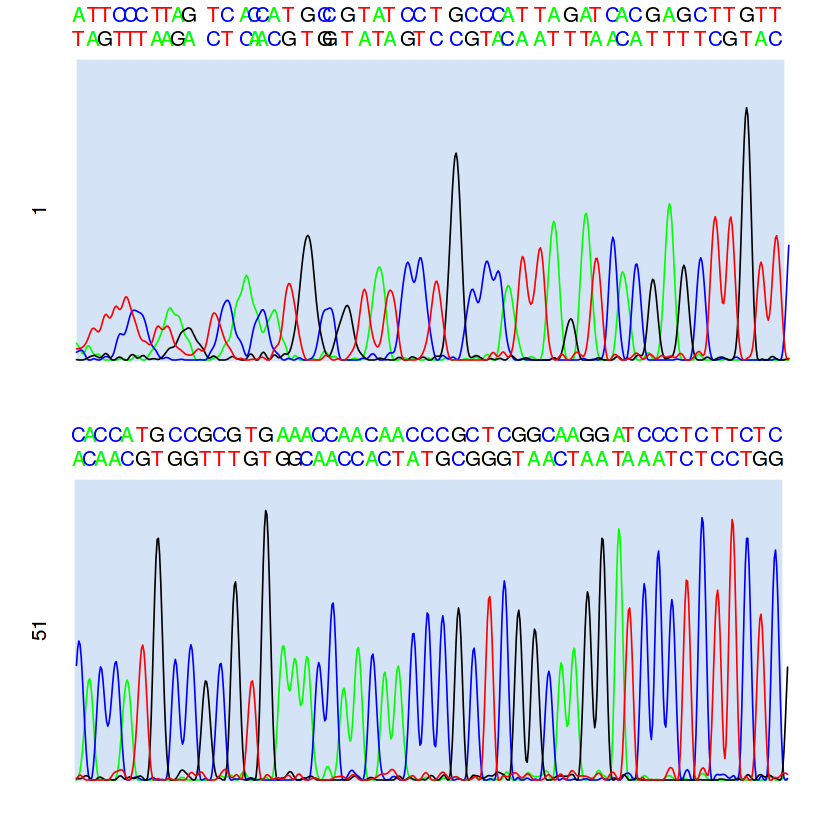
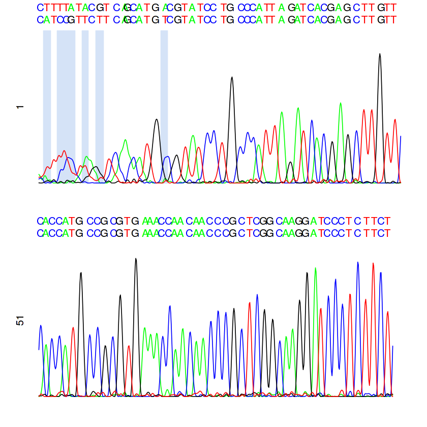
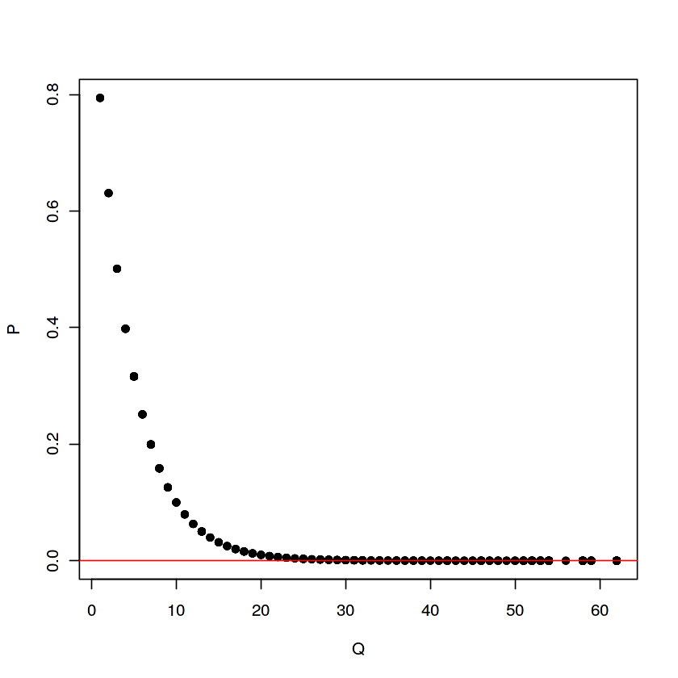
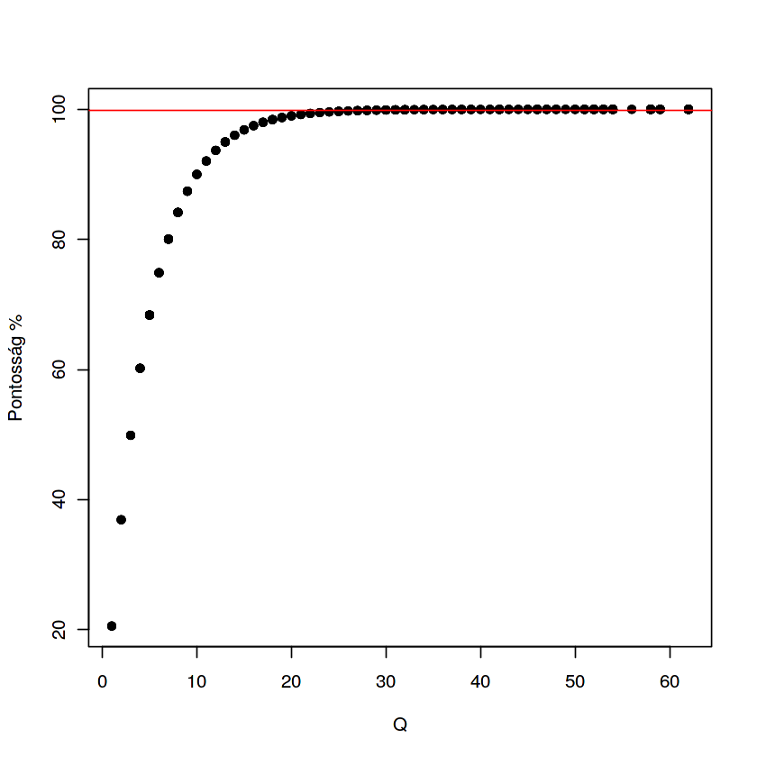

Kapilláris szekvenálás III.
===========================

.. code:: r

    # R
    library(sangerseqR)
    
    #getwd()
    setwd('data')
    #getwd()
    #list.files()
    
    abif.F = read.abif('sangerF.ab1')
    abif.R = read.abif('sangerR.ab1')

.. parsed-literal::

    Loading required package: Biostrings
    Loading required package: BiocGenerics
    Loading required package: parallel
    
    Attaching package: ‘BiocGenerics’
    
    The following objects are masked from ‘package:parallel’:
    
        clusterApply, clusterApplyLB, clusterCall, clusterEvalQ,
        clusterExport, clusterMap, parApply, parCapply, parLapply,
        parLapplyLB, parRapply, parSapply, parSapplyLB
    
    The following objects are masked from ‘package:stats’:
    
        IQR, mad, sd, var, xtabs
    
    The following objects are masked from ‘package:base’:
    
        anyDuplicated, append, as.data.frame, cbind, colMeans, colnames,
        colSums, do.call, duplicated, eval, evalq, Filter, Find, get, grep,
        grepl, intersect, is.unsorted, lapply, lengths, Map, mapply, match,
        mget, order, paste, pmax, pmax.int, pmin, pmin.int, Position, rank,
        rbind, Reduce, rowMeans, rownames, rowSums, sapply, setdiff, sort,
        table, tapply, union, unique, unsplit, which, which.max, which.min
    
    Loading required package: S4Vectors
    Loading required package: stats4
    
    Attaching package: ‘S4Vectors’
    
    The following object is masked from ‘package:base’:
    
        expand.grid
    
    Loading required package: IRanges
    Loading required package: XVector
    
    Attaching package: ‘Biostrings’
    
    The following object is masked from ‘package:base’:
    
        strsplit
    
    Warning message in read.abif("sangerF.ab1"):
    “unimplemented legacy type found in file”Warning message in read.abif("sangerR.ab1"):
    “unimplemented legacy type found in file”

.. code:: r

    # az elsődleges szekvencia, amelyet módosíthattak 
    abif.F@data$PBAS.1

.. raw:: html

    'ATTCCCTTAGTCACCATGCCGTATCCTGCCCATTAGATCACGAGCTTGTTCACCATGCCGCGTGAAACCAACAACCCGCTCGGCAAGGATCCCTCTTCTCGCTCCGGGCCCATTAACTGTGGGGGTAACTATTTAATGAACTTTAACAGGCATCTGGTTCTTTCTTCAGGGCCATCTCATCTAAAATCGCCCACTCTTTCCCCTTAAATAAGACATCTCGATGGACTAATGACTAATCAGCCCATGCCCAACATAACTGTGATGTCATGCATTTGGTATTTTTTAATTTTTGGGGATGCTTGGACTCAGCTATGGCCGTCTGAGGCCCCGACCCGGAGCATGAATTGTAGCTGGACTTAACTGCATCTTGAGCATCCTCATAATGGTAAGCATGGGCATAATATAATTAATGGTCACAGGACATATCTGCTGTATCGTGCATTTATATATTCTTTTTCCCCCCTTCCCCTTAAATATTTATCACCATTTTTAACACGCTTCCCCCTAGATATTAATATAAATTTATCCCGCCCTCAATACTCAAATTCATACTCCAACCGAAGTAAATATATAGGCACCTGGGTCACATGCATAACGCATAGTTAATGTAGCTTAAACTTAAAGCAAGGCACTGAAAATGCCTAGATGAGTCTACTGACTCCATGAACATATAGGTTTGGTCCCAGCCTTCCTGTTAACTTTCAATAGACTTATACATGCAAGCATCCACGCCCCGGTGAGTAACGCCCTTCGAATCACACAGGACTAAAGGAGCAGGTATCAAGCACACACTCTTGTAGCTCACAACGCCTTGCTTAACCACACCCCCACGGGAGACAGCAGTAACAAAAATTAAGCCATAAACGAAAGTTTGACTAAGCCATATTGACCAGGGTTGGTAAATCTCGTGCCAGCCACCGCGGTCATACGATTGACCCAAGCTAACAGGAGTACGGCGTAAAGCGTGTTAAGCATCATACTAATAGAGTTAAATTTTAATTAAACTGTAAAAAAGCCCATAATTATAACAAAAAATAAATGAACGAAAGTAACCCTACATAGCTTGATTACACATAGCTAGACCGGACCTGGATAGATACCCCACTATGCTTAGGTCCCTTAAACCACCAGAT'

.. code:: r

    nchar(abif.F@data$PBAS.1)

.. raw:: html

    1133

.. code:: r

    # mindig az eredeti elsődleges szekvencia
    abif.F@data$PBAS.2

.. raw:: html

    'ATTCCCTTAGTCACCATGCCGTATCCTGCCCATTAGATCACGAGCTTGTTCACCATGCCGCGTGAAACCAACAACCCGCTCGGCAAGGATCCCTCTTCTCGCTCCGGGCCCATTAACTGTGGGGGTAACTATTTAATGAACTTTAACAGGCATCTGGTTCTTTCTTCAGGGCCATCTCATCTAAAATCGCCCACTCTTTCCCCTTAAATAAGACATCTCGATGGACTAATGACTAATCAGCCCATGCCCAACATAACTGTGATGTCATGCATTTGGTATTTTTTAATTTTTGGGGATGCTTGGACTCAGCTATGGCCGTCTGAGGCCCCGACCCGGAGCATGAATTGTAGCTGGACTTAACTGCATCTTGAGCATCCTCATAATGGTAAGCATGGGCATAATATAATTAATGGTCACAGGACATATCTGCTGTATCGTGCATTTATATATTCTTTTTCCCCCCTTCCCCTTAAATATTTATCACCATTTTTAACACGCTTCCCCCTAGATATTAATATAAATTTATCCCGCCCTCAATACTCAAATTCATACTCCAACCGAAGTAAATATATAGGCACCTGGGTCACATGCATAACGCATAGTTAATGTAGCTTAAACTTAAAGCAAGGCACTGAAAATGCCTAGATGAGTCTACTGACTCCATGAACATATAGGTTTGGTCCCAGCCTTCCTGTTAACTTTCAATAGACTTATACATGCAAGCATCCACGCCCCGGTGAGTAACGCCCTTCGAATCACACAGGACTAAAGGAGCAGGTATCAAGCACACACTCTTGTAGCTCACAACGCCTTGCTTAACCACACCCCCACGGGAGACAGCAGTAACAAAAATTAAGCCATAAACGAAAGTTTGACTAAGCCATATTGACCAGGGTTGGTAAATCTCGTGCCAGCCACCGCGGTCATACGATTGACCCAAGCTAACAGGAGTACGGCGTAAAGCGTGTTAAGCATCATACTAATAGAGTTAAATTTTAATTAAACTGTAAAAAAGCCCATAATTATAACAAAAAATAAATGAACGAAAGTAACCCTACATAGCTTGATTACACATAGCTAGACCGGACCTGGATAGATACCCCACTATGCTTAGGTCCCTTAAACCACCAGAT'

.. code:: r

    abif.F@data$PBAS.1 == abif.F@data$PBAS.2

.. raw:: html

    TRUE

.. code:: r

    # a másodlagos szekvencia
    abif.F@data$P2BA.1

.. raw:: html

    'TAGTTTAAGACTCAACGTGGTATAGTCCGTACAATTTAACATTTTCGTACACAACGTGGTTTGTGGCAACCACTATGCGGGTAACTAATAAATCTCCTGGTGCGACAAAAATAATGGGAGCTAAAGTTAATAAACTAATTTCAATGAGTTTTGGGTTGCTCACGGCGGCTTATTCTCTTAAATTTTCTCAAATTCTCCCATTTAATTGAGGACATCACGCGGAAGAAGGGACTCCGGACCGTTTGCGAACCACAGCGGAGAGGAGGGGCTTGGGATATAAAAAATTAGGGGAAATTGTTGGTATTAATCAAGGTCGGTCGGAGACGTAAACATTAAGAATGATTGGTAGCGGAAGTAAGTGGCTTCTGAAGCGCCTTCATAGGGAAAGGAGGGCTAGTAGGATATTAAGGGCTCATAGAACAGAGAGGTGGAACGGAGAATAAATATATGCTCGGCCAGGGTTCCTTGTAATTTATAAACGACAATAAAAATCACGTTCCGGAATAGATATAATTATATTTGAAGCGGGCATAAACTACTAAGTTACTTACTCGACCAGAGTTATTTATATAGTCGCTGGCTTGACAGGCATACCGCGCAGTGATGGTAGCGAATTTTAATCGCAGGACGCAGAGGTTGCGTAGATAAGAGTACAGCCACTACAACCATATAGATGGGTTGTGACCGTCCTTGTGATCACCCACTAGACTCATACACACACGCACATACACGGGGCTATGAATCACGTTCCTCGTAACACAGAACAATGGAAGAGGATGTAACGCGCACACTCTCGTAGATAACACCGCGTCGTTCATCAACACAAGGACGCCAGACAGAAGAATCACTTTTAATGCGACATCCAAGGGTGGGACAATGAGACATAGTCAACCTTGGTTATTTCTCTCGCGACCGACAGCGCTCACACAATAGTCATACGCTATCACAAGAACACCGCATCGAGCGTGATGAGTCTCACAATTATAGAGATGTACCATTAATGCTGTATGGGGGAGAATATTAATATCACGGTTTATGTGTGCACGGGTATCATTATACATATGGTTAACACATATATATACAACACATGTTTAGAGATAATACTATGTGAATAACGTTCGTGCAACAACATAB'

.. code:: r

    abif.F@data$PBAS.1 == abif.F@data$P2BA.1

.. raw:: html

    FALSE

.. code:: r

    # az intenzitásvektorokon belül a peak-eket meghatározó indexek
    abif.F@data$PLOC.1

.. raw:: html

    <ol class=list-inline>
    	<li>2</li>
    	<li>14</li>
    	<li>24</li>
    	<li>36</li>
    	<li>45</li>
    	<li>54</li>
    	<li>67</li>
    	<li>75</li>
    	<li>84</li>
    	<li>93</li>
    	<li>114</li>
    	<li>125</li>
    	<li>141</li>
    	<li>148</li>
    	<li>154</li>
    	<li>164</li>
    	<li>176</li>
    	<li>192</li>
    	<li>206</li>
    	<li>210</li>
    	<li>225</li>
    	<li>239</li>
    	<li>251</li>
    	<li>260</li>
    	<li>275</li>
    	<li>285</li>
    	<li>299</li>
    	<li>315</li>
    	<li>328</li>
    	<li>340</li>
    	<li>350</li>
    	<li>358</li>
    	<li>370</li>
    	<li>385</li>
    	<li>396</li>
    	<li>410</li>
    	<li>423</li>
    	<li>431</li>
    	<li>445</li>
    	<li>453</li>
    	<li>464</li>
    	<li>478</li>
    	<li>492</li>
    	<li>504</li>
    	<li>518</li>
    	<li>530</li>
    	<li>542</li>
    	<li>556</li>
    	<li>568</li>
    	<li>580</li>
    	<li>593</li>
    	<li>602</li>
    	<li>611</li>
    	<li>623</li>
    	<li>633</li>
    	<li>646</li>
    	<li>658</li>
    	<li>673</li>
    	<li>686</li>
    	<li>698</li>
    	<li>710</li>
    	<li>722</li>
    	<li>736</li>
    	<li>748</li>
    	<li>762</li>
    	<li>772</li>
    	<li>782</li>
    	<li>792</li>
    	<li>803</li>
    	<li>813</li>
    	<li>824</li>
    	<li>836</li>
    	<li>847</li>
    	<li>858</li>
    	<li>870</li>
    	<li>882</li>
    	<li>895</li>
    	<li>908</li>
    	<li>920</li>
    	<li>933</li>
    	<li>946</li>
    	<li>958</li>
    	<li>971</li>
    	<li>983</li>
    	<li>993</li>
    	<li>1003</li>
    	<li>1015</li>
    	<li>1027</li>
    	<li>1041</li>
    	<li>1049</li>
    	<li>1062</li>
    	<li>1074</li>
    	<li>1085</li>
    	<li>1097</li>
    	<li>1110</li>
    	<li>1123</li>
    	<li>1135</li>
    	<li>1147</li>
    	<li>1158</li>
    	<li>1171</li>
    	<li>1183</li>
    	<li>1194</li>
    	<li>1206</li>
    	<li>1218</li>
    	<li>1229</li>
    	<li>1241</li>
    	<li>1255</li>
    	<li>1267</li>
    	<li>1279</li>
    	<li>1290</li>
    	<li>1301</li>
    	<li>1311</li>
    	<li>1323</li>
    	<li>1336</li>
    	<li>1347</li>
    	<li>1358</li>
    	<li>1369</li>
    	<li>1381</li>
    	<li>1394</li>
    	<li>1406</li>
    	<li>1419</li>
    	<li>1433</li>
    	<li>1445</li>
    	<li>1458</li>
    	<li>1470</li>
    	<li>1481</li>
    	<li>1493</li>
    	<li>1503</li>
    	<li>1514</li>
    	<li>1526</li>
    	<li>1537</li>
    	<li>1549</li>
    	<li>1562</li>
    	<li>1575</li>
    	<li>1586</li>
    	<li>1597</li>
    	<li>1608</li>
    	<li>1622</li>
    	<li>1634</li>
    	<li>1645</li>
    	<li>1656</li>
    	<li>1668</li>
    	<li>1680</li>
    	<li>1693</li>
    	<li>1704</li>
    	<li>1716</li>
    	<li>1727</li>
    	<li>1737</li>
    	<li>1750</li>
    	<li>1763</li>
    	<li>1775</li>
    	<li>1787</li>
    	<li>1797</li>
    	<li>1810</li>
    	<li>1822</li>
    	<li>1835</li>
    	<li>1849</li>
    	<li>1860</li>
    	<li>1873</li>
    	<li>1884</li>
    	<li>1896</li>
    	<li>1908</li>
    	<li>1920</li>
    	<li>1932</li>
    	<li>1944</li>
    	<li>1956</li>
    	<li>1967</li>
    	<li>1977</li>
    	<li>1990</li>
    	<li>2002</li>
    	<li>2014</li>
    	<li>2026</li>
    	<li>2038</li>
    	<li>2048</li>
    	<li>2060</li>
    	<li>2072</li>
    	<li>2085</li>
    	<li>2097</li>
    	<li>2108</li>
    	<li>2119</li>
    	<li>2131</li>
    	<li>2144</li>
    	<li>2155</li>
    	<li>2166</li>
    	<li>2178</li>
    	<li>2189</li>
    	<li>2200</li>
    	<li>2212</li>
    	<li>2225</li>
    	<li>2237</li>
    	<li>2249</li>
    	<li>2260</li>
    	<li>2271</li>
    	<li>2282</li>
    	<li>2295</li>
    	<li>2307</li>
    	<li>2320</li>
    	<li>2332</li>
    	<li>2344</li>
    	<li>2356</li>
    	<li>2367</li>
    	<li>2378</li>
    	<li>2390</li>
    	<li>2402</li>
    	<li>2415</li>
    	<li>2426</li>
    	<li>2437</li>
    	<li>2448</li>
    	<li>2459</li>
    	<li>2470</li>
    	<li>2481</li>
    	<li>2494</li>
    	<li>2506</li>
    	<li>2517</li>
    	<li>2528</li>
    	<li>2539</li>
    	<li>2552</li>
    	<li>2564</li>
    	<li>2577</li>
    	<li>2589</li>
    	<li>2602</li>
    	<li>2613</li>
    	<li>2625</li>
    	<li>2638</li>
    	<li>2650</li>
    	<li>2661</li>
    	<li>2673</li>
    	<li>2684</li>
    	<li>2695</li>
    	<li>2707</li>
    	<li>2720</li>
    	<li>2732</li>
    	<li>2743</li>
    	<li>2755</li>
    	<li>2766</li>
    	<li>2778</li>
    	<li>2790</li>
    	<li>2802</li>
    	<li>2813</li>
    	<li>2826</li>
    	<li>2838</li>
    	<li>2850</li>
    	<li>2862</li>
    	<li>2873</li>
    	<li>2885</li>
    	<li>2897</li>
    	<li>2909</li>
    	<li>2922</li>
    	<li>2933</li>
    	<li>2944</li>
    	<li>2955</li>
    	<li>2967</li>
    	<li>2978</li>
    	<li>2990</li>
    	<li>3001</li>
    	<li>3013</li>
    	<li>3025</li>
    	<li>3037</li>
    	<li>3050</li>
    	<li>3062</li>
    	<li>3075</li>
    	<li>3087</li>
    	<li>3098</li>
    	<li>3111</li>
    	<li>3122</li>
    	<li>3134</li>
    	<li>3145</li>
    	<li>3156</li>
    	<li>3169</li>
    	<li>3181</li>
    	<li>3192</li>
    	<li>3204</li>
    	<li>3216</li>
    	<li>3228</li>
    	<li>3241</li>
    	<li>3254</li>
    	<li>3266</li>
    	<li>3277</li>
    	<li>3288</li>
    	<li>3300</li>
    	<li>3312</li>
    	<li>3324</li>
    	<li>3336</li>
    	<li>3348</li>
    	<li>3359</li>
    	<li>3369</li>
    	<li>3381</li>
    	<li>3393</li>
    	<li>3405</li>
    	<li>3418</li>
    	<li>3429</li>
    	<li>3443</li>
    	<li>3455</li>
    	<li>3468</li>
    	<li>3480</li>
    	<li>3492</li>
    	<li>3502</li>
    	<li>3514</li>
    	<li>3526</li>
    	<li>3538</li>
    	<li>3550</li>
    	<li>3563</li>
    	<li>3576</li>
    	<li>3588</li>
    	<li>3599</li>
    	<li>3611</li>
    	<li>3623</li>
    	<li>3634</li>
    	<li>3646</li>
    	<li>3659</li>
    	<li>3671</li>
    	<li>3683</li>
    	<li>3694</li>
    	<li>3706</li>
    	<li>3719</li>
    	<li>3731</li>
    	<li>3743</li>
    	<li>3756</li>
    	<li>3768</li>
    	<li>3780</li>
    	<li>3792</li>
    	<li>3804</li>
    	<li>3816</li>
    	<li>3828</li>
    	<li>3840</li>
    	<li>3852</li>
    	<li>3864</li>
    	<li>3875</li>
    	<li>3887</li>
    	<li>3899</li>
    	<li>3912</li>
    	<li>3923</li>
    	<li>3935</li>
    	<li>3947</li>
    	<li>3959</li>
    	<li>3972</li>
    	<li>3985</li>
    	<li>3995</li>
    	<li>4008</li>
    	<li>4019</li>
    	<li>4030</li>
    	<li>4042</li>
    	<li>4055</li>
    	<li>4066</li>
    	<li>4077</li>
    	<li>4089</li>
    	<li>4102</li>
    	<li>4113</li>
    	<li>4125</li>
    	<li>4138</li>
    	<li>4149</li>
    	<li>4161</li>
    	<li>4174</li>
    	<li>4187</li>
    	<li>4199</li>
    	<li>4210</li>
    	<li>4222</li>
    	<li>4234</li>
    	<li>4245</li>
    	<li>4257</li>
    	<li>4268</li>
    	<li>4280</li>
    	<li>4293</li>
    	<li>4305</li>
    	<li>4316</li>
    	<li>4328</li>
    	<li>4340</li>
    	<li>4352</li>
    	<li>4364</li>
    	<li>4377</li>
    	<li>4389</li>
    	<li>4401</li>
    	<li>4413</li>
    	<li>4424</li>
    	<li>4435</li>
    	<li>4447</li>
    	<li>4459</li>
    	<li>4471</li>
    	<li>4483</li>
    	<li>4495</li>
    	<li>4506</li>
    	<li>4517</li>
    	<li>4529</li>
    	<li>4541</li>
    	<li>4553</li>
    	<li>4566</li>
    	<li>4578</li>
    	<li>4589</li>
    	<li>4601</li>
    	<li>4613</li>
    	<li>4625</li>
    	<li>4636</li>
    	<li>4648</li>
    	<li>4660</li>
    	<li>4672</li>
    	<li>4686</li>
    	<li>4698</li>
    	<li>4709</li>
    	<li>4720</li>
    	<li>4732</li>
    	<li>4744</li>
    	<li>4755</li>
    	<li>4767</li>
    	<li>4778</li>
    	<li>4790</li>
    	<li>4802</li>
    	<li>4814</li>
    	<li>4826</li>
    	<li>4838</li>
    	<li>4850</li>
    	<li>4861</li>
    	<li>4875</li>
    	<li>4887</li>
    	<li>4899</li>
    	<li>4911</li>
    	<li>4922</li>
    	<li>4934</li>
    	<li>4944</li>
    	<li>4957</li>
    	<li>4970</li>
    	<li>4983</li>
    	<li>4994</li>
    	<li>5005</li>
    	<li>5017</li>
    	<li>5028</li>
    	<li>5040</li>
    	<li>5053</li>
    	<li>5065</li>
    	<li>5078</li>
    	<li>5090</li>
    	<li>5102</li>
    	<li>5115</li>
    	<li>5127</li>
    	<li>5138</li>
    	<li>5149</li>
    	<li>5161</li>
    	<li>5174</li>
    	<li>5186</li>
    	<li>5198</li>
    	<li>5210</li>
    	<li>5221</li>
    	<li>5233</li>
    	<li>5245</li>
    	<li>5257</li>
    	<li>5268</li>
    	<li>5280</li>
    	<li>5291</li>
    	<li>5303</li>
    	<li>5314</li>
    	<li>5326</li>
    	<li>5338</li>
    	<li>5351</li>
    	<li>5363</li>
    	<li>5375</li>
    	<li>5388</li>
    	<li>5400</li>
    	<li>5412</li>
    	<li>5423</li>
    	<li>5435</li>
    	<li>5446</li>
    	<li>5458</li>
    	<li>5470</li>
    	<li>5482</li>
    	<li>5494</li>
    	<li>5507</li>
    	<li>5518</li>
    	<li>5530</li>
    	<li>5542</li>
    	<li>5553</li>
    	<li>5565</li>
    	<li>5578</li>
    	<li>5589</li>
    	<li>5600</li>
    	<li>5612</li>
    	<li>5623</li>
    	<li>5634</li>
    	<li>5646</li>
    	<li>5658</li>
    	<li>5670</li>
    	<li>5682</li>
    	<li>5693</li>
    	<li>5706</li>
    	<li>5717</li>
    	<li>5729</li>
    	<li>5741</li>
    	<li>5752</li>
    	<li>5765</li>
    	<li>5778</li>
    	<li>5790</li>
    	<li>5802</li>
    	<li>5815</li>
    	<li>5825</li>
    	<li>5837</li>
    	<li>5849</li>
    	<li>5859</li>
    	<li>5872</li>
    	<li>5885</li>
    	<li>5897</li>
    	<li>5910</li>
    	<li>5922</li>
    	<li>5934</li>
    	<li>5946</li>
    	<li>5958</li>
    	<li>5970</li>
    	<li>5982</li>
    	<li>5995</li>
    	<li>6006</li>
    	<li>6018</li>
    	<li>6031</li>
    	<li>6042</li>
    	<li>6053</li>
    	<li>6064</li>
    	<li>6077</li>
    	<li>6088</li>
    	<li>6101</li>
    	<li>6112</li>
    	<li>6124</li>
    	<li>6136</li>
    	<li>6147</li>
    	<li>6160</li>
    	<li>6172</li>
    	<li>6184</li>
    	<li>6196</li>
    	<li>6209</li>
    	<li>6220</li>
    	<li>6232</li>
    	<li>6245</li>
    	<li>6257</li>
    	<li>6270</li>
    	<li>6282</li>
    	<li>6294</li>
    	<li>6307</li>
    	<li>6319</li>
    	<li>6331</li>
    	<li>6344</li>
    	<li>6355</li>
    	<li>6366</li>
    	<li>6378</li>
    	<li>6390</li>
    	<li>6402</li>
    	<li>6414</li>
    	<li>6427</li>
    	<li>6438</li>
    	<li>6449</li>
    	<li>6462</li>
    	<li>6474</li>
    	<li>6486</li>
    	<li>6499</li>
    	<li>6510</li>
    	<li>6522</li>
    	<li>6534</li>
    	<li>6546</li>
    	<li>6559</li>
    	<li>6571</li>
    	<li>6584</li>
    	<li>6595</li>
    	<li>6607</li>
    	<li>6619</li>
    	<li>6631</li>
    	<li>6644</li>
    	<li>6657</li>
    	<li>6669</li>
    	<li>6681</li>
    	<li>6693</li>
    	<li>6705</li>
    	<li>6717</li>
    	<li>6729</li>
    	<li>6740</li>
    	<li>6752</li>
    	<li>6763</li>
    	<li>6776</li>
    	<li>6788</li>
    	<li>6800</li>
    	<li>6813</li>
    	<li>6827</li>
    	<li>6839</li>
    	<li>6850</li>
    	<li>6862</li>
    	<li>6875</li>
    	<li>6888</li>
    	<li>6900</li>
    	<li>6914</li>
    	<li>6926</li>
    	<li>6939</li>
    	<li>6951</li>
    	<li>6962</li>
    	<li>6974</li>
    	<li>6985</li>
    	<li>6997</li>
    	<li>7010</li>
    	<li>7023</li>
    	<li>7034</li>
    	<li>7047</li>
    	<li>7058</li>
    	<li>7071</li>
    	<li>7083</li>
    	<li>7096</li>
    	<li>7108</li>
    	<li>7120</li>
    	<li>7132</li>
    	<li>7144</li>
    	<li>7157</li>
    	<li>7169</li>
    	<li>7182</li>
    	<li>7194</li>
    	<li>7206</li>
    	<li>7218</li>
    	<li>7231</li>
    	<li>7243</li>
    	<li>7255</li>
    	<li>7268</li>
    	<li>7280</li>
    	<li>7293</li>
    	<li>7305</li>
    	<li>7317</li>
    	<li>7329</li>
    	<li>7341</li>
    	<li>7353</li>
    	<li>7365</li>
    	<li>7378</li>
    	<li>7390</li>
    	<li>7402</li>
    	<li>7414</li>
    	<li>7427</li>
    	<li>7439</li>
    	<li>7451</li>
    	<li>7463</li>
    	<li>7475</li>
    	<li>7488</li>
    	<li>7500</li>
    	<li>7512</li>
    	<li>7524</li>
    	<li>7537</li>
    	<li>7549</li>
    	<li>7563</li>
    	<li>7575</li>
    	<li>7587</li>
    	<li>7599</li>
    	<li>7611</li>
    	<li>7624</li>
    	<li>7635</li>
    	<li>7648</li>
    	<li>7661</li>
    	<li>7673</li>
    	<li>7686</li>
    	<li>7699</li>
    	<li>7710</li>
    	<li>7723</li>
    	<li>7736</li>
    	<li>7748</li>
    	<li>7760</li>
    	<li>7772</li>
    	<li>7785</li>
    	<li>7797</li>
    	<li>7808</li>
    	<li>7821</li>
    	<li>7834</li>
    	<li>7847</li>
    	<li>7859</li>
    	<li>7872</li>
    	<li>7884</li>
    	<li>7897</li>
    	<li>7908</li>
    	<li>7920</li>
    	<li>7933</li>
    	<li>7946</li>
    	<li>7959</li>
    	<li>7970</li>
    	<li>7982</li>
    	<li>7994</li>
    	<li>8006</li>
    	<li>8018</li>
    	<li>8030</li>
    	<li>8043</li>
    	<li>8057</li>
    	<li>8069</li>
    	<li>8082</li>
    	<li>8095</li>
    	<li>8107</li>
    	<li>8122</li>
    	<li>8132</li>
    	<li>8145</li>
    	<li>8158</li>
    	<li>8170</li>
    	<li>8181</li>
    	<li>8193</li>
    	<li>8206</li>
    	<li>8220</li>
    	<li>8232</li>
    	<li>8245</li>
    	<li>8257</li>
    	<li>8270</li>
    	<li>8282</li>
    	<li>8295</li>
    	<li>8307</li>
    	<li>8321</li>
    	<li>8332</li>
    	<li>8344</li>
    	<li>8356</li>
    	<li>8368</li>
    	<li>8381</li>
    	<li>8395</li>
    	<li>8407</li>
    	<li>8417</li>
    	<li>8430</li>
    	<li>8442</li>
    	<li>8455</li>
    	<li>8468</li>
    	<li>8481</li>
    	<li>8493</li>
    	<li>8505</li>
    	<li>8518</li>
    	<li>8530</li>
    	<li>8542</li>
    	<li>8555</li>
    	<li>8567</li>
    	<li>8579</li>
    	<li>8591</li>
    	<li>8604</li>
    	<li>8618</li>
    	<li>8630</li>
    	<li>8642</li>
    	<li>8655</li>
    	<li>8668</li>
    	<li>8680</li>
    	<li>8692</li>
    	<li>8705</li>
    	<li>8718</li>
    	<li>8730</li>
    	<li>8742</li>
    	<li>8755</li>
    	<li>8768</li>
    	<li>8782</li>
    	<li>8794</li>
    	<li>8807</li>
    	<li>8819</li>
    	<li>8834</li>
    	<li>8846</li>
    	<li>8858</li>
    	<li>8873</li>
    	<li>8884</li>
    	<li>8897</li>
    	<li>8910</li>
    	<li>8922</li>
    	<li>8933</li>
    	<li>8946</li>
    	<li>8959</li>
    	<li>8972</li>
    	<li>8985</li>
    	<li>8998</li>
    	<li>9012</li>
    	<li>9024</li>
    	<li>9037</li>
    	<li>9050</li>
    	<li>9062</li>
    	<li>9074</li>
    	<li>9087</li>
    	<li>9099</li>
    	<li>9111</li>
    	<li>9123</li>
    	<li>9136</li>
    	<li>9148</li>
    	<li>9160</li>
    	<li>9174</li>
    	<li>9189</li>
    	<li>9201</li>
    	<li>9213</li>
    	<li>9226</li>
    	<li>9239</li>
    	<li>9263</li>
    	<li>9276</li>
    	<li>9290</li>
    	<li>9303</li>
    	<li>9316</li>
    	<li>9328</li>
    	<li>9341</li>
    	<li>9353</li>
    	<li>9367</li>
    	<li>9380</li>
    	<li>9393</li>
    	<li>9404</li>
    	<li>9418</li>
    	<li>9430</li>
    	<li>9442</li>
    	<li>9456</li>
    	<li>9469</li>
    	<li>9482</li>
    	<li>9494</li>
    	<li>9506</li>
    	<li>9519</li>
    	<li>9531</li>
    	<li>9544</li>
    	<li>9558</li>
    	<li>9571</li>
    	<li>9585</li>
    	<li>9599</li>
    	<li>9611</li>
    	<li>9625</li>
    	<li>9638</li>
    	<li>9650</li>
    	<li>9663</li>
    	<li>9676</li>
    	<li>9689</li>
    	<li>9701</li>
    	<li>9713</li>
    	<li>9725</li>
    	<li>9738</li>
    	<li>9751</li>
    	<li>9764</li>
    	<li>9777</li>
    	<li>9791</li>
    	<li>9805</li>
    	<li>9819</li>
    	<li>9831</li>
    	<li>9845</li>
    	<li>9857</li>
    	<li>9872</li>
    	<li>9882</li>
    	<li>9895</li>
    	<li>9909</li>
    	<li>9920</li>
    	<li>9933</li>
    	<li>9946</li>
    	<li>9959</li>
    	<li>9972</li>
    	<li>9984</li>
    	<li>9998</li>
    	<li>10011</li>
    	<li>10024</li>
    	<li>10037</li>
    	<li>10050</li>
    	<li>10064</li>
    	<li>10077</li>
    	<li>10089</li>
    	<li>10106</li>
    	<li>10116</li>
    	<li>10132</li>
    	<li>10143</li>
    	<li>10157</li>
    	<li>10169</li>
    	<li>10183</li>
    	<li>10196</li>
    	<li>10209</li>
    	<li>10223</li>
    	<li>10236</li>
    	<li>10246</li>
    	<li>10261</li>
    	<li>10275</li>
    	<li>10288</li>
    	<li>10301</li>
    	<li>10313</li>
    	<li>10326</li>
    	<li>10339</li>
    	<li>10352</li>
    	<li>10367</li>
    	<li>10378</li>
    	<li>10393</li>
    	<li>10407</li>
    	<li>10419</li>
    	<li>10432</li>
    	<li>10445</li>
    	<li>10459</li>
    	<li>10472</li>
    	<li>10485</li>
    	<li>10498</li>
    	<li>10512</li>
    	<li>10526</li>
    	<li>10539</li>
    	<li>10552</li>
    	<li>10566</li>
    	<li>10579</li>
    	<li>10593</li>
    	<li>10606</li>
    	<li>10620</li>
    	<li>10634</li>
    	<li>10646</li>
    	<li>10660</li>
    	<li>10673</li>
    	<li>10687</li>
    	<li>10699</li>
    	<li>10713</li>
    	<li>10728</li>
    	<li>10741</li>
    	<li>10754</li>
    	<li>10767</li>
    	<li>10779</li>
    	<li>10795</li>
    	<li>10808</li>
    	<li>10823</li>
    	<li>10835</li>
    	<li>10850</li>
    	<li>10863</li>
    	<li>10885</li>
    	<li>10895</li>
    	<li>10904</li>
    	<li>10917</li>
    	<li>10933</li>
    	<li>10945</li>
    	<li>10961</li>
    	<li>10975</li>
    	<li>10987</li>
    	<li>11000</li>
    	<li>11013</li>
    	<li>11028</li>
    	<li>11042</li>
    	<li>11056</li>
    	<li>11070</li>
    	<li>11084</li>
    	<li>11099</li>
    	<li>11113</li>
    	<li>11126</li>
    	<li>11142</li>
    	<li>11153</li>
    	<li>11167</li>
    	<li>11180</li>
    	<li>11196</li>
    	<li>11209</li>
    	<li>11221</li>
    	<li>11236</li>
    	<li>11251</li>
    	<li>11266</li>
    	<li>11279</li>
    	<li>11294</li>
    	<li>11310</li>
    	<li>11324</li>
    	<li>11338</li>
    	<li>11351</li>
    	<li>11365</li>
    	<li>11378</li>
    	<li>11392</li>
    	<li>11407</li>
    	<li>11423</li>
    	<li>11436</li>
    	<li>11450</li>
    	<li>11466</li>
    	<li>11477</li>
    	<li>11492</li>
    	<li>11507</li>
    	<li>11521</li>
    	<li>11530</li>
    	<li>11549</li>
    	<li>11565</li>
    	<li>11580</li>
    	<li>11593</li>
    	<li>11605</li>
    	<li>11621</li>
    	<li>11635</li>
    	<li>11658</li>
    	<li>11667</li>
    	<li>11681</li>
    	<li>11695</li>
    	<li>11710</li>
    	<li>11724</li>
    	<li>11737</li>
    	<li>11760</li>
    	<li>11769</li>
    	<li>11783</li>
    	<li>11798</li>
    	<li>11815</li>
    	<li>11829</li>
    	<li>11843</li>
    	<li>11857</li>
    	<li>11871</li>
    	<li>11886</li>
    	<li>11901</li>
    	<li>11917</li>
    	<li>11932</li>
    	<li>11951</li>
    	<li>11961</li>
    	<li>11979</li>
    	<li>12001</li>
    	<li>12019</li>
    	<li>12035</li>
    	<li>12050</li>
    	<li>12064</li>
    	<li>12080</li>
    	<li>12095</li>
    	<li>12109</li>
    	<li>12124</li>
    	<li>12138</li>
    	<li>12155</li>
    	<li>12173</li>
    	<li>12194</li>
    	<li>12215</li>
    	<li>12230</li>
    	<li>12246</li>
    	<li>12263</li>
    	<li>12278</li>
    	<li>12298</li>
    	<li>12307</li>
    	<li>12327</li>
    	<li>12338</li>
    	<li>12349</li>
    	<li>12373</li>
    	<li>12387</li>
    	<li>12401</li>
    	<li>12415</li>
    	<li>12433</li>
    	<li>12442</li>
    	<li>12468</li>
    	<li>12477</li>
    	<li>12496</li>
    	<li>12510</li>
    	<li>12523</li>
    	<li>12540</li>
    	<li>12558</li>
    	<li>12574</li>
    	<li>12594</li>
    	<li>12610</li>
    	<li>12629</li>
    	<li>12639</li>
    	<li>12649</li>
    	<li>12658</li>
    	<li>12668</li>
    	<li>12686</li>
    	<li>12703</li>
    	<li>12712</li>
    	<li>12722</li>
    	<li>12737</li>
    	<li>12753</li>
    	<li>12769</li>
    	<li>12778</li>
    	<li>12808</li>
    	<li>12819</li>
    	<li>12836</li>
    	<li>12853</li>
    	<li>12870</li>
    	<li>12882</li>
    	<li>12902</li>
    	<li>12921</li>
    	<li>12934</li>
    	<li>12946</li>
    	<li>12959</li>
    	<li>12971</li>
    	<li>12984</li>
    	<li>13003</li>
    	<li>13021</li>
    	<li>13033</li>
    	<li>13046</li>
    	<li>13072</li>
    	<li>13088</li>
    	<li>13104</li>
    	<li>13113</li>
    	<li>13125</li>
    	<li>13144</li>
    	<li>13165</li>
    	<li>13176</li>
    	<li>13186</li>
    	<li>13213</li>
    	<li>13235</li>
    	<li>13254</li>
    	<li>13264</li>
    	<li>13289</li>
    	<li>13304</li>
    	<li>13319</li>
    	<li>13345</li>
    	<li>13364</li>
    	<li>13380</li>
    	<li>13407</li>
    	<li>13437</li>
    	<li>13451</li>
    	<li>13472</li>
    	<li>13493</li>
    	<li>13511</li>
    	<li>13520</li>
    	<li>13531</li>
    	<li>13558</li>
    	<li>13571</li>
    	<li>13581</li>
    	<li>13599</li>
    	<li>13608</li>
    	<li>13627</li>
    	<li>13661</li>
    	<li>13690</li>
    	<li>13711</li>
    	<li>13729</li>
    	<li>13749</li>
    	<li>13773</li>
    	<li>13798</li>
    	<li>13825</li>
    	<li>13851</li>
    	<li>13879</li>
    	<li>13903</li>
    	<li>13928</li>
    	<li>13935</li>
    	<li>13973</li>
    	<li>13994</li>
    	<li>14023</li>
    	<li>14032</li>
    	<li>14054</li>
    	<li>14068</li>
    	<li>14087</li>
    	<li>14150</li>
    	<li>14184</li>
    	<li>14219</li>
    	<li>14233</li>
    	<li>14258</li>
    	<li>14292</li>
    	<li>14310</li>
    	<li>14339</li>
    	<li>14353</li>
    	<li>14381</li>
    	<li>14409</li>
    	<li>14437</li>
    	<li>14465</li>
    	<li>14497</li>
    	<li>14519</li>
    	<li>14550</li>
    	<li>14563</li>
    	<li>14601</li>
    	<li>14646</li>
    	<li>14655</li>
    	<li>14689</li>
    	<li>14699</li>
    	<li>14717</li>
    	<li>14759</li>
    	<li>14768</li>
    	<li>14789</li>
    	<li>14810</li>
    	<li>14839</li>
    	<li>14848</li>
    	<li>14882</li>
    	<li>14895</li>
    	<li>14922</li>
    	<li>14957</li>
    	<li>14985</li>
    	<li>14995</li>
    	<li>15013</li>
    	<li>15041</li>
    	<li>15080</li>
    	<li>15098</li>
    	<li>15136</li>
    	<li>15148</li>
    </ol>

.. code:: r

    length(abif.F@data$PLOC.1)

.. raw:: html

    1133

.. code:: r

    length(abif.F@data$PLOC.2)

.. raw:: html

    1133

.. code:: r

    abif.F@data$PLOC.2 == abif.F@data$PLOC.1

.. raw:: html

    <ol class=list-inline>
    	<li>TRUE</li>
    	<li>TRUE</li>
    	<li>TRUE</li>
    	<li>TRUE</li>
    	<li>TRUE</li>
    	<li>TRUE</li>
    	<li>TRUE</li>
    	<li>TRUE</li>
    	<li>TRUE</li>
    	<li>TRUE</li>
    	<li>TRUE</li>
    	<li>TRUE</li>
    	<li>TRUE</li>
    	<li>TRUE</li>
    	<li>TRUE</li>
    	<li>TRUE</li>
    	<li>TRUE</li>
    	<li>TRUE</li>
    	<li>TRUE</li>
    	<li>TRUE</li>
    	<li>TRUE</li>
    	<li>TRUE</li>
    	<li>TRUE</li>
    	<li>TRUE</li>
    	<li>TRUE</li>
    	<li>TRUE</li>
    	<li>TRUE</li>
    	<li>TRUE</li>
    	<li>TRUE</li>
    	<li>TRUE</li>
    	<li>TRUE</li>
    	<li>TRUE</li>
    	<li>TRUE</li>
    	<li>TRUE</li>
    	<li>TRUE</li>
    	<li>TRUE</li>
    	<li>TRUE</li>
    	<li>TRUE</li>
    	<li>TRUE</li>
    	<li>TRUE</li>
    	<li>TRUE</li>
    	<li>TRUE</li>
    	<li>TRUE</li>
    	<li>TRUE</li>
    	<li>TRUE</li>
    	<li>TRUE</li>
    	<li>TRUE</li>
    	<li>TRUE</li>
    	<li>TRUE</li>
    	<li>TRUE</li>
    	<li>TRUE</li>
    	<li>TRUE</li>
    	<li>TRUE</li>
    	<li>TRUE</li>
    	<li>TRUE</li>
    	<li>TRUE</li>
    	<li>TRUE</li>
    	<li>TRUE</li>
    	<li>TRUE</li>
    	<li>TRUE</li>
    	<li>TRUE</li>
    	<li>TRUE</li>
    	<li>TRUE</li>
    	<li>TRUE</li>
    	<li>TRUE</li>
    	<li>TRUE</li>
    	<li>TRUE</li>
    	<li>TRUE</li>
    	<li>TRUE</li>
    	<li>TRUE</li>
    	<li>TRUE</li>
    	<li>TRUE</li>
    	<li>TRUE</li>
    	<li>TRUE</li>
    	<li>TRUE</li>
    	<li>TRUE</li>
    	<li>TRUE</li>
    	<li>TRUE</li>
    	<li>TRUE</li>
    	<li>TRUE</li>
    	<li>TRUE</li>
    	<li>TRUE</li>
    	<li>TRUE</li>
    	<li>TRUE</li>
    	<li>TRUE</li>
    	<li>TRUE</li>
    	<li>TRUE</li>
    	<li>TRUE</li>
    	<li>TRUE</li>
    	<li>TRUE</li>
    	<li>TRUE</li>
    	<li>TRUE</li>
    	<li>TRUE</li>
    	<li>TRUE</li>
    	<li>TRUE</li>
    	<li>TRUE</li>
    	<li>TRUE</li>
    	<li>TRUE</li>
    	<li>TRUE</li>
    	<li>TRUE</li>
    	<li>TRUE</li>
    	<li>TRUE</li>
    	<li>TRUE</li>
    	<li>TRUE</li>
    	<li>TRUE</li>
    	<li>TRUE</li>
    	<li>TRUE</li>
    	<li>TRUE</li>
    	<li>TRUE</li>
    	<li>TRUE</li>
    	<li>TRUE</li>
    	<li>TRUE</li>
    	<li>TRUE</li>
    	<li>TRUE</li>
    	<li>TRUE</li>
    	<li>TRUE</li>
    	<li>TRUE</li>
    	<li>TRUE</li>
    	<li>TRUE</li>
    	<li>TRUE</li>
    	<li>TRUE</li>
    	<li>TRUE</li>
    	<li>TRUE</li>
    	<li>TRUE</li>
    	<li>TRUE</li>
    	<li>TRUE</li>
    	<li>TRUE</li>
    	<li>TRUE</li>
    	<li>TRUE</li>
    	<li>TRUE</li>
    	<li>TRUE</li>
    	<li>TRUE</li>
    	<li>TRUE</li>
    	<li>TRUE</li>
    	<li>TRUE</li>
    	<li>TRUE</li>
    	<li>TRUE</li>
    	<li>TRUE</li>
    	<li>TRUE</li>
    	<li>TRUE</li>
    	<li>TRUE</li>
    	<li>TRUE</li>
    	<li>TRUE</li>
    	<li>TRUE</li>
    	<li>TRUE</li>
    	<li>TRUE</li>
    	<li>TRUE</li>
    	<li>TRUE</li>
    	<li>TRUE</li>
    	<li>TRUE</li>
    	<li>TRUE</li>
    	<li>TRUE</li>
    	<li>TRUE</li>
    	<li>TRUE</li>
    	<li>TRUE</li>
    	<li>TRUE</li>
    	<li>TRUE</li>
    	<li>TRUE</li>
    	<li>TRUE</li>
    	<li>TRUE</li>
    	<li>TRUE</li>
    	<li>TRUE</li>
    	<li>TRUE</li>
    	<li>TRUE</li>
    	<li>TRUE</li>
    	<li>TRUE</li>
    	<li>TRUE</li>
    	<li>TRUE</li>
    	<li>TRUE</li>
    	<li>TRUE</li>
    	<li>TRUE</li>
    	<li>TRUE</li>
    	<li>TRUE</li>
    	<li>TRUE</li>
    	<li>TRUE</li>
    	<li>TRUE</li>
    	<li>TRUE</li>
    	<li>TRUE</li>
    	<li>TRUE</li>
    	<li>TRUE</li>
    	<li>TRUE</li>
    	<li>TRUE</li>
    	<li>TRUE</li>
    	<li>TRUE</li>
    	<li>TRUE</li>
    	<li>TRUE</li>
    	<li>TRUE</li>
    	<li>TRUE</li>
    	<li>TRUE</li>
    	<li>TRUE</li>
    	<li>TRUE</li>
    	<li>TRUE</li>
    	<li>TRUE</li>
    	<li>TRUE</li>
    	<li>TRUE</li>
    	<li>TRUE</li>
    	<li>TRUE</li>
    	<li>TRUE</li>
    	<li>TRUE</li>
    	<li>TRUE</li>
    	<li>TRUE</li>
    	<li>TRUE</li>
    	<li>TRUE</li>
    	<li>TRUE</li>
    	<li>TRUE</li>
    	<li>TRUE</li>
    	<li>TRUE</li>
    	<li>TRUE</li>
    	<li>TRUE</li>
    	<li>TRUE</li>
    	<li>TRUE</li>
    	<li>TRUE</li>
    	<li>TRUE</li>
    	<li>TRUE</li>
    	<li>TRUE</li>
    	<li>TRUE</li>
    	<li>TRUE</li>
    	<li>TRUE</li>
    	<li>TRUE</li>
    	<li>TRUE</li>
    	<li>TRUE</li>
    	<li>TRUE</li>
    	<li>TRUE</li>
    	<li>TRUE</li>
    	<li>TRUE</li>
    	<li>TRUE</li>
    	<li>TRUE</li>
    	<li>TRUE</li>
    	<li>TRUE</li>
    	<li>TRUE</li>
    	<li>TRUE</li>
    	<li>TRUE</li>
    	<li>TRUE</li>
    	<li>TRUE</li>
    	<li>TRUE</li>
    	<li>TRUE</li>
    	<li>TRUE</li>
    	<li>TRUE</li>
    	<li>TRUE</li>
    	<li>TRUE</li>
    	<li>TRUE</li>
    	<li>TRUE</li>
    	<li>TRUE</li>
    	<li>TRUE</li>
    	<li>TRUE</li>
    	<li>TRUE</li>
    	<li>TRUE</li>
    	<li>TRUE</li>
    	<li>TRUE</li>
    	<li>TRUE</li>
    	<li>TRUE</li>
    	<li>TRUE</li>
    	<li>TRUE</li>
    	<li>TRUE</li>
    	<li>TRUE</li>
    	<li>TRUE</li>
    	<li>TRUE</li>
    	<li>TRUE</li>
    	<li>TRUE</li>
    	<li>TRUE</li>
    	<li>TRUE</li>
    	<li>TRUE</li>
    	<li>TRUE</li>
    	<li>TRUE</li>
    	<li>TRUE</li>
    	<li>TRUE</li>
    	<li>TRUE</li>
    	<li>TRUE</li>
    	<li>TRUE</li>
    	<li>TRUE</li>
    	<li>TRUE</li>
    	<li>TRUE</li>
    	<li>TRUE</li>
    	<li>TRUE</li>
    	<li>TRUE</li>
    	<li>TRUE</li>
    	<li>TRUE</li>
    	<li>TRUE</li>
    	<li>TRUE</li>
    	<li>TRUE</li>
    	<li>TRUE</li>
    	<li>TRUE</li>
    	<li>TRUE</li>
    	<li>TRUE</li>
    	<li>TRUE</li>
    	<li>TRUE</li>
    	<li>TRUE</li>
    	<li>TRUE</li>
    	<li>TRUE</li>
    	<li>TRUE</li>
    	<li>TRUE</li>
    	<li>TRUE</li>
    	<li>TRUE</li>
    	<li>TRUE</li>
    	<li>TRUE</li>
    	<li>TRUE</li>
    	<li>TRUE</li>
    	<li>TRUE</li>
    	<li>TRUE</li>
    	<li>TRUE</li>
    	<li>TRUE</li>
    	<li>TRUE</li>
    	<li>TRUE</li>
    	<li>TRUE</li>
    	<li>TRUE</li>
    	<li>TRUE</li>
    	<li>TRUE</li>
    	<li>TRUE</li>
    	<li>TRUE</li>
    	<li>TRUE</li>
    	<li>TRUE</li>
    	<li>TRUE</li>
    	<li>TRUE</li>
    	<li>TRUE</li>
    	<li>TRUE</li>
    	<li>TRUE</li>
    	<li>TRUE</li>
    	<li>TRUE</li>
    	<li>TRUE</li>
    	<li>TRUE</li>
    	<li>TRUE</li>
    	<li>TRUE</li>
    	<li>TRUE</li>
    	<li>TRUE</li>
    	<li>TRUE</li>
    	<li>TRUE</li>
    	<li>TRUE</li>
    	<li>TRUE</li>
    	<li>TRUE</li>
    	<li>TRUE</li>
    	<li>TRUE</li>
    	<li>TRUE</li>
    	<li>TRUE</li>
    	<li>TRUE</li>
    	<li>TRUE</li>
    	<li>TRUE</li>
    	<li>TRUE</li>
    	<li>TRUE</li>
    	<li>TRUE</li>
    	<li>TRUE</li>
    	<li>TRUE</li>
    	<li>TRUE</li>
    	<li>TRUE</li>
    	<li>TRUE</li>
    	<li>TRUE</li>
    	<li>TRUE</li>
    	<li>TRUE</li>
    	<li>TRUE</li>
    	<li>TRUE</li>
    	<li>TRUE</li>
    	<li>TRUE</li>
    	<li>TRUE</li>
    	<li>TRUE</li>
    	<li>TRUE</li>
    	<li>TRUE</li>
    	<li>TRUE</li>
    	<li>TRUE</li>
    	<li>TRUE</li>
    	<li>TRUE</li>
    	<li>TRUE</li>
    	<li>TRUE</li>
    	<li>TRUE</li>
    	<li>TRUE</li>
    	<li>TRUE</li>
    	<li>TRUE</li>
    	<li>TRUE</li>
    	<li>TRUE</li>
    	<li>TRUE</li>
    	<li>TRUE</li>
    	<li>TRUE</li>
    	<li>TRUE</li>
    	<li>TRUE</li>
    	<li>TRUE</li>
    	<li>TRUE</li>
    	<li>TRUE</li>
    	<li>TRUE</li>
    	<li>TRUE</li>
    	<li>TRUE</li>
    	<li>TRUE</li>
    	<li>TRUE</li>
    	<li>TRUE</li>
    	<li>TRUE</li>
    	<li>TRUE</li>
    	<li>TRUE</li>
    	<li>TRUE</li>
    	<li>TRUE</li>
    	<li>TRUE</li>
    	<li>TRUE</li>
    	<li>TRUE</li>
    	<li>TRUE</li>
    	<li>TRUE</li>
    	<li>TRUE</li>
    	<li>TRUE</li>
    	<li>TRUE</li>
    	<li>TRUE</li>
    	<li>TRUE</li>
    	<li>TRUE</li>
    	<li>TRUE</li>
    	<li>TRUE</li>
    	<li>TRUE</li>
    	<li>TRUE</li>
    	<li>TRUE</li>
    	<li>TRUE</li>
    	<li>TRUE</li>
    	<li>TRUE</li>
    	<li>TRUE</li>
    	<li>TRUE</li>
    	<li>TRUE</li>
    	<li>TRUE</li>
    	<li>TRUE</li>
    	<li>TRUE</li>
    	<li>TRUE</li>
    	<li>TRUE</li>
    	<li>TRUE</li>
    	<li>TRUE</li>
    	<li>TRUE</li>
    	<li>TRUE</li>
    	<li>TRUE</li>
    	<li>TRUE</li>
    	<li>TRUE</li>
    	<li>TRUE</li>
    	<li>TRUE</li>
    	<li>TRUE</li>
    	<li>TRUE</li>
    	<li>TRUE</li>
    	<li>TRUE</li>
    	<li>TRUE</li>
    	<li>TRUE</li>
    	<li>TRUE</li>
    	<li>TRUE</li>
    	<li>TRUE</li>
    	<li>TRUE</li>
    	<li>TRUE</li>
    	<li>TRUE</li>
    	<li>TRUE</li>
    	<li>TRUE</li>
    	<li>TRUE</li>
    	<li>TRUE</li>
    	<li>TRUE</li>
    	<li>TRUE</li>
    	<li>TRUE</li>
    	<li>TRUE</li>
    	<li>TRUE</li>
    	<li>TRUE</li>
    	<li>TRUE</li>
    	<li>TRUE</li>
    	<li>TRUE</li>
    	<li>TRUE</li>
    	<li>TRUE</li>
    	<li>TRUE</li>
    	<li>TRUE</li>
    	<li>TRUE</li>
    	<li>TRUE</li>
    	<li>TRUE</li>
    	<li>TRUE</li>
    	<li>TRUE</li>
    	<li>TRUE</li>
    	<li>TRUE</li>
    	<li>TRUE</li>
    	<li>TRUE</li>
    	<li>TRUE</li>
    	<li>TRUE</li>
    	<li>TRUE</li>
    	<li>TRUE</li>
    	<li>TRUE</li>
    	<li>TRUE</li>
    	<li>TRUE</li>
    	<li>TRUE</li>
    	<li>TRUE</li>
    	<li>TRUE</li>
    	<li>TRUE</li>
    	<li>TRUE</li>
    	<li>TRUE</li>
    	<li>TRUE</li>
    	<li>TRUE</li>
    	<li>TRUE</li>
    	<li>TRUE</li>
    	<li>TRUE</li>
    	<li>TRUE</li>
    	<li>TRUE</li>
    	<li>TRUE</li>
    	<li>TRUE</li>
    	<li>TRUE</li>
    	<li>TRUE</li>
    	<li>TRUE</li>
    	<li>TRUE</li>
    	<li>TRUE</li>
    	<li>TRUE</li>
    	<li>TRUE</li>
    	<li>TRUE</li>
    	<li>TRUE</li>
    	<li>TRUE</li>
    	<li>TRUE</li>
    	<li>TRUE</li>
    	<li>TRUE</li>
    	<li>TRUE</li>
    	<li>TRUE</li>
    	<li>TRUE</li>
    	<li>TRUE</li>
    	<li>TRUE</li>
    	<li>TRUE</li>
    	<li>TRUE</li>
    	<li>TRUE</li>
    	<li>TRUE</li>
    	<li>TRUE</li>
    	<li>TRUE</li>
    	<li>TRUE</li>
    	<li>TRUE</li>
    	<li>TRUE</li>
    	<li>TRUE</li>
    	<li>TRUE</li>
    	<li>TRUE</li>
    	<li>TRUE</li>
    	<li>TRUE</li>
    	<li>TRUE</li>
    	<li>TRUE</li>
    	<li>TRUE</li>
    	<li>TRUE</li>
    	<li>TRUE</li>
    	<li>TRUE</li>
    	<li>TRUE</li>
    	<li>TRUE</li>
    	<li>TRUE</li>
    	<li>TRUE</li>
    	<li>TRUE</li>
    	<li>TRUE</li>
    	<li>TRUE</li>
    	<li>TRUE</li>
    	<li>TRUE</li>
    	<li>TRUE</li>
    	<li>TRUE</li>
    	<li>TRUE</li>
    	<li>TRUE</li>
    	<li>TRUE</li>
    	<li>TRUE</li>
    	<li>TRUE</li>
    	<li>TRUE</li>
    	<li>TRUE</li>
    	<li>TRUE</li>
    	<li>TRUE</li>
    	<li>TRUE</li>
    	<li>TRUE</li>
    	<li>TRUE</li>
    	<li>TRUE</li>
    	<li>TRUE</li>
    	<li>TRUE</li>
    	<li>TRUE</li>
    	<li>TRUE</li>
    	<li>TRUE</li>
    	<li>TRUE</li>
    	<li>TRUE</li>
    	<li>TRUE</li>
    	<li>TRUE</li>
    	<li>TRUE</li>
    	<li>TRUE</li>
    	<li>TRUE</li>
    	<li>TRUE</li>
    	<li>TRUE</li>
    	<li>TRUE</li>
    	<li>TRUE</li>
    	<li>TRUE</li>
    	<li>TRUE</li>
    	<li>TRUE</li>
    	<li>TRUE</li>
    	<li>TRUE</li>
    	<li>TRUE</li>
    	<li>TRUE</li>
    	<li>TRUE</li>
    	<li>TRUE</li>
    	<li>TRUE</li>
    	<li>TRUE</li>
    	<li>TRUE</li>
    	<li>TRUE</li>
    	<li>TRUE</li>
    	<li>TRUE</li>
    	<li>TRUE</li>
    	<li>TRUE</li>
    	<li>TRUE</li>
    	<li>TRUE</li>
    	<li>TRUE</li>
    	<li>TRUE</li>
    	<li>TRUE</li>
    	<li>TRUE</li>
    	<li>TRUE</li>
    	<li>TRUE</li>
    	<li>TRUE</li>
    	<li>TRUE</li>
    	<li>TRUE</li>
    	<li>TRUE</li>
    	<li>TRUE</li>
    	<li>TRUE</li>
    	<li>TRUE</li>
    	<li>TRUE</li>
    	<li>TRUE</li>
    	<li>TRUE</li>
    	<li>TRUE</li>
    	<li>TRUE</li>
    	<li>TRUE</li>
    	<li>TRUE</li>
    	<li>TRUE</li>
    	<li>TRUE</li>
    	<li>TRUE</li>
    	<li>TRUE</li>
    	<li>TRUE</li>
    	<li>TRUE</li>
    	<li>TRUE</li>
    	<li>TRUE</li>
    	<li>TRUE</li>
    	<li>TRUE</li>
    	<li>TRUE</li>
    	<li>TRUE</li>
    	<li>TRUE</li>
    	<li>TRUE</li>
    	<li>TRUE</li>
    	<li>TRUE</li>
    	<li>TRUE</li>
    	<li>TRUE</li>
    	<li>TRUE</li>
    	<li>TRUE</li>
    	<li>TRUE</li>
    	<li>TRUE</li>
    	<li>TRUE</li>
    	<li>TRUE</li>
    	<li>TRUE</li>
    	<li>TRUE</li>
    	<li>TRUE</li>
    	<li>TRUE</li>
    	<li>TRUE</li>
    	<li>TRUE</li>
    	<li>TRUE</li>
    	<li>TRUE</li>
    	<li>TRUE</li>
    	<li>TRUE</li>
    	<li>TRUE</li>
    	<li>TRUE</li>
    	<li>TRUE</li>
    	<li>TRUE</li>
    	<li>TRUE</li>
    	<li>TRUE</li>
    	<li>TRUE</li>
    	<li>TRUE</li>
    	<li>TRUE</li>
    	<li>TRUE</li>
    	<li>TRUE</li>
    	<li>TRUE</li>
    	<li>TRUE</li>
    	<li>TRUE</li>
    	<li>TRUE</li>
    	<li>TRUE</li>
    	<li>TRUE</li>
    	<li>TRUE</li>
    	<li>TRUE</li>
    	<li>TRUE</li>
    	<li>TRUE</li>
    	<li>TRUE</li>
    	<li>TRUE</li>
    	<li>TRUE</li>
    	<li>TRUE</li>
    	<li>TRUE</li>
    	<li>TRUE</li>
    	<li>TRUE</li>
    	<li>TRUE</li>
    	<li>TRUE</li>
    	<li>TRUE</li>
    	<li>TRUE</li>
    	<li>TRUE</li>
    	<li>TRUE</li>
    	<li>TRUE</li>
    	<li>TRUE</li>
    	<li>TRUE</li>
    	<li>TRUE</li>
    	<li>TRUE</li>
    	<li>TRUE</li>
    	<li>TRUE</li>
    	<li>TRUE</li>
    	<li>TRUE</li>
    	<li>TRUE</li>
    	<li>TRUE</li>
    	<li>TRUE</li>
    	<li>TRUE</li>
    	<li>TRUE</li>
    	<li>TRUE</li>
    	<li>TRUE</li>
    	<li>TRUE</li>
    	<li>TRUE</li>
    	<li>TRUE</li>
    	<li>TRUE</li>
    	<li>TRUE</li>
    	<li>TRUE</li>
    	<li>TRUE</li>
    	<li>TRUE</li>
    	<li>TRUE</li>
    	<li>TRUE</li>
    	<li>TRUE</li>
    	<li>TRUE</li>
    	<li>TRUE</li>
    	<li>TRUE</li>
    	<li>TRUE</li>
    	<li>TRUE</li>
    	<li>TRUE</li>
    	<li>TRUE</li>
    	<li>TRUE</li>
    	<li>TRUE</li>
    	<li>TRUE</li>
    	<li>TRUE</li>
    	<li>TRUE</li>
    	<li>TRUE</li>
    	<li>TRUE</li>
    	<li>TRUE</li>
    	<li>TRUE</li>
    	<li>TRUE</li>
    	<li>TRUE</li>
    	<li>TRUE</li>
    	<li>TRUE</li>
    	<li>TRUE</li>
    	<li>TRUE</li>
    	<li>TRUE</li>
    	<li>TRUE</li>
    	<li>TRUE</li>
    	<li>TRUE</li>
    	<li>TRUE</li>
    	<li>TRUE</li>
    	<li>TRUE</li>
    	<li>TRUE</li>
    	<li>TRUE</li>
    	<li>TRUE</li>
    	<li>TRUE</li>
    	<li>TRUE</li>
    	<li>TRUE</li>
    	<li>TRUE</li>
    	<li>TRUE</li>
    	<li>TRUE</li>
    	<li>TRUE</li>
    	<li>TRUE</li>
    	<li>TRUE</li>
    	<li>TRUE</li>
    	<li>TRUE</li>
    	<li>TRUE</li>
    	<li>TRUE</li>
    	<li>TRUE</li>
    	<li>TRUE</li>
    	<li>TRUE</li>
    	<li>TRUE</li>
    	<li>TRUE</li>
    	<li>TRUE</li>
    	<li>TRUE</li>
    	<li>TRUE</li>
    	<li>TRUE</li>
    	<li>TRUE</li>
    	<li>TRUE</li>
    	<li>TRUE</li>
    	<li>TRUE</li>
    	<li>TRUE</li>
    	<li>TRUE</li>
    	<li>TRUE</li>
    	<li>TRUE</li>
    	<li>TRUE</li>
    	<li>TRUE</li>
    	<li>TRUE</li>
    	<li>TRUE</li>
    	<li>TRUE</li>
    	<li>TRUE</li>
    	<li>TRUE</li>
    	<li>TRUE</li>
    	<li>TRUE</li>
    	<li>TRUE</li>
    	<li>TRUE</li>
    	<li>TRUE</li>
    	<li>TRUE</li>
    	<li>TRUE</li>
    	<li>TRUE</li>
    	<li>TRUE</li>
    	<li>TRUE</li>
    	<li>TRUE</li>
    	<li>TRUE</li>
    	<li>TRUE</li>
    	<li>TRUE</li>
    	<li>TRUE</li>
    	<li>TRUE</li>
    	<li>TRUE</li>
    	<li>TRUE</li>
    	<li>TRUE</li>
    	<li>TRUE</li>
    	<li>TRUE</li>
    	<li>TRUE</li>
    	<li>TRUE</li>
    	<li>TRUE</li>
    	<li>TRUE</li>
    	<li>TRUE</li>
    	<li>TRUE</li>
    	<li>TRUE</li>
    	<li>TRUE</li>
    	<li>TRUE</li>
    	<li>TRUE</li>
    	<li>TRUE</li>
    	<li>TRUE</li>
    	<li>TRUE</li>
    	<li>TRUE</li>
    	<li>TRUE</li>
    	<li>TRUE</li>
    	<li>TRUE</li>
    	<li>TRUE</li>
    	<li>TRUE</li>
    	<li>TRUE</li>
    	<li>TRUE</li>
    	<li>TRUE</li>
    	<li>TRUE</li>
    	<li>TRUE</li>
    	<li>TRUE</li>
    	<li>TRUE</li>
    	<li>TRUE</li>
    	<li>TRUE</li>
    	<li>TRUE</li>
    	<li>TRUE</li>
    	<li>TRUE</li>
    	<li>TRUE</li>
    	<li>TRUE</li>
    	<li>TRUE</li>
    	<li>TRUE</li>
    	<li>TRUE</li>
    	<li>TRUE</li>
    	<li>TRUE</li>
    	<li>TRUE</li>
    	<li>TRUE</li>
    	<li>TRUE</li>
    	<li>TRUE</li>
    	<li>TRUE</li>
    	<li>TRUE</li>
    	<li>TRUE</li>
    	<li>TRUE</li>
    	<li>TRUE</li>
    	<li>TRUE</li>
    	<li>TRUE</li>
    	<li>TRUE</li>
    	<li>TRUE</li>
    	<li>TRUE</li>
    	<li>TRUE</li>
    	<li>TRUE</li>
    	<li>TRUE</li>
    	<li>TRUE</li>
    	<li>TRUE</li>
    	<li>TRUE</li>
    	<li>TRUE</li>
    	<li>TRUE</li>
    	<li>TRUE</li>
    	<li>TRUE</li>
    	<li>TRUE</li>
    	<li>TRUE</li>
    	<li>TRUE</li>
    	<li>TRUE</li>
    	<li>TRUE</li>
    	<li>TRUE</li>
    	<li>TRUE</li>
    	<li>TRUE</li>
    	<li>TRUE</li>
    	<li>TRUE</li>
    	<li>TRUE</li>
    	<li>TRUE</li>
    	<li>TRUE</li>
    	<li>TRUE</li>
    	<li>TRUE</li>
    	<li>TRUE</li>
    	<li>TRUE</li>
    	<li>TRUE</li>
    	<li>TRUE</li>
    	<li>TRUE</li>
    	<li>TRUE</li>
    	<li>TRUE</li>
    	<li>TRUE</li>
    	<li>TRUE</li>
    	<li>TRUE</li>
    	<li>TRUE</li>
    	<li>TRUE</li>
    	<li>TRUE</li>
    	<li>TRUE</li>
    	<li>TRUE</li>
    	<li>TRUE</li>
    	<li>TRUE</li>
    	<li>TRUE</li>
    	<li>TRUE</li>
    	<li>TRUE</li>
    	<li>TRUE</li>
    	<li>TRUE</li>
    	<li>TRUE</li>
    	<li>TRUE</li>
    	<li>TRUE</li>
    	<li>TRUE</li>
    	<li>TRUE</li>
    	<li>TRUE</li>
    	<li>TRUE</li>
    	<li>TRUE</li>
    	<li>TRUE</li>
    	<li>TRUE</li>
    	<li>TRUE</li>
    	<li>TRUE</li>
    	<li>TRUE</li>
    	<li>TRUE</li>
    	<li>TRUE</li>
    	<li>TRUE</li>
    	<li>TRUE</li>
    	<li>TRUE</li>
    	<li>TRUE</li>
    	<li>TRUE</li>
    	<li>TRUE</li>
    	<li>TRUE</li>
    	<li>TRUE</li>
    	<li>TRUE</li>
    	<li>TRUE</li>
    	<li>TRUE</li>
    	<li>TRUE</li>
    	<li>TRUE</li>
    	<li>TRUE</li>
    	<li>TRUE</li>
    	<li>TRUE</li>
    	<li>TRUE</li>
    	<li>TRUE</li>
    	<li>TRUE</li>
    	<li>TRUE</li>
    	<li>TRUE</li>
    	<li>TRUE</li>
    	<li>TRUE</li>
    	<li>TRUE</li>
    	<li>TRUE</li>
    	<li>TRUE</li>
    	<li>TRUE</li>
    	<li>TRUE</li>
    	<li>TRUE</li>
    	<li>TRUE</li>
    	<li>TRUE</li>
    	<li>TRUE</li>
    	<li>TRUE</li>
    	<li>TRUE</li>
    	<li>TRUE</li>
    	<li>TRUE</li>
    	<li>TRUE</li>
    	<li>TRUE</li>
    	<li>TRUE</li>
    	<li>TRUE</li>
    	<li>TRUE</li>
    	<li>TRUE</li>
    	<li>TRUE</li>
    	<li>TRUE</li>
    	<li>TRUE</li>
    	<li>TRUE</li>
    	<li>TRUE</li>
    	<li>TRUE</li>
    	<li>TRUE</li>
    	<li>TRUE</li>
    	<li>TRUE</li>
    	<li>TRUE</li>
    	<li>TRUE</li>
    	<li>TRUE</li>
    	<li>TRUE</li>
    	<li>TRUE</li>
    	<li>TRUE</li>
    	<li>TRUE</li>
    	<li>TRUE</li>
    	<li>TRUE</li>
    	<li>TRUE</li>
    	<li>TRUE</li>
    	<li>TRUE</li>
    	<li>TRUE</li>
    	<li>TRUE</li>
    	<li>TRUE</li>
    	<li>TRUE</li>
    	<li>TRUE</li>
    	<li>TRUE</li>
    	<li>TRUE</li>
    	<li>TRUE</li>
    	<li>TRUE</li>
    	<li>TRUE</li>
    	<li>TRUE</li>
    	<li>TRUE</li>
    	<li>TRUE</li>
    	<li>TRUE</li>
    	<li>TRUE</li>
    	<li>TRUE</li>
    	<li>TRUE</li>
    	<li>TRUE</li>
    	<li>TRUE</li>
    	<li>TRUE</li>
    	<li>TRUE</li>
    	<li>TRUE</li>
    	<li>TRUE</li>
    	<li>TRUE</li>
    	<li>TRUE</li>
    	<li>TRUE</li>
    	<li>TRUE</li>
    	<li>TRUE</li>
    	<li>TRUE</li>
    	<li>TRUE</li>
    	<li>TRUE</li>
    	<li>TRUE</li>
    	<li>TRUE</li>
    	<li>TRUE</li>
    	<li>TRUE</li>
    	<li>TRUE</li>
    	<li>TRUE</li>
    	<li>TRUE</li>
    	<li>TRUE</li>
    	<li>TRUE</li>
    	<li>TRUE</li>
    	<li>TRUE</li>
    	<li>TRUE</li>
    	<li>TRUE</li>
    	<li>TRUE</li>
    	<li>TRUE</li>
    	<li>TRUE</li>
    	<li>TRUE</li>
    	<li>TRUE</li>
    	<li>TRUE</li>
    	<li>TRUE</li>
    	<li>TRUE</li>
    	<li>TRUE</li>
    	<li>TRUE</li>
    	<li>TRUE</li>
    	<li>TRUE</li>
    	<li>TRUE</li>
    	<li>TRUE</li>
    	<li>TRUE</li>
    	<li>TRUE</li>
    	<li>TRUE</li>
    	<li>TRUE</li>
    	<li>TRUE</li>
    	<li>TRUE</li>
    	<li>TRUE</li>
    	<li>TRUE</li>
    	<li>TRUE</li>
    	<li>TRUE</li>
    	<li>TRUE</li>
    	<li>TRUE</li>
    	<li>TRUE</li>
    	<li>TRUE</li>
    	<li>TRUE</li>
    	<li>TRUE</li>
    	<li>TRUE</li>
    	<li>TRUE</li>
    	<li>TRUE</li>
    	<li>TRUE</li>
    	<li>TRUE</li>
    	<li>TRUE</li>
    	<li>TRUE</li>
    	<li>TRUE</li>
    	<li>TRUE</li>
    	<li>TRUE</li>
    	<li>TRUE</li>
    	<li>TRUE</li>
    	<li>TRUE</li>
    	<li>TRUE</li>
    	<li>TRUE</li>
    	<li>TRUE</li>
    	<li>TRUE</li>
    	<li>TRUE</li>
    	<li>TRUE</li>
    	<li>TRUE</li>
    	<li>TRUE</li>
    	<li>TRUE</li>
    	<li>TRUE</li>
    	<li>TRUE</li>
    	<li>TRUE</li>
    	<li>TRUE</li>
    	<li>TRUE</li>
    	<li>TRUE</li>
    	<li>TRUE</li>
    	<li>TRUE</li>
    	<li>TRUE</li>
    	<li>TRUE</li>
    	<li>TRUE</li>
    	<li>TRUE</li>
    	<li>TRUE</li>
    	<li>TRUE</li>
    	<li>TRUE</li>
    	<li>TRUE</li>
    	<li>TRUE</li>
    	<li>TRUE</li>
    	<li>TRUE</li>
    	<li>TRUE</li>
    	<li>TRUE</li>
    	<li>TRUE</li>
    	<li>TRUE</li>
    	<li>TRUE</li>
    	<li>TRUE</li>
    	<li>TRUE</li>
    	<li>TRUE</li>
    	<li>TRUE</li>
    	<li>TRUE</li>
    	<li>TRUE</li>
    	<li>TRUE</li>
    	<li>TRUE</li>
    	<li>TRUE</li>
    	<li>TRUE</li>
    	<li>TRUE</li>
    	<li>TRUE</li>
    	<li>TRUE</li>
    	<li>TRUE</li>
    	<li>TRUE</li>
    	<li>TRUE</li>
    	<li>TRUE</li>
    	<li>TRUE</li>
    	<li>TRUE</li>
    	<li>TRUE</li>
    	<li>TRUE</li>
    	<li>TRUE</li>
    	<li>TRUE</li>
    	<li>TRUE</li>
    	<li>TRUE</li>
    	<li>TRUE</li>
    	<li>TRUE</li>
    	<li>TRUE</li>
    	<li>TRUE</li>
    	<li>TRUE</li>
    	<li>TRUE</li>
    	<li>TRUE</li>
    	<li>TRUE</li>
    	<li>TRUE</li>
    	<li>TRUE</li>
    	<li>TRUE</li>
    	<li>TRUE</li>
    	<li>TRUE</li>
    	<li>TRUE</li>
    	<li>TRUE</li>
    	<li>TRUE</li>
    	<li>TRUE</li>
    	<li>TRUE</li>
    	<li>TRUE</li>
    	<li>TRUE</li>
    	<li>TRUE</li>
    	<li>TRUE</li>
    	<li>TRUE</li>
    	<li>TRUE</li>
    	<li>TRUE</li>
    	<li>TRUE</li>
    	<li>TRUE</li>
    </ol>

.. code:: r

    sum(abif.F@data$PLOC.2 == abif.F@data$PLOC.1)

.. raw:: html

    1133

.. code:: r

    sum(abif.F@data$PLOC.2 != abif.F@data$PLOC.1)

.. raw:: html

    0

.. code:: r

    # az elsődleges basecalling peakjeinek aplitúdója
    abif.F@data$P1AM.1

.. raw:: html

    <ol class=list-inline>
    	<li>146</li>
    	<li>350</li>
    	<li>540</li>
    	<li>311</li>
    	<li>524</li>
    	<li>524</li>
    	<li>382</li>
    	<li>379</li>
    	<li>461</li>
    	<li>403</li>
    	<li>553</li>
    	<li>677</li>
    	<li>894</li>
    	<li>372</li>
    	<li>554</li>
    	<li>533</li>
    	<li>889</li>
    	<li>1267</li>
    	<li>527</li>
    	<li>543</li>
    	<li>616</li>
    	<li>757</li>
    	<li>1016</li>
    	<li>741</li>
    	<li>997</li>
    	<li>1032</li>
    	<li>866</li>
    	<li>2113</li>
    	<li>681</li>
    	<li>934</li>
    	<li>840</li>
    	<li>739</li>
    	<li>1045</li>
    	<li>1140</li>
    	<li>1359</li>
    	<li>426</li>
    	<li>1412</li>
    	<li>996</li>
    	<li>1153</li>
    	<li>822</li>
    	<li>879</li>
    	<li>793</li>
    	<li>1386</li>
    	<li>870</li>
    	<li>844</li>
    	<li>1157</li>
    	<li>1180</li>
    	<li>2378</li>
    	<li>775</li>
    	<li>975</li>
    	<li>1038</li>
    	<li>809</li>
    	<li>848</li>
    	<li>892</li>
    	<li>759</li>
    	<li>1016</li>
    	<li>2157</li>
    	<li>889</li>
    	<li>973</li>
    	<li>857</li>
    	<li>831</li>
    	<li>1708</li>
    	<li>697</li>
    	<li>2266</li>
    	<li>881</li>
    	<li>814</li>
    	<li>804</li>
    	<li>794</li>
    	<li>1203</li>
    	<li>624</li>
    	<li>874</li>
    	<li>823</li>
    	<li>711</li>
    	<li>760</li>
    	<li>938</li>
    	<li>1081</li>
    	<li>1043</li>
    	<li>1442</li>
    	<li>847</li>
    	<li>1165</li>
    	<li>1177</li>
    	<li>1003</li>
    	<li>878</li>
    	<li>621</li>
    	<li>698</li>
    	<li>798</li>
    	<li>1088</li>
    	<li>1415</li>
    	<li>1463</li>
    	<li>963</li>
    	<li>1092</li>
    	<li>1292</li>
    	<li>995</li>
    	<li>1109</li>
    	<li>1435</li>
    	<li>990</li>
    	<li>1372</li>
    	<li>1322</li>
    	<li>891</li>
    	<li>1231</li>
    	<li>745</li>
    	<li>849</li>
    	<li>1168</li>
    	<li>1103</li>
    	<li>1155</li>
    	<li>818</li>
    	<li>1347</li>
    	<li>1018</li>
    	<li>654</li>
    	<li>997</li>
    	<li>986</li>
    	<li>747</li>
    	<li>988</li>
    	<li>1119</li>
    	<li>1085</li>
    	<li>688</li>
    	<li>807</li>
    	<li>1126</li>
    	<li>1912</li>
    	<li>681</li>
    	<li>1386</li>
    	<li>944</li>
    	<li>902</li>
    	<li>1122</li>
    	<li>979</li>
    	<li>810</li>
    	<li>1169</li>
    	<li>1194</li>
    	<li>869</li>
    	<li>1055</li>
    	<li>1286</li>
    	<li>1098</li>
    	<li>1013</li>
    	<li>1032</li>
    	<li>958</li>
    	<li>865</li>
    	<li>870</li>
    	<li>1816</li>
    	<li>1102</li>
    	<li>957</li>
    	<li>728</li>
    	<li>1154</li>
    	<li>1187</li>
    	<li>1013</li>
    	<li>997</li>
    	<li>628</li>
    	<li>763</li>
    	<li>807</li>
    	<li>701</li>
    	<li>1526</li>
    	<li>648</li>
    	<li>715</li>
    	<li>1079</li>
    	<li>1042</li>
    	<li>866</li>
    	<li>1623</li>
    	<li>1294</li>
    	<li>690</li>
    	<li>1118</li>
    	<li>1168</li>
    	<li>1067</li>
    	<li>1236</li>
    	<li>1249</li>
    	<li>1306</li>
    	<li>902</li>
    	<li>1167</li>
    	<li>1161</li>
    	<li>654</li>
    	<li>463</li>
    	<li>1629</li>
    	<li>968</li>
    	<li>689</li>
    	<li>1051</li>
    	<li>732</li>
    	<li>1078</li>
    	<li>1145</li>
    	<li>988</li>
    	<li>1092</li>
    	<li>853</li>
    	<li>931</li>
    	<li>1215</li>
    	<li>838</li>
    	<li>888</li>
    	<li>741</li>
    	<li>634</li>
    	<li>1038</li>
    	<li>934</li>
    	<li>1236</li>
    	<li>673</li>
    	<li>819</li>
    	<li>1090</li>
    	<li>1000</li>
    	<li>933</li>
    	<li>911</li>
    	<li>1240</li>
    	<li>1493</li>
    	<li>1018</li>
    	<li>1394</li>
    	<li>1332</li>
    	<li>1302</li>
    	<li>951</li>
    	<li>1071</li>
    	<li>1227</li>
    	<li>1137</li>
    	<li>1197</li>
    	<li>1146</li>
    	<li>702</li>
    	<li>768</li>
    	<li>922</li>
    	<li>1078</li>
    	<li>877</li>
    	<li>420</li>
    	<li>1947</li>
    	<li>840</li>
    	<li>794</li>
    	<li>1278</li>
    	<li>1362</li>
    	<li>897</li>
    	<li>1171</li>
    	<li>644</li>
    	<li>959</li>
    	<li>1035</li>
    	<li>1559</li>
    	<li>1414</li>
    	<li>1329</li>
    	<li>844</li>
    	<li>1044</li>
    	<li>1182</li>
    	<li>670</li>
    	<li>902</li>
    	<li>1759</li>
    	<li>1221</li>
    	<li>933</li>
    	<li>905</li>
    	<li>1219</li>
    	<li>836</li>
    	<li>782</li>
    	<li>1243</li>
    	<li>680</li>
    	<li>375</li>
    	<li>785</li>
    	<li>1092</li>
    	<li>960</li>
    	<li>802</li>
    	<li>988</li>
    	<li>1772</li>
    	<li>902</li>
    	<li>930</li>
    	<li>937</li>
    	<li>710</li>
    	<li>752</li>
    	<li>664</li>
    	<li>728</li>
    	<li>843</li>
    	<li>941</li>
    	<li>619</li>
    	<li>782</li>
    	<li>984</li>
    	<li>1602</li>
    	<li>692</li>
    	<li>1034</li>
    	<li>1223</li>
    	<li>800</li>
    	<li>1302</li>
    	<li>643</li>
    	<li>962</li>
    	<li>498</li>
    	<li>844</li>
    	<li>1639</li>
    	<li>668</li>
    	<li>621</li>
    	<li>1311</li>
    	<li>1554</li>
    	<li>1420</li>
    	<li>1281</li>
    	<li>874</li>
    	<li>828</li>
    	<li>1222</li>
    	<li>1299</li>
    	<li>1649</li>
    	<li>1530</li>
    	<li>1584</li>
    	<li>1510</li>
    	<li>1216</li>
    	<li>1096</li>
    	<li>786</li>
    	<li>1270</li>
    	<li>1923</li>
    	<li>1472</li>
    	<li>1487</li>
    	<li>1314</li>
    	<li>1604</li>
    	<li>988</li>
    	<li>786</li>
    	<li>810</li>
    	<li>1373</li>
    	<li>1154</li>
    	<li>1311</li>
    	<li>896</li>
    	<li>1305</li>
    	<li>1369</li>
    	<li>1834</li>
    	<li>547</li>
    	<li>1185</li>
    	<li>795</li>
    	<li>1230</li>
    	<li>1137</li>
    	<li>500</li>
    	<li>329</li>
    	<li>745</li>
    	<li>982</li>
    	<li>905</li>
    	<li>949</li>
    	<li>1183</li>
    	<li>1065</li>
    	<li>577</li>
    	<li>1062</li>
    	<li>878</li>
    	<li>633</li>
    	<li>1053</li>
    	<li>853</li>
    	<li>1424</li>
    	<li>2058</li>
    	<li>492</li>
    	<li>1342</li>
    	<li>767</li>
    	<li>1138</li>
    	<li>1051</li>
    	<li>1101</li>
    	<li>668</li>
    	<li>1360</li>
    	<li>913</li>
    	<li>1004</li>
    	<li>1103</li>
    	<li>839</li>
    	<li>820</li>
    	<li>1767</li>
    	<li>478</li>
    	<li>857</li>
    	<li>951</li>
    	<li>916</li>
    	<li>1545</li>
    	<li>1114</li>
    	<li>761</li>
    	<li>1008</li>
    	<li>1313</li>
    	<li>1765</li>
    	<li>679</li>
    	<li>1169</li>
    	<li>355</li>
    	<li>874</li>
    	<li>1182</li>
    	<li>1472</li>
    	<li>1374</li>
    	<li>1302</li>
    	<li>988</li>
    	<li>1087</li>
    	<li>1145</li>
    	<li>1102</li>
    	<li>614</li>
    	<li>841</li>
    	<li>1249</li>
    	<li>1812</li>
    	<li>1007</li>
    	<li>617</li>
    	<li>1160</li>
    	<li>1234</li>
    	<li>937</li>
    	<li>1182</li>
    	<li>1625</li>
    	<li>1038</li>
    	<li>671</li>
    	<li>915</li>
    	<li>986</li>
    	<li>1093</li>
    	<li>1303</li>
    	<li>1003</li>
    	<li>983</li>
    	<li>1228</li>
    	<li>729</li>
    	<li>972</li>
    	<li>1090</li>
    	<li>874</li>
    	<li>925</li>
    	<li>2189</li>
    	<li>832</li>
    	<li>695</li>
    	<li>998</li>
    	<li>986</li>
    	<li>701</li>
    	<li>967</li>
    	<li>891</li>
    	<li>956</li>
    	<li>2216</li>
    	<li>1018</li>
    	<li>646</li>
    	<li>775</li>
    	<li>903</li>
    	<li>1030</li>
    	<li>1103</li>
    	<li>880</li>
    	<li>799</li>
    	<li>1316</li>
    	<li>952</li>
    	<li>1035</li>
    	<li>791</li>
    	<li>952</li>
    	<li>1233</li>
    	<li>1247</li>
    	<li>1003</li>
    	<li>824</li>
    	<li>2395</li>
    	<li>951</li>
    	<li>711</li>
    	<li>1102</li>
    	<li>809</li>
    	<li>906</li>
    	<li>812</li>
    	<li>768</li>
    	<li>1322</li>
    	<li>1421</li>
    	<li>717</li>
    	<li>898</li>
    	<li>1095</li>
    	<li>1221</li>
    	<li>1087</li>
    	<li>1022</li>
    	<li>947</li>
    	<li>1423</li>
    	<li>1029</li>
    	<li>1022</li>
    	<li>1583</li>
    	<li>698</li>
    	<li>1102</li>
    	<li>960</li>
    	<li>1020</li>
    	<li>763</li>
    	<li>574</li>
    	<li>1850</li>
    	<li>638</li>
    	<li>926</li>
    	<li>1054</li>
    	<li>1166</li>
    	<li>1055</li>
    	<li>1004</li>
    	<li>892</li>
    	<li>894</li>
    	<li>1000</li>
    	<li>945</li>
    	<li>1080</li>
    	<li>1082</li>
    	<li>1205</li>
    	<li>879</li>
    	<li>1314</li>
    	<li>1332</li>
    	<li>1259</li>
    	<li>1208</li>
    	<li>1353</li>
    	<li>1039</li>
    	<li>1104</li>
    	<li>1106</li>
    	<li>1138</li>
    	<li>1225</li>
    	<li>1179</li>
    	<li>1468</li>
    	<li>1285</li>
    	<li>935</li>
    	<li>980</li>
    	<li>1073</li>
    	<li>1083</li>
    	<li>1147</li>
    	<li>1001</li>
    	<li>687</li>
    	<li>754</li>
    	<li>928</li>
    	<li>1221</li>
    	<li>1040</li>
    	<li>1000</li>
    	<li>1040</li>
    	<li>1079</li>
    	<li>940</li>
    	<li>1008</li>
    	<li>955</li>
    	<li>816</li>
    	<li>943</li>
    	<li>739</li>
    	<li>1086</li>
    	<li>1407</li>
    	<li>1272</li>
    	<li>1135</li>
    	<li>960</li>
    	<li>1189</li>
    	<li>983</li>
    	<li>805</li>
    	<li>803</li>
    	<li>869</li>
    	<li>650</li>
    	<li>1053</li>
    	<li>1191</li>
    	<li>1190</li>
    	<li>1350</li>
    	<li>1147</li>
    	<li>958</li>
    	<li>1105</li>
    	<li>1062</li>
    	<li>959</li>
    	<li>1249</li>
    	<li>370</li>
    	<li>1320</li>
    	<li>882</li>
    	<li>1051</li>
    	<li>1066</li>
    	<li>968</li>
    	<li>1298</li>
    	<li>814</li>
    	<li>797</li>
    	<li>1393</li>
    	<li>893</li>
    	<li>901</li>
    	<li>921</li>
    	<li>857</li>
    	<li>1115</li>
    	<li>1393</li>
    	<li>1083</li>
    	<li>1153</li>
    	<li>1034</li>
    	<li>1204</li>
    	<li>1244</li>
    	<li>1087</li>
    	<li>979</li>
    	<li>858</li>
    	<li>1349</li>
    	<li>970</li>
    	<li>1052</li>
    	<li>1240</li>
    	<li>662</li>
    	<li>767</li>
    	<li>899</li>
    	<li>1516</li>
    	<li>989</li>
    	<li>986</li>
    	<li>1041</li>
    	<li>750</li>
    	<li>637</li>
    	<li>1078</li>
    	<li>1227</li>
    	<li>1480</li>
    	<li>1114</li>
    	<li>736</li>
    	<li>1000</li>
    	<li>1453</li>
    	<li>1102</li>
    	<li>1042</li>
    	<li>1302</li>
    	<li>960</li>
    	<li>843</li>
    	<li>866</li>
    	<li>998</li>
    	<li>991</li>
    	<li>777</li>
    	<li>1417</li>
    	<li>1019</li>
    	<li>565</li>
    	<li>981</li>
    	<li>1291</li>
    	<li>818</li>
    	<li>1004</li>
    	<li>1053</li>
    	<li>1244</li>
    	<li>1046</li>
    	<li>1055</li>
    	<li>1062</li>
    	<li>1023</li>
    	<li>587</li>
    	<li>1289</li>
    	<li>1036</li>
    	<li>754</li>
    	<li>1105</li>
    	<li>1155</li>
    	<li>1130</li>
    	<li>2296</li>
    	<li>1313</li>
    	<li>740</li>
    	<li>981</li>
    	<li>1201</li>
    	<li>1098</li>
    	<li>974</li>
    	<li>1009</li>
    	<li>1346</li>
    	<li>1672</li>
    	<li>948</li>
    	<li>718</li>
    	<li>1087</li>
    	<li>1204</li>
    	<li>978</li>
    	<li>886</li>
    	<li>808</li>
    	<li>897</li>
    	<li>1024</li>
    	<li>719</li>
    	<li>1551</li>
    	<li>466</li>
    	<li>751</li>
    	<li>1104</li>
    	<li>995</li>
    	<li>1256</li>
    	<li>972</li>
    	<li>2268</li>
    	<li>842</li>
    	<li>1252</li>
    	<li>383</li>
    	<li>935</li>
    	<li>1337</li>
    	<li>995</li>
    	<li>1729</li>
    	<li>685</li>
    	<li>917</li>
    	<li>932</li>
    	<li>1195</li>
    	<li>1155</li>
    	<li>1119</li>
    	<li>648</li>
    	<li>705</li>
    	<li>691</li>
    	<li>877</li>
    	<li>871</li>
    	<li>648</li>
    	<li>1116</li>
    	<li>1636</li>
    	<li>689</li>
    	<li>885</li>
    	<li>861</li>
    	<li>1268</li>
    	<li>1252</li>
    	<li>1351</li>
    	<li>750</li>
    	<li>784</li>
    	<li>1263</li>
    	<li>1118</li>
    	<li>1846</li>
    	<li>938</li>
    	<li>958</li>
    	<li>880</li>
    	<li>1363</li>
    	<li>371</li>
    	<li>1235</li>
    	<li>1066</li>
    	<li>1108</li>
    	<li>2305</li>
    	<li>476</li>
    	<li>955</li>
    	<li>1328</li>
    	<li>902</li>
    	<li>1149</li>
    	<li>1177</li>
    	<li>1012</li>
    	<li>1827</li>
    	<li>1270</li>
    	<li>958</li>
    	<li>1121</li>
    	<li>1196</li>
    	<li>985</li>
    	<li>565</li>
    	<li>1080</li>
    	<li>1285</li>
    	<li>1243</li>
    	<li>841</li>
    	<li>820</li>
    	<li>788</li>
    	<li>1099</li>
    	<li>1040</li>
    	<li>917</li>
    	<li>851</li>
    	<li>513</li>
    	<li>1212</li>
    	<li>893</li>
    	<li>1054</li>
    	<li>971</li>
    	<li>1911</li>
    	<li>1098</li>
    	<li>807</li>
    	<li>1233</li>
    	<li>988</li>
    	<li>1006</li>
    	<li>828</li>
    	<li>577</li>
    	<li>921</li>
    	<li>1379</li>
    	<li>1076</li>
    	<li>1314</li>
    	<li>1245</li>
    	<li>967</li>
    	<li>1049</li>
    	<li>2104</li>
    	<li>851</li>
    	<li>1057</li>
    	<li>1065</li>
    	<li>900</li>
    	<li>975</li>
    	<li>1368</li>
    	<li>1313</li>
    	<li>1089</li>
    	<li>1051</li>
    	<li>714</li>
    	<li>755</li>
    	<li>899</li>
    	<li>1467</li>
    	<li>328</li>
    	<li>1470</li>
    	<li>883</li>
    	<li>1072</li>
    	<li>1157</li>
    	<li>1349</li>
    	<li>935</li>
    	<li>999</li>
    	<li>1024</li>
    	<li>636</li>
    	<li>1180</li>
    	<li>1705</li>
    	<li>913</li>
    	<li>528</li>
    	<li>720</li>
    	<li>702</li>
    	<li>1107</li>
    	<li>694</li>
    	<li>1137</li>
    	<li>1255</li>
    	<li>1008</li>
    	<li>639</li>
    	<li>1013</li>
    	<li>661</li>
    	<li>1167</li>
    	<li>1010</li>
    	<li>869</li>
    	<li>1049</li>
    	<li>1058</li>
    	<li>917</li>
    	<li>773</li>
    	<li>1329</li>
    	<li>2226</li>
    	<li>858</li>
    	<li>871</li>
    	<li>1256</li>
    	<li>879</li>
    	<li>1051</li>
    	<li>947</li>
    	<li>932</li>
    	<li>1250</li>
    	<li>1068</li>
    	<li>1251</li>
    	<li>1312</li>
    	<li>1190</li>
    	<li>473</li>
    	<li>1110</li>
    	<li>1331</li>
    	<li>1091</li>
    	<li>1322</li>
    	<li>887</li>
    	<li>835</li>
    	<li>834</li>
    	<li>842</li>
    	<li>773</li>
    	<li>611</li>
    	<li>1350</li>
    	<li>1709</li>
    	<li>750</li>
    	<li>1203</li>
    	<li>1160</li>
    	<li>893</li>
    	<li>935</li>
    	<li>707</li>
    	<li>1522</li>
    	<li>1650</li>
    	<li>672</li>
    	<li>806</li>
    	<li>995</li>
    	<li>458</li>
    	<li>1836</li>
    	<li>746</li>
    	<li>1190</li>
    	<li>1101</li>
    	<li>1081</li>
    	<li>860</li>
    	<li>594</li>
    	<li>718</li>
    	<li>985</li>
    	<li>828</li>
    	<li>1076</li>
    	<li>954</li>
    	<li>1096</li>
    	<li>638</li>
    	<li>1125</li>
    	<li>1245</li>
    	<li>1609</li>
    	<li>905</li>
    	<li>1283</li>
    	<li>1887</li>
    	<li>779</li>
    	<li>1257</li>
    	<li>373</li>
    	<li>1002</li>
    	<li>1357</li>
    	<li>1220</li>
    	<li>1106</li>
    	<li>858</li>
    	<li>871</li>
    	<li>668</li>
    	<li>1011</li>
    	<li>717</li>
    	<li>913</li>
    	<li>1420</li>
    	<li>879</li>
    	<li>1371</li>
    	<li>1829</li>
    	<li>876</li>
    	<li>1178</li>
    	<li>1065</li>
    	<li>1465</li>
    	<li>796</li>
    	<li>916</li>
    	<li>1259</li>
    	<li>744</li>
    	<li>1182</li>
    	<li>632</li>
    	<li>1085</li>
    	<li>1100</li>
    	<li>1163</li>
    	<li>1073</li>
    	<li>1346</li>
    	<li>676</li>
    	<li>1147</li>
    	<li>901</li>
    	<li>996</li>
    	<li>713</li>
    	<li>1530</li>
    	<li>808</li>
    	<li>1987</li>
    	<li>1169</li>
    	<li>907</li>
    	<li>783</li>
    	<li>1073</li>
    	<li>827</li>
    	<li>440</li>
    	<li>950</li>
    	<li>1013</li>
    	<li>906</li>
    	<li>1143</li>
    	<li>763</li>
    	<li>788</li>
    	<li>922</li>
    	<li>762</li>
    	<li>1081</li>
    	<li>1097</li>
    	<li>1402</li>
    	<li>1341</li>
    	<li>744</li>
    	<li>569</li>
    	<li>1046</li>
    	<li>1150</li>
    	<li>732</li>
    	<li>1115</li>
    	<li>1195</li>
    	<li>604</li>
    	<li>829</li>
    	<li>917</li>
    	<li>698</li>
    	<li>1560</li>
    	<li>820</li>
    	<li>762</li>
    	<li>1030</li>
    	<li>999</li>
    	<li>1063</li>
    	<li>1003</li>
    	<li>1811</li>
    	<li>1459</li>
    	<li>976</li>
    	<li>1034</li>
    	<li>1225</li>
    	<li>733</li>
    	<li>407</li>
    	<li>939</li>
    	<li>1083</li>
    	<li>701</li>
    	<li>964</li>
    	<li>1171</li>
    	<li>964</li>
    	<li>993</li>
    	<li>1488</li>
    	<li>1052</li>
    	<li>1052</li>
    	<li>945</li>
    	<li>764</li>
    	<li>945</li>
    	<li>1016</li>
    	<li>696</li>
    	<li>680</li>
    	<li>1087</li>
    	<li>1789</li>
    	<li>1095</li>
    	<li>649</li>
    	<li>1002</li>
    	<li>846</li>
    	<li>1036</li>
    	<li>1074</li>
    	<li>1308</li>
    	<li>896</li>
    	<li>1243</li>
    	<li>821</li>
    	<li>682</li>
    	<li>1754</li>
    	<li>874</li>
    	<li>1171</li>
    	<li>733</li>
    	<li>465</li>
    	<li>920</li>
    	<li>1237</li>
    	<li>732</li>
    	<li>948</li>
    	<li>1065</li>
    	<li>860</li>
    	<li>763</li>
    	<li>913</li>
    	<li>800</li>
    	<li>592</li>
    	<li>1199</li>
    	<li>837</li>
    	<li>1045</li>
    	<li>1040</li>
    	<li>1118</li>
    	<li>418</li>
    	<li>1528</li>
    	<li>929</li>
    	<li>1162</li>
    	<li>1774</li>
    	<li>1281</li>
    	<li>864</li>
    	<li>1091</li>
    	<li>1144</li>
    	<li>448</li>
    	<li>597</li>
    	<li>754</li>
    	<li>942</li>
    	<li>1062</li>
    	<li>856</li>
    	<li>896</li>
    	<li>703</li>
    	<li>749</li>
    	<li>919</li>
    	<li>826</li>
    	<li>1486</li>
    	<li>524</li>
    	<li>911</li>
    	<li>1283</li>
    	<li>1102</li>
    	<li>996</li>
    	<li>768</li>
    	<li>605</li>
    	<li>724</li>
    	<li>783</li>
    	<li>1357</li>
    	<li>425</li>
    	<li>917</li>
    	<li>743</li>
    	<li>874</li>
    	<li>881</li>
    	<li>697</li>
    	<li>1927</li>
    	<li>644</li>
    	<li>746</li>
    	<li>1123</li>
    	<li>992</li>
    	<li>604</li>
    	<li>946</li>
    	<li>697</li>
    	<li>931</li>
    	<li>1131</li>
    	<li>621</li>
    	<li>810</li>
    	<li>1274</li>
    	<li>862</li>
    	<li>856</li>
    	<li>893</li>
    	<li>841</li>
    	<li>869</li>
    	<li>1080</li>
    	<li>337</li>
    	<li>1204</li>
    	<li>715</li>
    	<li>674</li>
    	<li>871</li>
    	<li>1043</li>
    	<li>266</li>
    	<li>998</li>
    	<li>1227</li>
    	<li>995</li>
    	<li>744</li>
    	<li>925</li>
    	<li>794</li>
    	<li>762</li>
    	<li>834</li>
    	<li>1042</li>
    	<li>913</li>
    	<li>297</li>
    	<li>571</li>
    	<li>788</li>
    	<li>930</li>
    	<li>1659</li>
    	<li>499</li>
    	<li>856</li>
    	<li>268</li>
    	<li>506</li>
    	<li>375</li>
    	<li>364</li>
    	<li>853</li>
    	<li>699</li>
    	<li>509</li>
    	<li>571</li>
    	<li>562</li>
    	<li>601</li>
    	<li>844</li>
    	<li>526</li>
    	<li>864</li>
    	<li>900</li>
    	<li>723</li>
    	<li>1025</li>
    	<li>740</li>
    	<li>451</li>
    	<li>885</li>
    	<li>721</li>
    	<li>661</li>
    	<li>270</li>
    	<li>547</li>
    	<li>591</li>
    	<li>391</li>
    	<li>693</li>
    	<li>751</li>
    	<li>704</li>
    	<li>320</li>
    	<li>774</li>
    	<li>830</li>
    	<li>1521</li>
    	<li>658</li>
    	<li>631</li>
    	<li>692</li>
    	<li>421</li>
    	<li>931</li>
    	<li>472</li>
    	<li>679</li>
    	<li>1036</li>
    	<li>770</li>
    	<li>763</li>
    	<li>663</li>
    	<li>966</li>
    	<li>726</li>
    	<li>1028</li>
    	<li>1027</li>
    	<li>1059</li>
    	<li>810</li>
    	<li>1083</li>
    	<li>824</li>
    	<li>1038</li>
    	<li>397</li>
    	<li>1111</li>
    	<li>503</li>
    	<li>548</li>
    	<li>1412</li>
    	<li>2317</li>
    	<li>401</li>
    	<li>409</li>
    	<li>522</li>
    	<li>1177</li>
    	<li>463</li>
    	<li>1695</li>
    	<li>491</li>
    	<li>956</li>
    	<li>1183</li>
    	<li>362</li>
    	<li>1100</li>
    	<li>1052</li>
    	<li>1705</li>
    	<li>292</li>
    	<li>1847</li>
    	<li>564</li>
    	<li>1408</li>
    	<li>17</li>
    	<li>29</li>
    	<li>791</li>
    	<li>419</li>
    	<li>449</li>
    	<li>938</li>
    	<li>1168</li>
    	<li>1516</li>
    	<li>1276</li>
    	<li>1338</li>
    	<li>988</li>
    	<li>379</li>
    	<li>671</li>
    	<li>753</li>
    	<li>770</li>
    	<li>866</li>
    	<li>326</li>
    	<li>1083</li>
    	<li>775</li>
    	<li>708</li>
    	<li>698</li>
    	<li>1049</li>
    	<li>1087</li>
    	<li>819</li>
    	<li>1509</li>
    	<li>1298</li>
    	<li>867</li>
    	<li>1143</li>
    	<li>1443</li>
    	<li>242</li>
    	<li>248</li>
    	<li>11</li>
    	<li>1572</li>
    	<li>768</li>
    	<li>808</li>
    	<li>207</li>
    	<li>1157</li>
    	<li>742</li>
    	<li>200</li>
    	<li>647</li>
    	<li>652</li>
    	<li>474</li>
    	<li>405</li>
    	<li>343</li>
    	<li>845</li>
    	<li>754</li>
    	<li>33</li>
    	<li>1261</li>
    	<li>1331</li>
    </ol>

.. code:: r

    # a másodlagos basecalling peakjeinek aplitúdója, opcionális
    abif.F@data$P2AM.1

.. raw:: html

    <ol class=list-inline>
    	<li>174</li>
    	<li>141</li>
    	<li>61</li>
    	<li>703</li>
    	<li>747</li>
    	<li>302</li>
    	<li>290</li>
    	<li>590</li>
    	<li>347</li>
    	<li>272</li>
    	<li>426</li>
    	<li>293</li>
    	<li>203</li>
    	<li>704</li>
    	<li>397</li>
    	<li>196</li>
    	<li>188</li>
    	<li>52</li>
    	<li>213</li>
    	<li>166</li>
    	<li>69</li>
    	<li>230</li>
    	<li>352</li>
    	<li>488</li>
    	<li>19</li>
    	<li>79</li>
    	<li>143</li>
    	<li>62</li>
    	<li>46</li>
    	<li>52</li>
    	<li>433</li>
    	<li>411</li>
    	<li>137</li>
    	<li>204</li>
    	<li>78</li>
    	<li>70</li>
    	<li>455</li>
    	<li>572</li>
    	<li>362</li>
    	<li>409</li>
    	<li>176</li>
    	<li>49</li>
    	<li>45</li>
    	<li>47</li>
    	<li>76</li>
    	<li>46</li>
    	<li>54</li>
    	<li>59</li>
    	<li>15</li>
    	<li>29</li>
    	<li>258</li>
    	<li>373</li>
    	<li>81</li>
    	<li>239</li>
    	<li>131</li>
    	<li>53</li>
    	<li>27</li>
    	<li>65</li>
    	<li>48</li>
    	<li>49</li>
    	<li>68</li>
    	<li>45</li>
    	<li>55</li>
    	<li>40</li>
    	<li>41</li>
    	<li>48</li>
    	<li>65</li>
    	<li>102</li>
    	<li>87</li>
    	<li>89</li>
    	<li>61</li>
    	<li>35</li>
    	<li>95</li>
    	<li>55</li>
    	<li>29</li>
    	<li>28</li>
    	<li>46</li>
    	<li>20</li>
    	<li>48</li>
    	<li>30</li>
    	<li>48</li>
    	<li>34</li>
    	<li>33</li>
    	<li>49</li>
    	<li>38</li>
    	<li>39</li>
    	<li>27</li>
    	<li>50</li>
    	<li>178</li>
    	<li>313</li>
    	<li>17</li>
    	<li>14</li>
    	<li>60</li>
    	<li>54</li>
    	<li>68</li>
    	<li>36</li>
    	<li>26</li>
    	<li>30</li>
    	<li>25</li>
    	<li>27</li>
    	<li>28</li>
    	<li>37</li>
    	<li>25</li>
    	<li>20</li>
    	<li>39</li>
    	<li>23</li>
    	<li>25</li>
    	<li>20</li>
    	<li>32</li>
    	<li>31</li>
    	<li>92</li>
    	<li>37</li>
    	<li>31</li>
    	<li>39</li>
    	<li>21</li>
    	<li>26</li>
    	<li>35</li>
    	<li>70</li>
    	<li>22</li>
    	<li>47</li>
    	<li>13</li>
    	<li>18</li>
    	<li>31</li>
    	<li>15</li>
    	<li>32</li>
    	<li>31</li>
    	<li>24</li>
    	<li>28</li>
    	<li>33</li>
    	<li>50</li>
    	<li>25</li>
    	<li>24</li>
    	<li>12</li>
    	<li>33</li>
    	<li>14</li>
    	<li>26</li>
    	<li>33</li>
    	<li>34</li>
    	<li>24</li>
    	<li>23</li>
    	<li>46</li>
    	<li>27</li>
    	<li>27</li>
    	<li>42</li>
    	<li>37</li>
    	<li>24</li>
    	<li>30</li>
    	<li>38</li>
    	<li>23</li>
    	<li>21</li>
    	<li>22</li>
    	<li>46</li>
    	<li>58</li>
    	<li>35</li>
    	<li>47</li>
    	<li>23</li>
    	<li>55</li>
    	<li>20</li>
    	<li>19</li>
    	<li>38</li>
    	<li>23</li>
    	<li>18</li>
    	<li>26</li>
    	<li>27</li>
    	<li>34</li>
    	<li>27</li>
    	<li>36</li>
    	<li>32</li>
    	<li>20</li>
    	<li>21</li>
    	<li>30</li>
    	<li>24</li>
    	<li>29</li>
    	<li>46</li>
    	<li>31</li>
    	<li>37</li>
    	<li>34</li>
    	<li>40</li>
    	<li>56</li>
    	<li>36</li>
    	<li>47</li>
    	<li>35</li>
    	<li>24</li>
    	<li>22</li>
    	<li>29</li>
    	<li>36</li>
    	<li>24</li>
    	<li>41</li>
    	<li>52</li>
    	<li>25</li>
    	<li>21</li>
    	<li>30</li>
    	<li>44</li>
    	<li>52</li>
    	<li>49</li>
    	<li>49</li>
    	<li>27</li>
    	<li>28</li>
    	<li>51</li>
    	<li>19</li>
    	<li>21</li>
    	<li>17</li>
    	<li>42</li>
    	<li>19</li>
    	<li>22</li>
    	<li>27</li>
    	<li>18</li>
    	<li>34</li>
    	<li>41</li>
    	<li>17</li>
    	<li>19</li>
    	<li>41</li>
    	<li>32</li>
    	<li>29</li>
    	<li>45</li>
    	<li>49</li>
    	<li>14</li>
    	<li>35</li>
    	<li>22</li>
    	<li>19</li>
    	<li>32</li>
    	<li>64</li>
    	<li>23</li>
    	<li>35</li>
    	<li>29</li>
    	<li>27</li>
    	<li>31</li>
    	<li>25</li>
    	<li>37</li>
    	<li>38</li>
    	<li>39</li>
    	<li>26</li>
    	<li>18</li>
    	<li>22</li>
    	<li>27</li>
    	<li>22</li>
    	<li>33</li>
    	<li>17</li>
    	<li>30</li>
    	<li>40</li>
    	<li>21</li>
    	<li>19</li>
    	<li>29</li>
    	<li>42</li>
    	<li>78</li>
    	<li>36</li>
    	<li>19</li>
    	<li>16</li>
    	<li>29</li>
    	<li>29</li>
    	<li>18</li>
    	<li>32</li>
    	<li>16</li>
    	<li>22</li>
    	<li>9</li>
    	<li>14</li>
    	<li>15</li>
    	<li>58</li>
    	<li>37</li>
    	<li>32</li>
    	<li>20</li>
    	<li>40</li>
    	<li>34</li>
    	<li>16</li>
    	<li>19</li>
    	<li>14</li>
    	<li>43</li>
    	<li>50</li>
    	<li>21</li>
    	<li>17</li>
    	<li>59</li>
    	<li>25</li>
    	<li>23</li>
    	<li>35</li>
    	<li>11</li>
    	<li>21</li>
    	<li>40</li>
    	<li>75</li>
    	<li>30</li>
    	<li>24</li>
    	<li>14</li>
    	<li>21</li>
    	<li>41</li>
    	<li>31</li>
    	<li>31</li>
    	<li>74</li>
    	<li>19</li>
    	<li>8</li>
    	<li>20</li>
    	<li>32</li>
    	<li>62</li>
    	<li>8</li>
    	<li>5</li>
    	<li>18</li>
    	<li>30</li>
    	<li>55</li>
    	<li>41</li>
    	<li>63</li>
    	<li>51</li>
    	<li>35</li>
    	<li>79</li>
    	<li>20</li>
    	<li>28</li>
    	<li>42</li>
    	<li>64</li>
    	<li>47</li>
    	<li>24</li>
    	<li>19</li>
    	<li>28</li>
    	<li>24</li>
    	<li>38</li>
    	<li>18</li>
    	<li>41</li>
    	<li>13</li>
    	<li>20</li>
    	<li>18</li>
    	<li>22</li>
    	<li>22</li>
    	<li>28</li>
    	<li>25</li>
    	<li>40</li>
    	<li>64</li>
    	<li>46</li>
    	<li>23</li>
    	<li>40</li>
    	<li>13</li>
    	<li>9</li>
    	<li>26</li>
    	<li>35</li>
    	<li>46</li>
    	<li>51</li>
    	<li>21</li>
    	<li>16</li>
    	<li>31</li>
    	<li>27</li>
    	<li>38</li>
    	<li>28</li>
    	<li>42</li>
    	<li>32</li>
    	<li>32</li>
    	<li>45</li>
    	<li>45</li>
    	<li>37</li>
    	<li>60</li>
    	<li>35</li>
    	<li>40</li>
    	<li>20</li>
    	<li>27</li>
    	<li>19</li>
    	<li>21</li>
    	<li>33</li>
    	<li>64</li>
    	<li>17</li>
    	<li>28</li>
    	<li>31</li>
    	<li>29</li>
    	<li>16</li>
    	<li>40</li>
    	<li>28</li>
    	<li>29</li>
    	<li>43</li>
    	<li>53</li>
    	<li>22</li>
    	<li>24</li>
    	<li>45</li>
    	<li>26</li>
    	<li>25</li>
    	<li>22</li>
    	<li>36</li>
    	<li>38</li>
    	<li>33</li>
    	<li>19</li>
    	<li>18</li>
    	<li>36</li>
    	<li>46</li>
    	<li>35</li>
    	<li>32</li>
    	<li>29</li>
    	<li>29</li>
    	<li>29</li>
    	<li>40</li>
    	<li>27</li>
    	<li>43</li>
    	<li>56</li>
    	<li>24</li>
    	<li>33</li>
    	<li>55</li>
    	<li>26</li>
    	<li>32</li>
    	<li>37</li>
    	<li>37</li>
    	<li>54</li>
    	<li>97</li>
    	<li>11</li>
    	<li>14</li>
    	<li>21</li>
    	<li>32</li>
    	<li>22</li>
    	<li>41</li>
    	<li>26</li>
    	<li>28</li>
    	<li>45</li>
    	<li>19</li>
    	<li>30</li>
    	<li>25</li>
    	<li>40</li>
    	<li>23</li>
    	<li>47</li>
    	<li>16</li>
    	<li>43</li>
    	<li>80</li>
    	<li>30</li>
    	<li>23</li>
    	<li>30</li>
    	<li>29</li>
    	<li>22</li>
    	<li>34</li>
    	<li>49</li>
    	<li>32</li>
    	<li>40</li>
    	<li>21</li>
    	<li>28</li>
    	<li>28</li>
    	<li>27</li>
    	<li>17</li>
    	<li>21</li>
    	<li>30</li>
    	<li>44</li>
    	<li>20</li>
    	<li>20</li>
    	<li>40</li>
    	<li>32</li>
    	<li>46</li>
    	<li>17</li>
    	<li>28</li>
    	<li>43</li>
    	<li>20</li>
    	<li>33</li>
    	<li>28</li>
    	<li>26</li>
    	<li>53</li>
    	<li>30</li>
    	<li>37</li>
    	<li>46</li>
    	<li>18</li>
    	<li>34</li>
    	<li>19</li>
    	<li>21</li>
    	<li>21</li>
    	<li>22</li>
    	<li>23</li>
    	<li>26</li>
    	<li>16</li>
    	<li>26</li>
    	<li>16</li>
    	<li>32</li>
    	<li>52</li>
    	<li>26</li>
    	<li>10</li>
    	<li>33</li>
    	<li>8</li>
    	<li>28</li>
    	<li>51</li>
    	<li>38</li>
    	<li>67</li>
    	<li>15</li>
    	<li>20</li>
    	<li>40</li>
    	<li>34</li>
    	<li>46</li>
    	<li>59</li>
    	<li>14</li>
    	<li>17</li>
    	<li>24</li>
    	<li>23</li>
    	<li>22</li>
    	<li>17</li>
    	<li>35</li>
    	<li>31</li>
    	<li>27</li>
    	<li>36</li>
    	<li>39</li>
    	<li>25</li>
    	<li>21</li>
    	<li>30</li>
    	<li>51</li>
    	<li>8</li>
    	<li>28</li>
    	<li>25</li>
    	<li>26</li>
    	<li>55</li>
    	<li>27</li>
    	<li>31</li>
    	<li>30</li>
    	<li>55</li>
    	<li>40</li>
    	<li>22</li>
    	<li>30</li>
    	<li>44</li>
    	<li>76</li>
    	<li>39</li>
    	<li>23</li>
    	<li>33</li>
    	<li>20</li>
    	<li>30</li>
    	<li>79</li>
    	<li>23</li>
    	<li>19</li>
    	<li>25</li>
    	<li>29</li>
    	<li>25</li>
    	<li>61</li>
    	<li>86</li>
    	<li>22</li>
    	<li>33</li>
    	<li>39</li>
    	<li>26</li>
    	<li>31</li>
    	<li>19</li>
    	<li>30</li>
    	<li>54</li>
    	<li>31</li>
    	<li>35</li>
    	<li>41</li>
    	<li>21</li>
    	<li>29</li>
    	<li>22</li>
    	<li>24</li>
    	<li>42</li>
    	<li>20</li>
    	<li>13</li>
    	<li>19</li>
    	<li>28</li>
    	<li>19</li>
    	<li>47</li>
    	<li>48</li>
    	<li>27</li>
    	<li>38</li>
    	<li>40</li>
    	<li>29</li>
    	<li>36</li>
    	<li>55</li>
    	<li>33</li>
    	<li>20</li>
    	<li>41</li>
    	<li>17</li>
    	<li>25</li>
    	<li>46</li>
    	<li>51</li>
    	<li>41</li>
    	<li>34</li>
    	<li>19</li>
    	<li>14</li>
    	<li>31</li>
    	<li>52</li>
    	<li>86</li>
    	<li>39</li>
    	<li>15</li>
    	<li>45</li>
    	<li>69</li>
    	<li>21</li>
    	<li>31</li>
    	<li>49</li>
    	<li>57</li>
    	<li>20</li>
    	<li>27</li>
    	<li>63</li>
    	<li>58</li>
    	<li>44</li>
    	<li>86</li>
    	<li>24</li>
    	<li>30</li>
    	<li>38</li>
    	<li>27</li>
    	<li>36</li>
    	<li>32</li>
    	<li>59</li>
    	<li>39</li>
    	<li>48</li>
    	<li>59</li>
    	<li>26</li>
    	<li>30</li>
    	<li>40</li>
    	<li>32</li>
    	<li>39</li>
    	<li>53</li>
    	<li>53</li>
    	<li>40</li>
    	<li>39</li>
    	<li>26</li>
    	<li>31</li>
    	<li>47</li>
    	<li>32</li>
    	<li>35</li>
    	<li>32</li>
    	<li>25</li>
    	<li>17</li>
    	<li>38</li>
    	<li>28</li>
    	<li>49</li>
    	<li>43</li>
    	<li>29</li>
    	<li>30</li>
    	<li>46</li>
    	<li>43</li>
    	<li>61</li>
    	<li>55</li>
    	<li>17</li>
    	<li>33</li>
    	<li>38</li>
    	<li>28</li>
    	<li>39</li>
    	<li>27</li>
    	<li>80</li>
    	<li>24</li>
    	<li>13</li>
    	<li>30</li>
    	<li>39</li>
    	<li>37</li>
    	<li>51</li>
    	<li>23</li>
    	<li>10</li>
    	<li>31</li>
    	<li>42</li>
    	<li>47</li>
    	<li>34</li>
    	<li>65</li>
    	<li>29</li>
    	<li>18</li>
    	<li>49</li>
    	<li>36</li>
    	<li>51</li>
    	<li>39</li>
    	<li>76</li>
    	<li>15</li>
    	<li>19</li>
    	<li>11</li>
    	<li>94</li>
    	<li>32</li>
    	<li>71</li>
    	<li>81</li>
    	<li>24</li>
    	<li>68</li>
    	<li>36</li>
    	<li>44</li>
    	<li>87</li>
    	<li>113</li>
    	<li>32</li>
    	<li>58</li>
    	<li>40</li>
    	<li>40</li>
    	<li>40</li>
    	<li>63</li>
    	<li>72</li>
    	<li>73</li>
    	<li>51</li>
    	<li>42</li>
    	<li>78</li>
    	<li>66</li>
    	<li>53</li>
    	<li>23</li>
    	<li>89</li>
    	<li>125</li>
    	<li>61</li>
    	<li>68</li>
    	<li>22</li>
    	<li>71</li>
    	<li>85</li>
    	<li>65</li>
    	<li>70</li>
    	<li>43</li>
    	<li>79</li>
    	<li>55</li>
    	<li>60</li>
    	<li>58</li>
    	<li>71</li>
    	<li>47</li>
    	<li>75</li>
    	<li>42</li>
    	<li>119</li>
    	<li>145</li>
    	<li>27</li>
    	<li>30</li>
    	<li>118</li>
    	<li>109</li>
    	<li>89</li>
    	<li>50</li>
    	<li>71</li>
    	<li>77</li>
    	<li>153</li>
    	<li>87</li>
    	<li>57</li>
    	<li>89</li>
    	<li>87</li>
    	<li>131</li>
    	<li>178</li>
    	<li>96</li>
    	<li>85</li>
    	<li>111</li>
    	<li>44</li>
    	<li>16</li>
    	<li>75</li>
    	<li>159</li>
    	<li>190</li>
    	<li>72</li>
    	<li>78</li>
    	<li>60</li>
    	<li>64</li>
    	<li>95</li>
    	<li>144</li>
    	<li>45</li>
    	<li>113</li>
    	<li>108</li>
    	<li>116</li>
    	<li>92</li>
    	<li>80</li>
    	<li>126</li>
    	<li>61</li>
    	<li>36</li>
    	<li>126</li>
    	<li>65</li>
    	<li>72</li>
    	<li>60</li>
    	<li>79</li>
    	<li>101</li>
    	<li>109</li>
    	<li>37</li>
    	<li>87</li>
    	<li>122</li>
    	<li>76</li>
    	<li>59</li>
    	<li>44</li>
    	<li>17</li>
    	<li>32</li>
    	<li>115</li>
    	<li>102</li>
    	<li>65</li>
    	<li>69</li>
    	<li>81</li>
    	<li>151</li>
    	<li>303</li>
    	<li>174</li>
    	<li>88</li>
    	<li>176</li>
    	<li>134</li>
    	<li>78</li>
    	<li>113</li>
    	<li>43</li>
    	<li>96</li>
    	<li>100</li>
    	<li>120</li>
    	<li>136</li>
    	<li>101</li>
    	<li>66</li>
    	<li>98</li>
    	<li>244</li>
    	<li>87</li>
    	<li>127</li>
    	<li>94</li>
    	<li>120</li>
    	<li>104</li>
    	<li>142</li>
    	<li>88</li>
    	<li>47</li>
    	<li>139</li>
    	<li>179</li>
    	<li>106</li>
    	<li>93</li>
    	<li>58</li>
    	<li>129</li>
    	<li>109</li>
    	<li>77</li>
    	<li>143</li>
    	<li>127</li>
    	<li>112</li>
    	<li>153</li>
    	<li>99</li>
    	<li>87</li>
    	<li>177</li>
    	<li>191</li>
    	<li>267</li>
    	<li>162</li>
    	<li>107</li>
    	<li>70</li>
    	<li>60</li>
    	<li>89</li>
    	<li>77</li>
    	<li>99</li>
    	<li>79</li>
    	<li>84</li>
    	<li>70</li>
    	<li>67</li>
    	<li>53</li>
    	<li>128</li>
    	<li>57</li>
    	<li>281</li>
    	<li>150</li>
    	<li>193</li>
    	<li>120</li>
    	<li>114</li>
    	<li>137</li>
    	<li>58</li>
    	<li>165</li>
    	<li>104</li>
    	<li>209</li>
    	<li>109</li>
    	<li>67</li>
    	<li>125</li>
    	<li>86</li>
    	<li>99</li>
    	<li>107</li>
    	<li>74</li>
    	<li>350</li>
    	<li>231</li>
    	<li>187</li>
    	<li>86</li>
    	<li>469</li>
    	<li>336</li>
    	<li>83</li>
    	<li>91</li>
    	<li>208</li>
    	<li>167</li>
    	<li>100</li>
    	<li>105</li>
    	<li>102</li>
    	<li>18</li>
    	<li>16</li>
    	<li>19</li>
    	<li>63</li>
    	<li>159</li>
    	<li>171</li>
    	<li>42</li>
    	<li>10</li>
    	<li>23</li>
    	<li>253</li>
    	<li>605</li>
    	<li>214</li>
    	<li>609</li>
    	<li>214</li>
    	<li>125</li>
    	<li>162</li>
    	<li>135</li>
    	<li>136</li>
    	<li>187</li>
    	<li>87</li>
    	<li>51</li>
    	<li>195</li>
    	<li>124</li>
    	<li>14</li>
    	<li>28</li>
    	<li>32</li>
    	<li>92</li>
    	<li>270</li>
    	<li>186</li>
    	<li>140</li>
    	<li>78</li>
    	<li>222</li>
    	<li>55</li>
    	<li>103</li>
    	<li>361</li>
    	<li>194</li>
    	<li>166</li>
    	<li>52</li>
    	<li>207</li>
    	<li>198</li>
    	<li>164</li>
    	<li>59</li>
    	<li>73</li>
    	<li>78</li>
    	<li>203</li>
    	<li>91</li>
    	<li>19</li>
    	<li>67</li>
    	<li>239</li>
    	<li>266</li>
    	<li>473</li>
    	<li>293</li>
    	<li>211</li>
    	<li>72</li>
    	<li>214</li>
    	<li>44</li>
    	<li>181</li>
    	<li>237</li>
    	<li>304</li>
    	<li>215</li>
    	<li>322</li>
    	<li>348</li>
    	<li>209</li>
    	<li>291</li>
    	<li>332</li>
    	<li>255</li>
    	<li>263</li>
    	<li>9</li>
    	<li>13</li>
    	<li>109</li>
    	<li>177</li>
    	<li>447</li>
    	<li>341</li>
    	<li>126</li>
    	<li>292</li>
    	<li>211</li>
    	<li>9</li>
    	<li>158</li>
    	<li>318</li>
    	<li>250</li>
    	<li>183</li>
    	<li>198</li>
    	<li>270</li>
    	<li>384</li>
    	<li>204</li>
    	<li>443</li>
    	<li>309</li>
    	<li>540</li>
    	<li>191</li>
    	<li>151</li>
    	<li>156</li>
    	<li>301</li>
    	<li>333</li>
    	<li>171</li>
    	<li>216</li>
    	<li>158</li>
    	<li>233</li>
    	<li>74</li>
    	<li>282</li>
    	<li>228</li>
    	<li>338</li>
    	<li>278</li>
    	<li>386</li>
    	<li>406</li>
    	<li>239</li>
    	<li>216</li>
    	<li>229</li>
    	<li>514</li>
    	<li>312</li>
    	<li>327</li>
    	<li>717</li>
    	<li>8</li>
    	<li>212</li>
    	<li>257</li>
    	<li>52</li>
    	<li>148</li>
    	<li>237</li>
    	<li>363</li>
    	<li>374</li>
    	<li>140</li>
    	<li>261</li>
    	<li>199</li>
    	<li>15</li>
    	<li>430</li>
    	<li>157</li>
    	<li>436</li>
    	<li>330</li>
    	<li>477</li>
    	<li>438</li>
    	<li>19</li>
    	<li>206</li>
    	<li>234</li>
    	<li>146</li>
    	<li>502</li>
    	<li>213</li>
    	<li>21</li>
    	<li>252</li>
    	<li>291</li>
    	<li>210</li>
    	<li>274</li>
    	<li>601</li>
    	<li>244</li>
    	<li>100</li>
    	<li>235</li>
    	<li>137</li>
    	<li>82</li>
    	<li>194</li>
    	<li>158</li>
    	<li>350</li>
    	<li>384</li>
    	<li>284</li>
    	<li>327</li>
    	<li>283</li>
    	<li>338</li>
    	<li>463</li>
    	<li>308</li>
    	<li>153</li>
    	<li>50</li>
    	<li>318</li>
    	<li>293</li>
    	<li>219</li>
    	<li>257</li>
    	<li>402</li>
    	<li>96</li>
    	<li>133</li>
    	<li>168</li>
    	<li>56</li>
    	<li>117</li>
    	<li>53</li>
    	<li>11</li>
    	<li>10</li>
    	<li>178</li>
    	<li>322</li>
    	<li>83</li>
    	<li>15</li>
    	<li>172</li>
    	<li>290</li>
    	<li>37</li>
    	<li>219</li>
    	<li>223</li>
    	<li>645</li>
    	<li>371</li>
    	<li>372</li>
    	<li>179</li>
    	<li>29</li>
    	<li>31</li>
    	<li>29</li>
    	<li>20</li>
    	<li>186</li>
    	<li>290</li>
    	<li>232</li>
    	<li>31</li>
    	<li>244</li>
    	<li>310</li>
    	<li>296</li>
    	<li>382</li>
    	<li>36</li>
    	<li>12</li>
    	<li>436</li>
    	<li>441</li>
    	<li>395</li>
    	<li>263</li>
    	<li>195</li>
    	<li>141</li>
    	<li>174</li>
    	<li>6</li>
    	<li>8</li>
    	<li>13</li>
    	<li>22</li>
    	<li>210</li>
    	<li>373</li>
    	<li>236</li>
    	<li>23</li>
    	<li>44</li>
    	<li>764</li>
    	<li>406</li>
    	<li>684</li>
    	<li>495</li>
    	<li>439</li>
    	<li>198</li>
    	<li>96</li>
    	<li>17</li>
    	<li>68</li>
    	<li>174</li>
    	<li>215</li>
    	<li>250</li>
    	<li>168</li>
    	<li>71</li>
    	<li>16</li>
    	<li>87</li>
    	<li>322</li>
    	<li>427</li>
    	<li>409</li>
    	<li>69</li>
    	<li>531</li>
    	<li>549</li>
    	<li>564</li>
    	<li>224</li>
    	<li>458</li>
    	<li>1131</li>
    	<li>644</li>
    	<li>359</li>
    	<li>1738</li>
    	<li>849</li>
    	<li>1083</li>
    	<li>658</li>
    	<li>432</li>
    	<li>91</li>
    	<li>357</li>
    	<li>602</li>
    	<li>499</li>
    	<li>582</li>
    	<li>228</li>
    	<li>382</li>
    	<li>152</li>
    	<li>736</li>
    	<li>292</li>
    	<li>551</li>
    	<li>24</li>
    	<li>1547</li>
    	<li>966</li>
    	<li>82</li>
    	<li>387</li>
    	<li>460</li>
    	<li>1431</li>
    	<li>732</li>
    	<li>116</li>
    	<li>300</li>
    	<li>162</li>
    	<li>322</li>
    	<li>985</li>
    	<li>195</li>
    	<li>830</li>
    	<li>557</li>
    	<li>290</li>
    	<li>39</li>
    	<li>28</li>
    	<li>186</li>
    	<li>360</li>
    	<li>300</li>
    	<li>637</li>
    	<li>829</li>
    	<li>1305</li>
    	<li>772</li>
    	<li>195</li>
    	<li>132</li>
    	<li>384</li>
    	<li>556</li>
    	<li>1346</li>
    	<li>531</li>
    	<li>1684</li>
    	<li>17</li>
    	<li>29</li>
    	<li>440</li>
    	<li>158</li>
    	<li>42</li>
    	<li>76</li>
    	<li>71</li>
    	<li>154</li>
    	<li>83</li>
    	<li>363</li>
    	<li>709</li>
    	<li>271</li>
    	<li>21</li>
    	<li>135</li>
    	<li>524</li>
    	<li>774</li>
    	<li>1096</li>
    </ol>

.. code:: r

    sseq = sangerseq(abif.F)
    str(sseq)

.. parsed-literal::

    Formal class 'sangerseq' [package "sangerseqR"] with 7 slots
      ..@ primarySeqID  : chr "From ab1 file"
      ..@ primarySeq    :Formal class 'DNAString' [package "Biostrings"] with 5 slots
      .. .. ..@ shared         :Formal class 'SharedRaw' [package "XVector"] with 2 slots
      .. .. .. .. ..@ xp                    :<externalptr> 
      .. .. .. .. ..@ .link_to_cached_object:<environment: 0x4ea6ca8> 
      .. .. ..@ offset         : int 0
      .. .. ..@ length         : int 1133
      .. .. ..@ elementMetadata: NULL
      .. .. ..@ metadata       : list()
      ..@ secondarySeqID: chr "From ab1 file"
      ..@ secondarySeq  :Formal class 'DNAString' [package "Biostrings"] with 5 slots
      .. .. ..@ shared         :Formal class 'SharedRaw' [package "XVector"] with 2 slots
      .. .. .. .. ..@ xp                    :<externalptr> 
      .. .. .. .. ..@ .link_to_cached_object:<environment: 0x4ea6ca8> 
      .. .. ..@ offset         : int 0
      .. .. ..@ length         : int 1133
      .. .. ..@ elementMetadata: NULL
      .. .. ..@ metadata       : list()
      ..@ traceMatrix   : int [1:15156, 1:4] 54 49 43 35 26 20 21 27 37 44 ...
      ..@ peakPosMatrix : num [1:1133, 1:4] 3 15 25 37 46 55 68 76 85 94 ...
      ..@ peakAmpMatrix : int [1:1133, 1:4] 146 350 540 311 524 524 382 379 461 403 ...

.. code:: r

    slotNames(sseq)

.. raw:: html

    <ol class=list-inline>
    	<li>'primarySeqID'</li>
    	<li>'primarySeq'</li>
    	<li>'secondarySeqID'</li>
    	<li>'secondarySeq'</li>
    	<li>'traceMatrix'</li>
    	<li>'peakPosMatrix'</li>
    	<li>'peakAmpMatrix'</li>
    </ol>

.. code:: r

    # head(sseq@traceMatrix)
    # traceMatrix(sseq)

.. code:: r

    # traceMatrix A,C,G,T oszlopsorrendben tartalmazza az összes intenzitásértéket
    head(traceMatrix(sseq))

.. raw:: html

    <table>
    <tbody>
    	<tr><td>54</td><td>25</td><td>1 </td><td>36</td></tr>
    	<tr><td>49</td><td>27</td><td>1 </td><td>36</td></tr>
    	<tr><td>43</td><td>29</td><td>0 </td><td>37</td></tr>
    	<tr><td>35</td><td>31</td><td>0 </td><td>37</td></tr>
    	<tr><td>26</td><td>32</td><td>0 </td><td>39</td></tr>
    	<tr><td>20</td><td>30</td><td>0 </td><td>41</td></tr>
    </tbody>
    </table>

.. code:: r

    # mindegyik bázisra vonatkozóan tartalmazza azt az indexet, ahol a Basecall window-al a maximális peaket találta
    # vegyük észre, hogy ezek az indexértékek 1-el nagyobbak, mint a nyers adatokból lekérdezett volt
    head(peakPosMatrix(sseq))

.. raw:: html

    <table>
    <tbody>
    	<tr><td> 3</td><td> 3</td><td>NA</td><td>NA</td></tr>
    	<tr><td>15</td><td>15</td><td>NA</td><td>NA</td></tr>
    	<tr><td>25</td><td>25</td><td>NA</td><td>NA</td></tr>
    	<tr><td>37</td><td>37</td><td>NA</td><td>NA</td></tr>
    	<tr><td>46</td><td>46</td><td>NA</td><td>NA</td></tr>
    	<tr><td>55</td><td>55</td><td>NA</td><td>NA</td></tr>
    </tbody>
    </table>

.. code:: r

    sum(peakPosMatrix(sseq)[,1] != peakPosMatrix(sseq)[,2])

.. raw:: html

    0

.. code:: r

    is.na(peakPosMatrix(sseq)[,3])

.. raw:: html

    <ol class=list-inline>
    	<li>TRUE</li>
    	<li>TRUE</li>
    	<li>TRUE</li>
    	<li>TRUE</li>
    	<li>TRUE</li>
    	<li>TRUE</li>
    	<li>TRUE</li>
    	<li>TRUE</li>
    	<li>TRUE</li>
    	<li>TRUE</li>
    	<li>TRUE</li>
    	<li>TRUE</li>
    	<li>TRUE</li>
    	<li>TRUE</li>
    	<li>TRUE</li>
    	<li>TRUE</li>
    	<li>TRUE</li>
    	<li>TRUE</li>
    	<li>TRUE</li>
    	<li>TRUE</li>
    	<li>TRUE</li>
    	<li>TRUE</li>
    	<li>TRUE</li>
    	<li>TRUE</li>
    	<li>TRUE</li>
    	<li>TRUE</li>
    	<li>TRUE</li>
    	<li>TRUE</li>
    	<li>TRUE</li>
    	<li>TRUE</li>
    	<li>TRUE</li>
    	<li>TRUE</li>
    	<li>TRUE</li>
    	<li>TRUE</li>
    	<li>TRUE</li>
    	<li>TRUE</li>
    	<li>TRUE</li>
    	<li>TRUE</li>
    	<li>TRUE</li>
    	<li>TRUE</li>
    	<li>TRUE</li>
    	<li>TRUE</li>
    	<li>TRUE</li>
    	<li>TRUE</li>
    	<li>TRUE</li>
    	<li>TRUE</li>
    	<li>TRUE</li>
    	<li>TRUE</li>
    	<li>TRUE</li>
    	<li>TRUE</li>
    	<li>TRUE</li>
    	<li>TRUE</li>
    	<li>TRUE</li>
    	<li>TRUE</li>
    	<li>TRUE</li>
    	<li>TRUE</li>
    	<li>TRUE</li>
    	<li>TRUE</li>
    	<li>TRUE</li>
    	<li>TRUE</li>
    	<li>TRUE</li>
    	<li>TRUE</li>
    	<li>TRUE</li>
    	<li>TRUE</li>
    	<li>TRUE</li>
    	<li>TRUE</li>
    	<li>TRUE</li>
    	<li>TRUE</li>
    	<li>TRUE</li>
    	<li>TRUE</li>
    	<li>TRUE</li>
    	<li>TRUE</li>
    	<li>TRUE</li>
    	<li>TRUE</li>
    	<li>TRUE</li>
    	<li>TRUE</li>
    	<li>TRUE</li>
    	<li>TRUE</li>
    	<li>TRUE</li>
    	<li>TRUE</li>
    	<li>TRUE</li>
    	<li>TRUE</li>
    	<li>TRUE</li>
    	<li>TRUE</li>
    	<li>TRUE</li>
    	<li>TRUE</li>
    	<li>TRUE</li>
    	<li>TRUE</li>
    	<li>TRUE</li>
    	<li>TRUE</li>
    	<li>TRUE</li>
    	<li>TRUE</li>
    	<li>TRUE</li>
    	<li>TRUE</li>
    	<li>TRUE</li>
    	<li>TRUE</li>
    	<li>TRUE</li>
    	<li>TRUE</li>
    	<li>TRUE</li>
    	<li>TRUE</li>
    	<li>TRUE</li>
    	<li>TRUE</li>
    	<li>TRUE</li>
    	<li>TRUE</li>
    	<li>TRUE</li>
    	<li>TRUE</li>
    	<li>TRUE</li>
    	<li>TRUE</li>
    	<li>TRUE</li>
    	<li>TRUE</li>
    	<li>TRUE</li>
    	<li>TRUE</li>
    	<li>TRUE</li>
    	<li>TRUE</li>
    	<li>TRUE</li>
    	<li>TRUE</li>
    	<li>TRUE</li>
    	<li>TRUE</li>
    	<li>TRUE</li>
    	<li>TRUE</li>
    	<li>TRUE</li>
    	<li>TRUE</li>
    	<li>TRUE</li>
    	<li>TRUE</li>
    	<li>TRUE</li>
    	<li>TRUE</li>
    	<li>TRUE</li>
    	<li>TRUE</li>
    	<li>TRUE</li>
    	<li>TRUE</li>
    	<li>TRUE</li>
    	<li>TRUE</li>
    	<li>TRUE</li>
    	<li>TRUE</li>
    	<li>TRUE</li>
    	<li>TRUE</li>
    	<li>TRUE</li>
    	<li>TRUE</li>
    	<li>TRUE</li>
    	<li>TRUE</li>
    	<li>TRUE</li>
    	<li>TRUE</li>
    	<li>TRUE</li>
    	<li>TRUE</li>
    	<li>TRUE</li>
    	<li>TRUE</li>
    	<li>TRUE</li>
    	<li>TRUE</li>
    	<li>TRUE</li>
    	<li>TRUE</li>
    	<li>TRUE</li>
    	<li>TRUE</li>
    	<li>TRUE</li>
    	<li>TRUE</li>
    	<li>TRUE</li>
    	<li>TRUE</li>
    	<li>TRUE</li>
    	<li>TRUE</li>
    	<li>TRUE</li>
    	<li>TRUE</li>
    	<li>TRUE</li>
    	<li>TRUE</li>
    	<li>TRUE</li>
    	<li>TRUE</li>
    	<li>TRUE</li>
    	<li>TRUE</li>
    	<li>TRUE</li>
    	<li>TRUE</li>
    	<li>TRUE</li>
    	<li>TRUE</li>
    	<li>TRUE</li>
    	<li>TRUE</li>
    	<li>TRUE</li>
    	<li>TRUE</li>
    	<li>TRUE</li>
    	<li>TRUE</li>
    	<li>TRUE</li>
    	<li>TRUE</li>
    	<li>TRUE</li>
    	<li>TRUE</li>
    	<li>TRUE</li>
    	<li>TRUE</li>
    	<li>TRUE</li>
    	<li>TRUE</li>
    	<li>TRUE</li>
    	<li>TRUE</li>
    	<li>TRUE</li>
    	<li>TRUE</li>
    	<li>TRUE</li>
    	<li>TRUE</li>
    	<li>TRUE</li>
    	<li>TRUE</li>
    	<li>TRUE</li>
    	<li>TRUE</li>
    	<li>TRUE</li>
    	<li>TRUE</li>
    	<li>TRUE</li>
    	<li>TRUE</li>
    	<li>TRUE</li>
    	<li>TRUE</li>
    	<li>TRUE</li>
    	<li>TRUE</li>
    	<li>TRUE</li>
    	<li>TRUE</li>
    	<li>TRUE</li>
    	<li>TRUE</li>
    	<li>TRUE</li>
    	<li>TRUE</li>
    	<li>TRUE</li>
    	<li>TRUE</li>
    	<li>TRUE</li>
    	<li>TRUE</li>
    	<li>TRUE</li>
    	<li>TRUE</li>
    	<li>TRUE</li>
    	<li>TRUE</li>
    	<li>TRUE</li>
    	<li>TRUE</li>
    	<li>TRUE</li>
    	<li>TRUE</li>
    	<li>TRUE</li>
    	<li>TRUE</li>
    	<li>TRUE</li>
    	<li>TRUE</li>
    	<li>TRUE</li>
    	<li>TRUE</li>
    	<li>TRUE</li>
    	<li>TRUE</li>
    	<li>TRUE</li>
    	<li>TRUE</li>
    	<li>TRUE</li>
    	<li>TRUE</li>
    	<li>TRUE</li>
    	<li>TRUE</li>
    	<li>TRUE</li>
    	<li>TRUE</li>
    	<li>TRUE</li>
    	<li>TRUE</li>
    	<li>TRUE</li>
    	<li>TRUE</li>
    	<li>TRUE</li>
    	<li>TRUE</li>
    	<li>TRUE</li>
    	<li>TRUE</li>
    	<li>TRUE</li>
    	<li>TRUE</li>
    	<li>TRUE</li>
    	<li>TRUE</li>
    	<li>TRUE</li>
    	<li>TRUE</li>
    	<li>TRUE</li>
    	<li>TRUE</li>
    	<li>TRUE</li>
    	<li>TRUE</li>
    	<li>TRUE</li>
    	<li>TRUE</li>
    	<li>TRUE</li>
    	<li>TRUE</li>
    	<li>TRUE</li>
    	<li>TRUE</li>
    	<li>TRUE</li>
    	<li>TRUE</li>
    	<li>TRUE</li>
    	<li>TRUE</li>
    	<li>TRUE</li>
    	<li>TRUE</li>
    	<li>TRUE</li>
    	<li>TRUE</li>
    	<li>TRUE</li>
    	<li>TRUE</li>
    	<li>TRUE</li>
    	<li>TRUE</li>
    	<li>TRUE</li>
    	<li>TRUE</li>
    	<li>TRUE</li>
    	<li>TRUE</li>
    	<li>TRUE</li>
    	<li>TRUE</li>
    	<li>TRUE</li>
    	<li>TRUE</li>
    	<li>TRUE</li>
    	<li>TRUE</li>
    	<li>TRUE</li>
    	<li>TRUE</li>
    	<li>TRUE</li>
    	<li>TRUE</li>
    	<li>TRUE</li>
    	<li>TRUE</li>
    	<li>TRUE</li>
    	<li>TRUE</li>
    	<li>TRUE</li>
    	<li>TRUE</li>
    	<li>TRUE</li>
    	<li>TRUE</li>
    	<li>TRUE</li>
    	<li>TRUE</li>
    	<li>TRUE</li>
    	<li>TRUE</li>
    	<li>TRUE</li>
    	<li>TRUE</li>
    	<li>TRUE</li>
    	<li>TRUE</li>
    	<li>TRUE</li>
    	<li>TRUE</li>
    	<li>TRUE</li>
    	<li>TRUE</li>
    	<li>TRUE</li>
    	<li>TRUE</li>
    	<li>TRUE</li>
    	<li>TRUE</li>
    	<li>TRUE</li>
    	<li>TRUE</li>
    	<li>TRUE</li>
    	<li>TRUE</li>
    	<li>TRUE</li>
    	<li>TRUE</li>
    	<li>TRUE</li>
    	<li>TRUE</li>
    	<li>TRUE</li>
    	<li>TRUE</li>
    	<li>TRUE</li>
    	<li>TRUE</li>
    	<li>TRUE</li>
    	<li>TRUE</li>
    	<li>TRUE</li>
    	<li>TRUE</li>
    	<li>TRUE</li>
    	<li>TRUE</li>
    	<li>TRUE</li>
    	<li>TRUE</li>
    	<li>TRUE</li>
    	<li>TRUE</li>
    	<li>TRUE</li>
    	<li>TRUE</li>
    	<li>TRUE</li>
    	<li>TRUE</li>
    	<li>TRUE</li>
    	<li>TRUE</li>
    	<li>TRUE</li>
    	<li>TRUE</li>
    	<li>TRUE</li>
    	<li>TRUE</li>
    	<li>TRUE</li>
    	<li>TRUE</li>
    	<li>TRUE</li>
    	<li>TRUE</li>
    	<li>TRUE</li>
    	<li>TRUE</li>
    	<li>TRUE</li>
    	<li>TRUE</li>
    	<li>TRUE</li>
    	<li>TRUE</li>
    	<li>TRUE</li>
    	<li>TRUE</li>
    	<li>TRUE</li>
    	<li>TRUE</li>
    	<li>TRUE</li>
    	<li>TRUE</li>
    	<li>TRUE</li>
    	<li>TRUE</li>
    	<li>TRUE</li>
    	<li>TRUE</li>
    	<li>TRUE</li>
    	<li>TRUE</li>
    	<li>TRUE</li>
    	<li>TRUE</li>
    	<li>TRUE</li>
    	<li>TRUE</li>
    	<li>TRUE</li>
    	<li>TRUE</li>
    	<li>TRUE</li>
    	<li>TRUE</li>
    	<li>TRUE</li>
    	<li>TRUE</li>
    	<li>TRUE</li>
    	<li>TRUE</li>
    	<li>TRUE</li>
    	<li>TRUE</li>
    	<li>TRUE</li>
    	<li>TRUE</li>
    	<li>TRUE</li>
    	<li>TRUE</li>
    	<li>TRUE</li>
    	<li>TRUE</li>
    	<li>TRUE</li>
    	<li>TRUE</li>
    	<li>TRUE</li>
    	<li>TRUE</li>
    	<li>TRUE</li>
    	<li>TRUE</li>
    	<li>TRUE</li>
    	<li>TRUE</li>
    	<li>TRUE</li>
    	<li>TRUE</li>
    	<li>TRUE</li>
    	<li>TRUE</li>
    	<li>TRUE</li>
    	<li>TRUE</li>
    	<li>TRUE</li>
    	<li>TRUE</li>
    	<li>TRUE</li>
    	<li>TRUE</li>
    	<li>TRUE</li>
    	<li>TRUE</li>
    	<li>TRUE</li>
    	<li>TRUE</li>
    	<li>TRUE</li>
    	<li>TRUE</li>
    	<li>TRUE</li>
    	<li>TRUE</li>
    	<li>TRUE</li>
    	<li>TRUE</li>
    	<li>TRUE</li>
    	<li>TRUE</li>
    	<li>TRUE</li>
    	<li>TRUE</li>
    	<li>TRUE</li>
    	<li>TRUE</li>
    	<li>TRUE</li>
    	<li>TRUE</li>
    	<li>TRUE</li>
    	<li>TRUE</li>
    	<li>TRUE</li>
    	<li>TRUE</li>
    	<li>TRUE</li>
    	<li>TRUE</li>
    	<li>TRUE</li>
    	<li>TRUE</li>
    	<li>TRUE</li>
    	<li>TRUE</li>
    	<li>TRUE</li>
    	<li>TRUE</li>
    	<li>TRUE</li>
    	<li>TRUE</li>
    	<li>TRUE</li>
    	<li>TRUE</li>
    	<li>TRUE</li>
    	<li>TRUE</li>
    	<li>TRUE</li>
    	<li>TRUE</li>
    	<li>TRUE</li>
    	<li>TRUE</li>
    	<li>TRUE</li>
    	<li>TRUE</li>
    	<li>TRUE</li>
    	<li>TRUE</li>
    	<li>TRUE</li>
    	<li>TRUE</li>
    	<li>TRUE</li>
    	<li>TRUE</li>
    	<li>TRUE</li>
    	<li>TRUE</li>
    	<li>TRUE</li>
    	<li>TRUE</li>
    	<li>TRUE</li>
    	<li>TRUE</li>
    	<li>TRUE</li>
    	<li>TRUE</li>
    	<li>TRUE</li>
    	<li>TRUE</li>
    	<li>TRUE</li>
    	<li>TRUE</li>
    	<li>TRUE</li>
    	<li>TRUE</li>
    	<li>TRUE</li>
    	<li>TRUE</li>
    	<li>TRUE</li>
    	<li>TRUE</li>
    	<li>TRUE</li>
    	<li>TRUE</li>
    	<li>TRUE</li>
    	<li>TRUE</li>
    	<li>TRUE</li>
    	<li>TRUE</li>
    	<li>TRUE</li>
    	<li>TRUE</li>
    	<li>TRUE</li>
    	<li>TRUE</li>
    	<li>TRUE</li>
    	<li>TRUE</li>
    	<li>TRUE</li>
    	<li>TRUE</li>
    	<li>TRUE</li>
    	<li>TRUE</li>
    	<li>TRUE</li>
    	<li>TRUE</li>
    	<li>TRUE</li>
    	<li>TRUE</li>
    	<li>TRUE</li>
    	<li>TRUE</li>
    	<li>TRUE</li>
    	<li>TRUE</li>
    	<li>TRUE</li>
    	<li>TRUE</li>
    	<li>TRUE</li>
    	<li>TRUE</li>
    	<li>TRUE</li>
    	<li>TRUE</li>
    	<li>TRUE</li>
    	<li>TRUE</li>
    	<li>TRUE</li>
    	<li>TRUE</li>
    	<li>TRUE</li>
    	<li>TRUE</li>
    	<li>TRUE</li>
    	<li>TRUE</li>
    	<li>TRUE</li>
    	<li>TRUE</li>
    	<li>TRUE</li>
    	<li>TRUE</li>
    	<li>TRUE</li>
    	<li>TRUE</li>
    	<li>TRUE</li>
    	<li>TRUE</li>
    	<li>TRUE</li>
    	<li>TRUE</li>
    	<li>TRUE</li>
    	<li>TRUE</li>
    	<li>TRUE</li>
    	<li>TRUE</li>
    	<li>TRUE</li>
    	<li>TRUE</li>
    	<li>TRUE</li>
    	<li>TRUE</li>
    	<li>TRUE</li>
    	<li>TRUE</li>
    	<li>TRUE</li>
    	<li>TRUE</li>
    	<li>TRUE</li>
    	<li>TRUE</li>
    	<li>TRUE</li>
    	<li>TRUE</li>
    	<li>TRUE</li>
    	<li>TRUE</li>
    	<li>TRUE</li>
    	<li>TRUE</li>
    	<li>TRUE</li>
    	<li>TRUE</li>
    	<li>TRUE</li>
    	<li>TRUE</li>
    	<li>TRUE</li>
    	<li>TRUE</li>
    	<li>TRUE</li>
    	<li>TRUE</li>
    	<li>TRUE</li>
    	<li>TRUE</li>
    	<li>TRUE</li>
    	<li>TRUE</li>
    	<li>TRUE</li>
    	<li>TRUE</li>
    	<li>TRUE</li>
    	<li>TRUE</li>
    	<li>TRUE</li>
    	<li>TRUE</li>
    	<li>TRUE</li>
    	<li>TRUE</li>
    	<li>TRUE</li>
    	<li>TRUE</li>
    	<li>TRUE</li>
    	<li>TRUE</li>
    	<li>TRUE</li>
    	<li>TRUE</li>
    	<li>TRUE</li>
    	<li>TRUE</li>
    	<li>TRUE</li>
    	<li>TRUE</li>
    	<li>TRUE</li>
    	<li>TRUE</li>
    	<li>TRUE</li>
    	<li>TRUE</li>
    	<li>TRUE</li>
    	<li>TRUE</li>
    	<li>TRUE</li>
    	<li>TRUE</li>
    	<li>TRUE</li>
    	<li>TRUE</li>
    	<li>TRUE</li>
    	<li>TRUE</li>
    	<li>TRUE</li>
    	<li>TRUE</li>
    	<li>TRUE</li>
    	<li>TRUE</li>
    	<li>TRUE</li>
    	<li>TRUE</li>
    	<li>TRUE</li>
    	<li>TRUE</li>
    	<li>TRUE</li>
    	<li>TRUE</li>
    	<li>TRUE</li>
    	<li>TRUE</li>
    	<li>TRUE</li>
    	<li>TRUE</li>
    	<li>TRUE</li>
    	<li>TRUE</li>
    	<li>TRUE</li>
    	<li>TRUE</li>
    	<li>TRUE</li>
    	<li>TRUE</li>
    	<li>TRUE</li>
    	<li>TRUE</li>
    	<li>TRUE</li>
    	<li>TRUE</li>
    	<li>TRUE</li>
    	<li>TRUE</li>
    	<li>TRUE</li>
    	<li>TRUE</li>
    	<li>TRUE</li>
    	<li>TRUE</li>
    	<li>TRUE</li>
    	<li>TRUE</li>
    	<li>TRUE</li>
    	<li>TRUE</li>
    	<li>TRUE</li>
    	<li>TRUE</li>
    	<li>TRUE</li>
    	<li>TRUE</li>
    	<li>TRUE</li>
    	<li>TRUE</li>
    	<li>TRUE</li>
    	<li>TRUE</li>
    	<li>TRUE</li>
    	<li>TRUE</li>
    	<li>TRUE</li>
    	<li>TRUE</li>
    	<li>TRUE</li>
    	<li>TRUE</li>
    	<li>TRUE</li>
    	<li>TRUE</li>
    	<li>TRUE</li>
    	<li>TRUE</li>
    	<li>TRUE</li>
    	<li>TRUE</li>
    	<li>TRUE</li>
    	<li>TRUE</li>
    	<li>TRUE</li>
    	<li>TRUE</li>
    	<li>TRUE</li>
    	<li>TRUE</li>
    	<li>TRUE</li>
    	<li>TRUE</li>
    	<li>TRUE</li>
    	<li>TRUE</li>
    	<li>TRUE</li>
    	<li>TRUE</li>
    	<li>TRUE</li>
    	<li>TRUE</li>
    	<li>TRUE</li>
    	<li>TRUE</li>
    	<li>TRUE</li>
    	<li>TRUE</li>
    	<li>TRUE</li>
    	<li>TRUE</li>
    	<li>TRUE</li>
    	<li>TRUE</li>
    	<li>TRUE</li>
    	<li>TRUE</li>
    	<li>TRUE</li>
    	<li>TRUE</li>
    	<li>TRUE</li>
    	<li>TRUE</li>
    	<li>TRUE</li>
    	<li>TRUE</li>
    	<li>TRUE</li>
    	<li>TRUE</li>
    	<li>TRUE</li>
    	<li>TRUE</li>
    	<li>TRUE</li>
    	<li>TRUE</li>
    	<li>TRUE</li>
    	<li>TRUE</li>
    	<li>TRUE</li>
    	<li>TRUE</li>
    	<li>TRUE</li>
    	<li>TRUE</li>
    	<li>TRUE</li>
    	<li>TRUE</li>
    	<li>TRUE</li>
    	<li>TRUE</li>
    	<li>TRUE</li>
    	<li>TRUE</li>
    	<li>TRUE</li>
    	<li>TRUE</li>
    	<li>TRUE</li>
    	<li>TRUE</li>
    	<li>TRUE</li>
    	<li>TRUE</li>
    	<li>TRUE</li>
    	<li>TRUE</li>
    	<li>TRUE</li>
    	<li>TRUE</li>
    	<li>TRUE</li>
    	<li>TRUE</li>
    	<li>TRUE</li>
    	<li>TRUE</li>
    	<li>TRUE</li>
    	<li>TRUE</li>
    	<li>TRUE</li>
    	<li>TRUE</li>
    	<li>TRUE</li>
    	<li>TRUE</li>
    	<li>TRUE</li>
    	<li>TRUE</li>
    	<li>TRUE</li>
    	<li>TRUE</li>
    	<li>TRUE</li>
    	<li>TRUE</li>
    	<li>TRUE</li>
    	<li>TRUE</li>
    	<li>TRUE</li>
    	<li>TRUE</li>
    	<li>TRUE</li>
    	<li>TRUE</li>
    	<li>TRUE</li>
    	<li>TRUE</li>
    	<li>TRUE</li>
    	<li>TRUE</li>
    	<li>TRUE</li>
    	<li>TRUE</li>
    	<li>TRUE</li>
    	<li>TRUE</li>
    	<li>TRUE</li>
    	<li>TRUE</li>
    	<li>TRUE</li>
    	<li>TRUE</li>
    	<li>TRUE</li>
    	<li>TRUE</li>
    	<li>TRUE</li>
    	<li>TRUE</li>
    	<li>TRUE</li>
    	<li>TRUE</li>
    	<li>TRUE</li>
    	<li>TRUE</li>
    	<li>TRUE</li>
    	<li>TRUE</li>
    	<li>TRUE</li>
    	<li>TRUE</li>
    	<li>TRUE</li>
    	<li>TRUE</li>
    	<li>TRUE</li>
    	<li>TRUE</li>
    	<li>TRUE</li>
    	<li>TRUE</li>
    	<li>TRUE</li>
    	<li>TRUE</li>
    	<li>TRUE</li>
    	<li>TRUE</li>
    	<li>TRUE</li>
    	<li>TRUE</li>
    	<li>TRUE</li>
    	<li>TRUE</li>
    	<li>TRUE</li>
    	<li>TRUE</li>
    	<li>TRUE</li>
    	<li>TRUE</li>
    	<li>TRUE</li>
    	<li>TRUE</li>
    	<li>TRUE</li>
    	<li>TRUE</li>
    	<li>TRUE</li>
    	<li>TRUE</li>
    	<li>TRUE</li>
    	<li>TRUE</li>
    	<li>TRUE</li>
    	<li>TRUE</li>
    	<li>TRUE</li>
    	<li>TRUE</li>
    	<li>TRUE</li>
    	<li>TRUE</li>
    	<li>TRUE</li>
    	<li>TRUE</li>
    	<li>TRUE</li>
    	<li>TRUE</li>
    	<li>TRUE</li>
    	<li>TRUE</li>
    	<li>TRUE</li>
    	<li>TRUE</li>
    	<li>TRUE</li>
    	<li>TRUE</li>
    	<li>TRUE</li>
    	<li>TRUE</li>
    	<li>TRUE</li>
    	<li>TRUE</li>
    	<li>TRUE</li>
    	<li>TRUE</li>
    	<li>TRUE</li>
    	<li>TRUE</li>
    	<li>TRUE</li>
    	<li>TRUE</li>
    	<li>TRUE</li>
    	<li>TRUE</li>
    	<li>TRUE</li>
    	<li>TRUE</li>
    	<li>TRUE</li>
    	<li>TRUE</li>
    	<li>TRUE</li>
    	<li>TRUE</li>
    	<li>TRUE</li>
    	<li>TRUE</li>
    	<li>TRUE</li>
    	<li>TRUE</li>
    	<li>TRUE</li>
    	<li>TRUE</li>
    	<li>TRUE</li>
    	<li>TRUE</li>
    	<li>TRUE</li>
    	<li>TRUE</li>
    	<li>TRUE</li>
    	<li>TRUE</li>
    	<li>TRUE</li>
    	<li>TRUE</li>
    	<li>TRUE</li>
    	<li>TRUE</li>
    	<li>TRUE</li>
    	<li>TRUE</li>
    	<li>TRUE</li>
    	<li>TRUE</li>
    	<li>TRUE</li>
    	<li>TRUE</li>
    	<li>TRUE</li>
    	<li>TRUE</li>
    	<li>TRUE</li>
    	<li>TRUE</li>
    	<li>TRUE</li>
    	<li>TRUE</li>
    	<li>TRUE</li>
    	<li>TRUE</li>
    	<li>TRUE</li>
    	<li>TRUE</li>
    	<li>TRUE</li>
    	<li>TRUE</li>
    	<li>TRUE</li>
    	<li>TRUE</li>
    	<li>TRUE</li>
    	<li>TRUE</li>
    	<li>TRUE</li>
    	<li>TRUE</li>
    	<li>TRUE</li>
    	<li>TRUE</li>
    	<li>TRUE</li>
    	<li>TRUE</li>
    	<li>TRUE</li>
    	<li>TRUE</li>
    	<li>TRUE</li>
    	<li>TRUE</li>
    	<li>TRUE</li>
    	<li>TRUE</li>
    	<li>TRUE</li>
    	<li>TRUE</li>
    	<li>TRUE</li>
    	<li>TRUE</li>
    	<li>TRUE</li>
    	<li>TRUE</li>
    	<li>TRUE</li>
    	<li>TRUE</li>
    	<li>TRUE</li>
    	<li>TRUE</li>
    	<li>TRUE</li>
    	<li>TRUE</li>
    	<li>TRUE</li>
    	<li>TRUE</li>
    	<li>TRUE</li>
    	<li>TRUE</li>
    	<li>TRUE</li>
    	<li>TRUE</li>
    	<li>TRUE</li>
    	<li>TRUE</li>
    	<li>TRUE</li>
    	<li>TRUE</li>
    	<li>TRUE</li>
    	<li>TRUE</li>
    	<li>TRUE</li>
    	<li>TRUE</li>
    	<li>TRUE</li>
    	<li>TRUE</li>
    	<li>TRUE</li>
    	<li>TRUE</li>
    	<li>TRUE</li>
    	<li>TRUE</li>
    	<li>TRUE</li>
    	<li>TRUE</li>
    	<li>TRUE</li>
    	<li>TRUE</li>
    	<li>TRUE</li>
    	<li>TRUE</li>
    	<li>TRUE</li>
    	<li>TRUE</li>
    	<li>TRUE</li>
    	<li>TRUE</li>
    	<li>TRUE</li>
    	<li>TRUE</li>
    	<li>TRUE</li>
    	<li>TRUE</li>
    	<li>TRUE</li>
    	<li>TRUE</li>
    	<li>TRUE</li>
    	<li>TRUE</li>
    	<li>TRUE</li>
    	<li>TRUE</li>
    	<li>TRUE</li>
    	<li>TRUE</li>
    	<li>TRUE</li>
    	<li>TRUE</li>
    	<li>TRUE</li>
    	<li>TRUE</li>
    	<li>TRUE</li>
    	<li>TRUE</li>
    	<li>TRUE</li>
    	<li>TRUE</li>
    	<li>TRUE</li>
    	<li>TRUE</li>
    	<li>TRUE</li>
    	<li>TRUE</li>
    	<li>TRUE</li>
    	<li>TRUE</li>
    	<li>TRUE</li>
    	<li>TRUE</li>
    	<li>TRUE</li>
    	<li>TRUE</li>
    	<li>TRUE</li>
    	<li>TRUE</li>
    	<li>TRUE</li>
    	<li>TRUE</li>
    	<li>TRUE</li>
    	<li>TRUE</li>
    	<li>TRUE</li>
    	<li>TRUE</li>
    	<li>TRUE</li>
    	<li>TRUE</li>
    	<li>TRUE</li>
    	<li>TRUE</li>
    	<li>TRUE</li>
    	<li>TRUE</li>
    	<li>TRUE</li>
    	<li>TRUE</li>
    	<li>TRUE</li>
    	<li>TRUE</li>
    	<li>TRUE</li>
    	<li>TRUE</li>
    	<li>TRUE</li>
    	<li>TRUE</li>
    	<li>TRUE</li>
    	<li>TRUE</li>
    	<li>TRUE</li>
    	<li>TRUE</li>
    	<li>TRUE</li>
    	<li>TRUE</li>
    	<li>TRUE</li>
    	<li>TRUE</li>
    	<li>TRUE</li>
    	<li>TRUE</li>
    	<li>TRUE</li>
    	<li>TRUE</li>
    	<li>TRUE</li>
    	<li>TRUE</li>
    	<li>TRUE</li>
    	<li>TRUE</li>
    	<li>TRUE</li>
    	<li>TRUE</li>
    	<li>TRUE</li>
    	<li>TRUE</li>
    	<li>TRUE</li>
    	<li>TRUE</li>
    	<li>TRUE</li>
    	<li>TRUE</li>
    	<li>TRUE</li>
    	<li>TRUE</li>
    	<li>TRUE</li>
    	<li>TRUE</li>
    	<li>TRUE</li>
    	<li>TRUE</li>
    	<li>TRUE</li>
    	<li>TRUE</li>
    	<li>TRUE</li>
    	<li>TRUE</li>
    	<li>TRUE</li>
    	<li>TRUE</li>
    	<li>TRUE</li>
    	<li>TRUE</li>
    	<li>TRUE</li>
    	<li>TRUE</li>
    	<li>TRUE</li>
    	<li>TRUE</li>
    	<li>TRUE</li>
    	<li>TRUE</li>
    	<li>TRUE</li>
    	<li>TRUE</li>
    	<li>TRUE</li>
    	<li>TRUE</li>
    	<li>TRUE</li>
    	<li>TRUE</li>
    	<li>TRUE</li>
    	<li>TRUE</li>
    	<li>TRUE</li>
    	<li>TRUE</li>
    	<li>TRUE</li>
    	<li>TRUE</li>
    	<li>TRUE</li>
    	<li>TRUE</li>
    	<li>TRUE</li>
    	<li>TRUE</li>
    	<li>TRUE</li>
    	<li>TRUE</li>
    	<li>TRUE</li>
    	<li>TRUE</li>
    	<li>TRUE</li>
    	<li>TRUE</li>
    	<li>TRUE</li>
    	<li>TRUE</li>
    	<li>TRUE</li>
    	<li>TRUE</li>
    	<li>TRUE</li>
    	<li>TRUE</li>
    	<li>TRUE</li>
    	<li>TRUE</li>
    	<li>TRUE</li>
    	<li>TRUE</li>
    	<li>TRUE</li>
    	<li>TRUE</li>
    	<li>TRUE</li>
    	<li>TRUE</li>
    	<li>TRUE</li>
    	<li>TRUE</li>
    	<li>TRUE</li>
    	<li>TRUE</li>
    	<li>TRUE</li>
    	<li>TRUE</li>
    	<li>TRUE</li>
    	<li>TRUE</li>
    	<li>TRUE</li>
    	<li>TRUE</li>
    	<li>TRUE</li>
    	<li>TRUE</li>
    	<li>TRUE</li>
    	<li>TRUE</li>
    	<li>TRUE</li>
    	<li>TRUE</li>
    	<li>TRUE</li>
    	<li>TRUE</li>
    	<li>TRUE</li>
    	<li>TRUE</li>
    	<li>TRUE</li>
    	<li>TRUE</li>
    	<li>TRUE</li>
    	<li>TRUE</li>
    	<li>TRUE</li>
    	<li>TRUE</li>
    	<li>TRUE</li>
    	<li>TRUE</li>
    	<li>TRUE</li>
    	<li>TRUE</li>
    	<li>TRUE</li>
    	<li>TRUE</li>
    	<li>TRUE</li>
    	<li>TRUE</li>
    	<li>TRUE</li>
    	<li>TRUE</li>
    	<li>TRUE</li>
    	<li>TRUE</li>
    	<li>TRUE</li>
    	<li>TRUE</li>
    	<li>TRUE</li>
    	<li>TRUE</li>
    	<li>TRUE</li>
    	<li>TRUE</li>
    	<li>TRUE</li>
    	<li>TRUE</li>
    	<li>TRUE</li>
    	<li>TRUE</li>
    	<li>TRUE</li>
    	<li>TRUE</li>
    	<li>TRUE</li>
    	<li>TRUE</li>
    	<li>TRUE</li>
    	<li>TRUE</li>
    	<li>TRUE</li>
    	<li>TRUE</li>
    	<li>TRUE</li>
    	<li>TRUE</li>
    	<li>TRUE</li>
    	<li>TRUE</li>
    	<li>TRUE</li>
    	<li>TRUE</li>
    	<li>TRUE</li>
    	<li>TRUE</li>
    	<li>TRUE</li>
    	<li>TRUE</li>
    	<li>TRUE</li>
    	<li>TRUE</li>
    	<li>TRUE</li>
    	<li>TRUE</li>
    	<li>TRUE</li>
    	<li>TRUE</li>
    	<li>TRUE</li>
    	<li>TRUE</li>
    	<li>TRUE</li>
    	<li>TRUE</li>
    	<li>TRUE</li>
    	<li>TRUE</li>
    	<li>TRUE</li>
    	<li>TRUE</li>
    	<li>TRUE</li>
    	<li>TRUE</li>
    	<li>TRUE</li>
    	<li>TRUE</li>
    	<li>TRUE</li>
    	<li>TRUE</li>
    	<li>TRUE</li>
    	<li>TRUE</li>
    	<li>TRUE</li>
    	<li>TRUE</li>
    	<li>TRUE</li>
    	<li>TRUE</li>
    	<li>TRUE</li>
    	<li>TRUE</li>
    	<li>TRUE</li>
    	<li>TRUE</li>
    	<li>TRUE</li>
    	<li>TRUE</li>
    	<li>TRUE</li>
    	<li>TRUE</li>
    	<li>TRUE</li>
    	<li>TRUE</li>
    	<li>TRUE</li>
    	<li>TRUE</li>
    	<li>TRUE</li>
    	<li>TRUE</li>
    	<li>TRUE</li>
    	<li>TRUE</li>
    	<li>TRUE</li>
    	<li>TRUE</li>
    	<li>TRUE</li>
    	<li>TRUE</li>
    	<li>TRUE</li>
    </ol>

.. code:: r

    sum(is.na(peakPosMatrix(sseq)[,3]))

.. raw:: html

    1133

.. code:: r

    sum(!is.na(peakPosMatrix(sseq)[,3]))

.. raw:: html

    0

.. code:: r

    sum(is.na(peakPosMatrix(sseq)[,4]))

.. raw:: html

    1133

.. code:: r

    # az adott ablakban mért legnagyobb amplitúdó, a függvény leírása szerint mindegyik bázisra, 
    # azonban itt csak az első és második oszlop tartalmaz adatot, és ezek pedig megyegyeznek a P1AM.1 és P2AM.1 értékekkel
    head(peakAmpMatrix(sseq))

.. raw:: html

    <table>
    <tbody>
    	<tr><td>146</td><td>174</td><td>NA </td><td>NA </td></tr>
    	<tr><td>350</td><td>141</td><td>NA </td><td>NA </td></tr>
    	<tr><td>540</td><td> 61</td><td>NA </td><td>NA </td></tr>
    	<tr><td>311</td><td>703</td><td>NA </td><td>NA </td></tr>
    	<tr><td>524</td><td>747</td><td>NA </td><td>NA </td></tr>
    	<tr><td>524</td><td>302</td><td>NA </td><td>NA </td></tr>
    </tbody>
    </table>

.. code:: r

    summary(peakAmpMatrix(sseq))

.. parsed-literal::

           V1               V2               V3             V4      
     Min.   :  11.0   Min.   :   5.0   Min.   : NA    Min.   : NA   
     1st Qu.: 786.0   1st Qu.:  28.0   1st Qu.: NA    1st Qu.: NA   
     Median : 976.0   Median :  48.0   Median : NA    Median : NA   
     Mean   : 993.2   Mean   : 123.2   Mean   :NaN    Mean   :NaN   
     3rd Qu.:1163.0   3rd Qu.: 140.0   3rd Qu.: NA    3rd Qu.: NA   
     Max.   :2395.0   Max.   :1738.0   Max.   : NA    Max.   : NA   
                                       NA's   :1133   NA's   :1133  

.. code:: r

    sd(peakAmpMatrix(sseq)[,1])

.. raw:: html

    336.887827397846

.. code:: r

    primarySeq(sseq)

.. parsed-literal::

      1133-letter "DNAString" instance
    seq: ATTCCCTTAGTCACCATGCCGTATCCTGCCCATTAG...TACCCCACTATGCTTAGGTCCCTTAAACCACCAGAT

.. code:: r

    primarySeq(sseq)[c(2:80)]

.. parsed-literal::

      79-letter "DNAString" instance
    seq: TTCCCTTAGTCACCATGCCGTATCCTGCCCATTAGA...CTTGTTCACCATGCCGCGTGAAACCAACAACCCGCT

.. code:: r

    primarySeq(sseq, string=TRUE)

.. raw:: html

    'ATTCCCTTAGTCACCATGCCGTATCCTGCCCATTAGATCACGAGCTTGTTCACCATGCCGCGTGAAACCAACAACCCGCTCGGCAAGGATCCCTCTTCTCGCTCCGGGCCCATTAACTGTGGGGGTAACTATTTAATGAACTTTAACAGGCATCTGGTTCTTTCTTCAGGGCCATCTCATCTAAAATCGCCCACTCTTTCCCCTTAAATAAGACATCTCGATGGACTAATGACTAATCAGCCCATGCCCAACATAACTGTGATGTCATGCATTTGGTATTTTTTAATTTTTGGGGATGCTTGGACTCAGCTATGGCCGTCTGAGGCCCCGACCCGGAGCATGAATTGTAGCTGGACTTAACTGCATCTTGAGCATCCTCATAATGGTAAGCATGGGCATAATATAATTAATGGTCACAGGACATATCTGCTGTATCGTGCATTTATATATTCTTTTTCCCCCCTTCCCCTTAAATATTTATCACCATTTTTAACACGCTTCCCCCTAGATATTAATATAAATTTATCCCGCCCTCAATACTCAAATTCATACTCCAACCGAAGTAAATATATAGGCACCTGGGTCACATGCATAACGCATAGTTAATGTAGCTTAAACTTAAAGCAAGGCACTGAAAATGCCTAGATGAGTCTACTGACTCCATGAACATATAGGTTTGGTCCCAGCCTTCCTGTTAACTTTCAATAGACTTATACATGCAAGCATCCACGCCCCGGTGAGTAACGCCCTTCGAATCACACAGGACTAAAGGAGCAGGTATCAAGCACACACTCTTGTAGCTCACAACGCCTTGCTTAACCACACCCCCACGGGAGACAGCAGTAACAAAAATTAAGCCATAAACGAAAGTTTGACTAAGCCATATTGACCAGGGTTGGTAAATCTCGTGCCAGCCACCGCGGTCATACGATTGACCCAAGCTAACAGGAGTACGGCGTAAAGCGTGTTAAGCATCATACTAATAGAGTTAAATTTTAATTAAACTGTAAAAAAGCCCATAATTATAACAAAAAATAAATGAACGAAAGTAACCCTACATAGCTTGATTACACATAGCTAGACCGGACCTGGATAGATACCCCACTATGCTTAGGTCCCTTAAACCACCAGAT'

.. code:: r

    ?chromatogram

.. code:: r

    chromatogram(sseq, trim5=0, trim3=1033, width=50, showcalls='both')

.. code:: r

    peakAmpMatrix(sseq)[1:28,1]

.. raw:: html

    <ol class=list-inline>
    	<li>146</li>
    	<li>350</li>
    	<li>540</li>
    	<li>311</li>
    	<li>524</li>
    	<li>524</li>
    	<li>382</li>
    	<li>379</li>
    	<li>461</li>
    	<li>403</li>
    	<li>553</li>
    	<li>677</li>
    	<li>894</li>
    	<li>372</li>
    	<li>554</li>
    	<li>533</li>
    	<li>889</li>
    	<li>1267</li>
    	<li>527</li>
    	<li>543</li>
    	<li>616</li>
    	<li>757</li>
    	<li>1016</li>
    	<li>741</li>
    	<li>997</li>
    	<li>1032</li>
    	<li>866</li>
    	<li>2113</li>
    </ol>

Az ábrán a kék háttér azt jelzi, ahol az elsődleges és a másodlagos
szekvencia eltér egymástól, azonban ha megvizsgáljuk az ábrát, akkor azt
is láthatjuk, hogy a másodlagos szekvencia bázisai az elsődlegeshez
viszonyítva nagyon alacsony intenzitásból lehetnek meghatározva.

Homozigóta szekvencia esetén ez nem jelent problémát, mivel akkor
használhatjuk csak az elsődleges szekvenciát. Homozigóta szekvenciáknál
azonban nem mindegy, hogy a másodlagos szekvencia milyen
megalapozottságú.

A makeBaseCalls()-függvénnyel saját beállításokkal azonosíthatunk
másodlagos szekvenciát. A függvény ratio-argumentumával azt állíthatjuk
be, hogy az elsődleges szekvencia intenzitásértékéhez viszonyítva
mekkora intenzitás értéktől tekintjük azt jelnek és nem zajnak.

.. code:: r

    seq.new = makeBaseCalls(sseq, ratio = 0.33)
    
    chromatogram(seq.new, trim5=0, trim3=1033, width=50, showcalls='both')

.. code:: r

    illesztes = pairwiseAlignment(primarySeq(seq.new), primarySeq(sseq), type='global-local')
    writePairwiseAlignments(illesztes)

.. parsed-literal::

    ########################################
    # Program: Biostrings (version 2.46.0), a Bioconductor package
    # Rundate: Tue Mar  6 10:39:37 2018
    ########################################
    #=======================================
    #
    # Aligned_sequences: 2
    # 1: P1
    # 2: S1
    # Matrix: NA
    # Gap_penalty: 14.0
    # Extend_penalty: 4.0
    #
    # Length: 1133
    # Identity:    1071/1133 (94.5%)
    # Similarity:    NA/1133 (NA%)
    # Gaps:           6/1133 (0.5%)
    # Score: 1738.12
    #
    #
    #=======================================
    
    P1                 1 CTTTTATACGTCAGCATGACGTATCCTGCCCATTAGATCACGAGCTTGTT     50
                         |  |||   |||| |||| |||||||||||||||||||||||||||||||
    S1                 4 CCCTTA---GTCACCATGCCGTATCCTGCCCATTAGATCACGAGCTTGTT     50
    
    P1                51 CACCATGCCGCGTGAAACCAACAACCCGCTCGGCAAGGATCCCTCTTCTC    100
                         ||||||||||||||||||||||||||||||||||||||||||||||||||
    S1                51 CACCATGCCGCGTGAAACCAACAACCCGCTCGGCAAGGATCCCTCTTCTC    100
    
    P1               101 GCTCCGGGCCCATTAACTGTGGGGGTAACTATTTAATGAACTTTAACAGG    150
                         ||||||||||||||||||||||||||||||||||||||||||||||||||
    S1               101 GCTCCGGGCCCATTAACTGTGGGGGTAACTATTTAATGAACTTTAACAGG    150
    
    P1               151 CATCTGGTTCTTTCTTCAGGGCCATCTCATCTAAAATCGCCCACTCTTTC    200
                         ||||||||||||||||||||||||||||||||||||||||||||||||||
    S1               151 CATCTGGTTCTTTCTTCAGGGCCATCTCATCTAAAATCGCCCACTCTTTC    200
    
    P1               201 CCCTTAAATAAGACATCTCGATGGACTAATGACTAATCAGCCCATGCCCA    250
                         ||||||||||||||||||||||||||||||||||||||||||||||||||
    S1               201 CCCTTAAATAAGACATCTCGATGGACTAATGACTAATCAGCCCATGCCCA    250
    
    P1               251 ACATAACTGTGATGTCATGCATTTGGTATTTTTTAATTTTTGGGGATGCT    300
                         ||||||||||||||||||||||||||||||||||||||||||||||||||
    S1               251 ACATAACTGTGATGTCATGCATTTGGTATTTTTTAATTTTTGGGGATGCT    300
    
    P1               301 TGGACTCAGCTATGGCCGTCTGAGGCCCCGACCCGGAGCATGAATTGTAG    350
                         ||||||||||||||||||||||||||||||||||||||||||||||||||
    S1               301 TGGACTCAGCTATGGCCGTCTGAGGCCCCGACCCGGAGCATGAATTGTAG    350
    
    P1               351 CTGGACTTAACTGCATCTTGAGCATCCTCATAATGGTAAGCATGGGCATA    400
                         ||||||||||||||||||||||||||||||||||||||||||||||||||
    S1               351 CTGGACTTAACTGCATCTTGAGCATCCTCATAATGGTAAGCATGGGCATA    400
    
    P1               401 ATATAATTAATGGTCACAGGACATATCTGCTGTATCGTGCATTTATATAT    450
                         ||||||||||||||||||||||||||||||||||||||||||||||||||
    S1               401 ATATAATTAATGGTCACAGGACATATCTGCTGTATCGTGCATTTATATAT    450
    
    P1               451 TCTTTTTCCCCCCTTCCCCTTAAATATTTATCACCATTTTTAACACGCTT    500
                         ||||||||||||||||||||||||||||||||||||||||||||||||||
    S1               451 TCTTTTTCCCCCCTTCCCCTTAAATATTTATCACCATTTTTAACACGCTT    500
    
    P1               501 CCCCCTAGATATTAATATAAATTTATCCCGCCCTCAATACTCAAATTCAT    550
                         ||||||||||||||||||||||||||||||||||||||||||||||||||
    S1               501 CCCCCTAGATATTAATATAAATTTATCCCGCCCTCAATACTCAAATTCAT    550
    
    P1               551 ACTCCAACCGAAGTAAATATATAGGCACCTGGGTCACATGCATAACGCAT    600
                         ||||||||||||||||||||||||||||||||||||||||||||||||||
    S1               551 ACTCCAACCGAAGTAAATATATAGGCACCTGGGTCACATGCATAACGCAT    600
    
    P1               601 AGTTAATGTAGCTTAAACTTAAAGCAAGGCACTGAAAATGCCTAGATGAG    650
                         ||||||||||||||||||||||||||||||||||||||||||||||||||
    S1               601 AGTTAATGTAGCTTAAACTTAAAGCAAGGCACTGAAAATGCCTAGATGAG    650
    
    P1               651 TCTACTGACTCCATGAACATATAGGTTTGGTCCCAGCCTTCCTGTTAACT    700
                         ||||||||||||||||||||||||||||||||||||||||||||||||||
    S1               651 TCTACTGACTCCATGAACATATAGGTTTGGTCCCAGCCTTCCTGTTAACT    700
    
    P1               701 TTCAATAGACTTATACATGCAAGCATCCACGCCCCGGTGAGTAACGCCCT    750
                         ||||||||||||||||||||||||||||||||||||||||||||||||||
    S1               701 TTCAATAGACTTATACATGCAAGCATCCACGCCCCGGTGAGTAACGCCCT    750
    
    P1               751 TCGAATCACACAGGACTAAACGAGCATGTATCAAGCACACACTCTTGTAG    800
                         |||||||||||||||||||| ||||| |||||||||||||||||||||||
    S1               751 TCGAATCACACAGGACTAAAGGAGCAGGTATCAAGCACACACTCTTGTAG    800
    
    P1               801 CTCACAACGCCGTGCTTAGCCACACCCCCACGGGAGACAGCAGTAACAAA    850
                         ||||||||||| |||||| |||||||||||||||||||||||||||||||
    S1               801 CTCACAACGCCTTGCTTAACCACACCCCCACGGGAGACAGCAGTAACAAA    850
    
    P1               851 AATTAAGTCATAAACGAAAGTTAGACTACGCCATATCGACCACGCCTGAT    900
                         ||||||| |||||||||||||| ||||| ||||||| ||||| |  || |
    S1               851 AATTAAGCCATAAACGAAAGTTTGACTAAGCCATATTGACCAGGGTTGGT    900
    
    P1               901 AAATCTCGTGACAGTCACGGCGCTCATACGAATGATCTATGCTGACAAGA    950
                         |||||||||| ||| ||| ||| |||||||| ||| | | ||| ||| ||
    S1               901 AAATCTCGTGCCAGCCACCGCGGTCATACGATTGACCCAAGCTAACAGGA    950
    
    P1               951 GTACTGCGTAAAGCGTGCTAAGCATCATACTAATAAAGCTGAACTTCAAT   1000
                         |||| |||||||||||| ||||||||||||||||| || | || || |||
    S1               951 GTACGGCGTAAAGCGTGTTAAGCATCATACTAATAGAGTTAAATTTTAAT   1000
    
    P1              1001 AAAGCTGTAAAAACGACCATGATTA-AACAAAAAGTAAATGAACGAATGT   1049
                          || ||||||||| | |||| |||| |||||||| |||||||||||| ||
    S1              1001 TAAACTGTAAAAAAGCCCATAATTATAACAAAAAATAAATGAACGAAAGT   1050
    
    P1              1050 AACCTTACAAAGCATGATAACACATAGCTAAAGCGAACCTGGATAAAAAA   1099
                         |||| |||| ||| |||| ||||||||||| | || ||||||||| | | 
    S1              1051 AACCCTACATAGCTTGATTACACATAGCTAGACCGGACCTGGATAGATAC   1100
    
    P1              1100 CCCCCTATGCTTAGGGCCAGTAAAACCCAAAAG   1132
                         ||| ||||||||||| ||  ||||  |||  ||
    S1              1101 CCCACTATGCTTAGGTCCCTTAAA--CCACCAG   1131
    
    
    #---------------------------------------
    #---------------------------------------

Ehhez hasonlóan illeszthetjük az elsődleges szekvenciát a referencia
genomra. Ennek első lépése, hogy letöltjük a referencia-szekvenciát
FASTA formátumban és DNAString-é alakítjuk.

.. code:: r

    library(rentrez)
    
    fasta.mt = entrez_fetch(db='nuccore', id='NC_001941.1', rettype='fasta')
    fasta.mt

.. raw:: html

    '&gt;NC_001941.1 Ovis aries mitochondrion, complete genome\nGTTAATGTAGCTTAAACTTAAAGCAAGGCACTGAAAATGCCTAGATGAGTCTACTGACTCCATGAACATA\nTAGGTTTGGTCCCAGCCTTCCTGTTAACTTTCAATAGACTTATACATGCAAGCATCCACGCCCCGGTGAG\nTAACGCCCTTCGAATCACACAGGACTAAAAGGAGCAGGTATCAAGCACACACTCTTGTAGCTCACAACGC\nCTTGCTTAACCACACCCCCACGGGAGACAGCAGTAACAAAAATTAAGCCATAAACGAAAGTTTGACTAAG\nTCATATTGACCAGGGTTGGTAAATCTCGTGCCAGCCACCGCGGTCATACGATTGACCCAAGCTAACAGGA\nGTACGGCGTAAAGCGTGTTAAAGCATCATACTAAATAGAGTTAAATTTTAATTAAACTGTAAAAAGCCAT\nAATTATAACAAAAATAAATGACGAAAGTAACCCTACAATAGCTGATACACCATAGCTAAGACCCAAACTG\nGGATTAGATACCCCACTATGCTTAGCCCTAAACACAAATAATTATAAAAACAAAATTATTCGCCAGAGTA\nCTACCGCAACAGCCCGAAACTCAAAGGACTTGGCGGTGCTTTATACCCTTCTAGAGGAGCCTGTTCTATA\nATCGATAAACCCCGATAAACCTCACCAATCCTTGCTAATACAGTCTATATACCGCCATCTTCAGCAAACC\nCTAAAAAAGGGACAAAAGTAAGCTCAATAATAACACATAAAGACGTTAGGTCAAGGTGTAACCTATGGAG\nTGGGAAGAAATGGGCTACATTTTCTACCCAAGAAAATTTAATACGAAAGCCATTATGAAATTAATAGCCA\nAAGGAGGATTTAGCAGTAAACTAAGAATAGAGTGCTTAGTTGAATCAGGCCATGAAGCACGCACACACCG\nCCCGTCACCCTCCTCAAGTAAATATGATATACTTAAACCTATTTACATATATCAACCACACGAGAGGAGA\nCAAGTCGTAACAAGGTAAGCATACTGGAAAGTGTGCTTGGATAAACCAAGATATAGCTTAATTAAAGCAT\nCTAGTTTACACCTAGAAGATTTCACACATTATGAGTATCTTGAACTATACCTAGCCCAAAATCTCCCACT\nCTCCAGTTTAAATAACTAAATTAATTAAAATAAAACATTTACCCTAATTAAAGTATAGGAGATAGAAATT\nCTAAACACGGCGCTATAGAGAAAGTACCGCAAGGGAATGATGAAAGAAAAAAATCATAGTACAAAAAAGC\nAAAGATTAACCCTTGTACCTTTTGCATAATGAATTAACGAGCAAAAAACTTAACAAAACGAATTTTAGCT\nAAGTAACCCGAAACCAGACGAGCTACTTATAGACAGTTTATTAGAACCAACTCATCTATGTGGCAAAATA\nGTGAGAAGATCCATAAGTAGAGGTGACATGCCTAACGAGCCTGGTGATAGCTGGTTGTCCAGAAAATGAA\nTTTTAGTTCAGCTTTAAAGATACCAAAAATACAAATAAATCCCACTGTATCTTTAAAAGTTAGTCTAAAA\nAGGTACAGCCTTTTAGAAATGGGTACAACCTTCACTAGAGAGTAAGATCTAAAAATACCATAGTAGGCCT\nAAAAGCAGCCATCAATTAAGAAAGCGTTAAAGCTCAACAACAATAGTATTATTAATCCCAGCAATAACAT\nTAGCCAACTCCTAGATTTAATACTGGACTATTCTATTACTAAATAGAAGAATAATGTTAATATGAGTAAC\nAAGAAATATTTTCTCCTCGCACAAGTTTAAGTCAGTAACTGATAATACCCTGACCGTTAACAGTAAATAA\nAAATAACCCAACAATAAATGATTTATTACTTATACTGTTAACCCAACACAGGAGTGCACCCAGGAAAGAT\nTCAAAGAAGTAAAAGGAACTCGGCAAACACTAAACCCCGCCTGTTTACCAAAAACATCACCTCCAGCATC\nCCTAGTATTGGAGGCACTGCCTGCCCAGTGACTAAACGTTAAACGGCCGCGGTATTCTGACCGTGCAAAG\nGTAGCATAATCATTTGTTCTCTAAATAAGGACTTGTATGAATGGCCACACGAGGGTTTTACTGTCTCTTA\nCTTCCAATCAGTGAAATTGACCTCCCCGTGAAGAGGCGGGGATAAATCAACAAGACGAGAAGACCCTATG\nGAGCTTTAACTAAGTAACTCAAGGAAAATAAATTCAACCACCAAGGGATAACAACACTCCTTATGAGTTA\nACAGTTTCGGTTGGGGTGACCTCGGAGAACAGAAAATCCTCCGAGCGATTTTAAAGACTAGACTAACAAG\nTCAAACCAAACCATCGCTTATTGATCCAAAAACTTGATCAACGGAACAAGTTACCCTAGGGATAACAGCG\nCAATCCTATTCAAGAGTCCATATCGACAATAGGGTTTACGACCTCGATGTTGGATCAGGACACCCCGATG\nGTGCAACCGCTATCAAAGGTTCGTTTGTTCAACGATTAAAGTCCTACGTGATCTGAGTTCAGACCGGAGT\nAATCCAGGTCGGTTTCTATCTGTTATGTATTTCTCCCAGTACGAAAGGACAAGAGAAATAAGGCCAACTT\nTAACAAAGCGCCTTAAACCAATTAATGACTTTATCTTAATTAATTTCACAACAAAACCTGCCCTAGAAAA\nGGGCCCAGTTAAGGTGGCAGAGCCCGGTAATTGCGTAAAACTTAAACCTTTATACTCAGAGATTCAAATC\nCTCTCCTTAACAAAATGTTTATAATCAACGTTCTAACACTCATCATTCCTATTCTCCTAGCTGTAGCTTT\nTCTTACACTAGTTGAACGAAAAGTTCTAGGTTATATACAATTTCGAAAAGGCCCAAACGTTGTAGGGCCA\nTATGGCTTACTTCAACCCATCGCCGACGCAATTAAACTCTTCATCAAAGAACCCCTACGACCCGCCACAT\nCCTCAATCTCAATATTCATTCTAGCCCCCATCCTAGCACTAACCCTAGCCTTAACTATATGAATCCCCCT\nACCCATACCCTATCCCCTCATCAATATAAACTTAGGAGTCCTCTTCATATTAGCCATATCAAGCCTAGCC\nGTATACTCAATCCTCTGATCAGGTTGAGCCTCCAACTCAAAATATGCTCTCATTGGAGCCCTACGGGCAG\nTAGCACAAACAATCTCTTATGAAGTAACACTAGCAATTATTTTACTATCAGTCCTACTAATAAATGGGTC\nCTTTACCCTTTCTACACTAATCATTACACAAGAACAAGTATGATTAATCTTCCCAGCATGACCCCTAGCA\nATAATATGATTTATCTCAACACTAGCAGAAACAAACCGAGCACCATTTGACCTCACCGAAGGAGAATCTG\nAACTAGTATCAGGCTTTAACGTAGAATATGCTGCCGGACCATTCGCCCTATTCTTTATAGCAGAATATGC\nGAATATTATCATAATAAACATCTTCACAACAACCCTCTTCTTAGGAGCATTTCACAACCCATACATACCA\nGAACTTTACACAATCAACTTCACCATCAAATCGCTACTACTCTCAATTACCTTCCTATGAATCCGAGCAT\nCCTACCCCCGATTCCGTTACGACCAACTAATACACTTACTATGAAAAAATTTTCTACCCCTAACACTAGC\nCCTATGCATATGACACGTATCGCTACCTATTCTCCTATCAAGCATCCCCCCACAAACATAAGAAATATGT\nCTGACAAAAGAGTTACTTTGATAGAGTAAATAATAGAGGTTTAAATCCTCTTATTTCTAGAACTATAGGA\nATTGAACCTACTCCTAAGAACCCAAAACTCTTCGTGCTCCCAATTACACCAAATTCTAATAGTAAGGTCA\nGCTAATTAAGCTATCGGGCCCATACCCCGAAAATGTTGGTTCATATCCTTCCCGTACTAATAAATCCAAT\nTATCCTCATTATTATTCTAATAACCGTTATACTTGGAACCATTATCGTTATGATTAGCACCCACTGATTG\nCTCATCTGAATTGGATTTGAAATAAATATACTTGCTATTATTCCCATTATAATAAAAAAGCACAACCCAC\nGAGCCACAGAAGCATCAACCAAATATTTCCTAACTCAATCAACAGCCTCAATACTACTAATAATAGCCAT\nTATCATTAACTTAATATTCTCAGGCCAATGAACCGTAATAAAACTATTTAATCCAATAGCCTCCATACTC\nATAACAATAGCCCTCGCTATAAAACTAGGTATAGCCCCATTCCACTTCTGAGTCCCAGAAGTAACACAAG\nGCATTCCCCTATCCTCAGGCCTAATCTTACTCACATGACAAAAACTAGCACCCATGTCAGTACTTTACCA\nAATCCTTCCATCCATCAACCTAGACCTGATCCTAACCCTATCAATTCTATCTATTACAATCGGAGGCTGA\nGGAGGACTGAACCAAACCCAACTACGAAAAATTATAGCCTATTCATCAATTGCCCACATAGGCTGAATAA\nCAGCAGTTTTACTATATAATCCCACCATAACACTACTAAACCTAATTATTTATATCATTATAACCTCTAC\nCATATTTACACTATTTATAGCCAACTCAACCACAACCACCCTATCATTATCACACACATGAAATAAAGCA\nCCCATCATAACAATTCTAGTCCTCATTACCCTCCTATCAATAGGAGGACTTCCCCCACTATCAGGATTTA\nTACCAAAATGAATAATTATCCAAGAAATAACAAAAAATGACAGCATTATCTTACCCACCCTCATAGCAAT\nTACAGCACTACTAAACCTATATTTTTATATACGACTTACATACTCCACTGCACTCACGATATTTCCCTCC\nACAAACAACATAAAAATGAAATGACAATTCCCAACCACAAAACGAATAACCCTCCTACCAACAATAACTG\nTACTATCCACCATACTACTACCACTAACACCAATCCTCTCAATTCTAGAATAGGAATTTAGGTTAAACAG\nACCAAGAGCCTTCAAAGCCCTAAGCAAGTATAATTTACTTAATTCCTGATAAGGACTGCAAGACTACATC\nTTACATCAATTGAATGCAAATCAACCACTTTAATTAAGCTAAATCCTCACTAGATTGGTGGGCTCCACCC\nCCACGAAACTTTAGTTAACAGCTAAACACCCTAAACAACTGGCTTCAATCTACTTCTCCCGCCGCGAGAA\nAAAAAAGGCGGGAGAAGCCCCGGCAGAGTTTGAAGCTGCTTCTTTGAATTTGCAATTCAATATGTTAATT\nCACTACAGGACCTGGTAAAAAGAGGAATTAAACCTCTGTTCTTAGATTTACAGTCTATTGCTTTACTCAG\nCCATTTTACCCATGTTCATCAACCGCTGATTATTTTCAACCAACCACAAAGATATCGGCACCCTTTACCT\nTCTATTTGGTGCCTGAGCTGGTATAGTAGGAACCGCCTTAAGCCTACTAATTCGCGCCGAACTAGGCCAA\nCCCGGAACTCTACTCGGAGATGACCAAATCTACAACGTAATTGTAACCGCACATGCATTTGTAATAATTT\nTCTTTATAGTAATGCCTATTATAATCGGTGGATTCGGCAACTGACTAGTTCCTCTGATAATTGGAGCCCC\nTGATATAGCATTTCCTCGGATAAATAACATAAGCTTTTGACTTCTTCCCCCATCTTTCCTGTTACTCCTA\nGCATCCTCTATGGTTGAGGCCGGAGCAGGAACAGGTTGAACCGTATACCCTCCTCTAGCAGGCAACCTAG\nCCCATGCAGGAGCCTCAGTAGATCTAACTATTTTCTCCCTACATCTGGCAGGTGTCTCTTCAATTCTAGG\nAGCCATTAATTTTATTACAACTATTATTAATATAAAACCCCCTGCGATGTCACAGTATCAAACCCCCTTG\nTTTGTATGATCTGTACTAATTACTGCCGTACTTCTCCTTCTCTCACTTCCTGTATTAGCAGCTGGTATCA\nCAATACTACTAACGGACCGAAACCTGAATACAACCTTTTTTGACCCAGCAGGAGGAGGAGACCCTATCCT\nATATCAACACCTATTCTGATTCTTTGGGCACCCTGAAGTATATATTCTTATTTTACCTGGGTTTGGGATA\nATCTCCCATATTGTGACCTACTATTCAGGAAAAAAAGAACCATTCGGATATATAGGAATAGTATGAGCCA\nTAATATCAATTGGGTTCCTAGGATTCATTGTATGAGCCCACCATATATTCACAGTCGGAATAGACGTCGA\nTACACGGGCTTACTTCACGTCAGCTACTATAATTATCGCCATCCCAACAGGAGTAAAAGTATTCAGTTGA\nCTAGCAACGCTTCATGGGGGTAATATCAAATGATCTCCTGCCATAATATGAGCCCTAGGTTTCATCTTTC\nTTTTCACAGTCGGAGGCTTAACTGGAATTGTTCTAGCCAACTCCTCCCTTGACATTGTCCTCCATGACAC\nATATTATGTAGTAGCACATTTCCACTACGTATTATCAATAGGAGCTGTATTTGCTATTATAGGAGGATTT\nGTACATTGATTTCCCCTATTCTCAGGCTATACTCTCAATGATACATGAGCCAAAATCCACTTTGCAATTA\nTATTTGTAGGTGTTAACATGACTTTCTTTCCACAGCATTTCCTAGGACTATCCGGTATACCACGACGATA\nCTCTGATTATCCAGACGCATATACAATATGAAATACTATCTCATCTATAGGCTCATTTATCTCACTAACA\nGCAGTAATACTAATAATCTTCATCATCTGAGAAGCATTTGCATCTAAACGAGAAGTCCTAACTGTAGACC\nTAACCACAACAAACCTAGAATGACTAAACGGATGTCCTCCACCATACCACACATTTGAAGAACCCACATA\nTGTTAACCTAAAATAAGAAAGGAAGGAATCGAACCTCCTATTATTGGTTTCAAGCCAACACCATAGCCAC\nTATGACTCTCTCAATAAACGAGATGTTAGTAAAACATTACATAACCTTGTCAAGATTAAATTACAGGTGA\nAAATCCCGTACATCTCATATGGCATATCCCATACAACTAGGCTTTCAAGACGCAACATCACCTATCATGG\nAAGAACTACTACACTTTCACGACCACACATTAATAATCGTTTTCCTAATCAGCTCTCTAGTACTTTATAT\nTATTTCACTAATACTAACAACAAAATTAACCCATACCAGTACCATAGACGCGCAAGAAGTAGAAACAATC\nTGAACCATTCTACCAGCCATTATCTTAATTATGATTGCTCTTCCATCCTTGCGAATCCTATACATAATAG\nATGAAATCAACAACCCATCTCTCACAGTAAAGACCATAGGGCATCAATGATACTGAAGCTATGAATATAC\nAGATTATGAAGACCTAAGCTTCGATTCCTATATAATCCCAACATCAGAACTAAAACCAGGAGAACTGCGT\nTTACTAGAAGTAGACAACCGAGTTGTATTACCCATGGAAATAACAGTCCGAATACTAATCTCTTCCGAAG\nATGTCCTACCCTCATGAGCAGTCCCTTCTCTAGGACTAAAAACAGACGCAATTCCAGGTCGTTTAAATCA\nAACAACCCTTATGTCAACTCGTCCAGGCCTATTCTACGGTCAATGCTCAGAAATTTGCGGATCAAATCAC\nAGTTTTATGCCAATTGTTCTTGAACTAGTCCCATTAAAATACTTTGAAAAATGATCCGCATCAATACTAT\nAAAATCATCAAGAAGCTATCCCAGCGTTAACCTTTTAAGTTAAAGACTGAGAATATTATATTCTCCTTGA\nTGATATGCCACAACTAGACACATCAACGTGACTTACAATAATTCTATCAATATTTTTAGTCCTCTTCATT\nATTTTTCAACTAAAAATCTCAAAACACAACTTCTACCACAACCCAGAATTAATAACAACAAAAACACCGA\nAACAAAATACTCCTTGAGAAACAAAATGAACGAAAATCTATTTGCCTCTTTCATTACCCCTATAATATTT\nGGTCTCCCCCTCGTTACCCTCATTGTTTTATTCCCTAGCCTATTATTTCCCACATCAAACCGACTAGTCA\nACAACCGCCTCATCTCCCTCCAACAGTGAATACTTCAATTAGTATCAAAACAAATAATGAGCATTCATAA\nTACCAAAGGACAGACATGAGCATTAATGCTAATGTCCCTAATTTTATTTATTGGATCTACAAACCTACTA\nGGCCTCCTACCCCACTCATTTACACCAACTACACAACTATCAATAAACCTAGGCATGGCCATTCCTTTAT\nGAGGAGGAGCTGTAATTACAGGCTTCCGCAACAAAACTAAAGCTTCACTCGCCCATTTCCTACCACAAGG\nGACACCCACCCCACTGATCCCAATACTAGTAATTATTGAAACCATCAGCCTATTTATTCAACCAGTAGCC\nCTTGCCGTACGATTAACAGCTAATATCACGGCAGGACACTTACTAATTCACCTAATTGGAGGAGCCACCC\nTTGCACTAATAAGCATTAATACCACAACAGCACTCATCACATTCATTATCCTAATTTTACTAACAGTTCT\nCGAATTCGCAGTGGCTATAATTCAAGCCTATGTATTTACCCTTCTAGTTAGCTTATACCTGCATGATAAC\nACATAATGACACACCAAACCCACGCTTATCACATAGTAAACCCAAGCCCCTGACCTCTCACAGGAGCACT\nATCTGCCCTCCTAATAACATCTGGTCTCATCATATGATTTCACTTCAACTCAACAGCTCTACTAACTCTG\nGGCCTAACAACAAATATACTTACAATATACCAGTGATGACGAGATGTGATTCGAGAAAGCACCTTCCAAG\nGCCACCATACTCCGGCTGTCCAAAAGGGCCTTCGTTACGGAATGATTCTTTTCATTATCTCCGAAGTTCT\nATTCTTTACTGGATTTTTCTGAGCCTTCTACCACTCAAGCCTTGCCCCCACACCCGAACTAGGCGGCTGC\nTGACCTCCAACAGGCATTCACCCACTTAATCCCTTAGAAGTCCCACTACTCAACACCTCTGTCCTTCTAG\nCCTCAGGAGTATCCATTACTTGAGCTCACCATAGCCTCATAGAAGGGAACCGTTACCACATGTTACAAGC\nCCTATTCATTACCATCGCACTAGGCGTGTACTTTACACTGTTACAGGCATCAGAGTATTATGAAGCACCC\nTTTACAATCTCAGACGGAGTTTACGGTTCAACTTTCTTCGTAGCTACAGGATTTCACGGCCTCCATGTCA\nTCATCGGATCCACCTTCCTAATTGTCTGCTTCTTCCGCCAATTAAAATTTCATTTCACCTCTAGTCACCA\nTTTCGGTTTCGAAGCCGCTGCCTGATACTGACACTTCGTAGATGTAGTATGACTTTTCCTCTATATATCC\nATCTACTGATGAGGCTCATGTCCTTTTAGTATTAATTAGTACAACTGACTTCCAATCAGTTAGTTTCGGT\nCTAATCCGAAAAAGAACAATAAACCTTATAATTACTCTCCTAACTAACTTCACGCTAGCTACATTACTCG\nTAACCATCGCATTCTGACTTCCCCAACTGAACGTGTATTCAGAAAAAACAAGCCCATACGAATGTGGATT\nTGACCCCATAGGGTCTGCTCGCCTCCCCTTCTCTATAAAATTCTTCCTAGTAGCCATCACATTCCTCCTT\nTTTGATCTAGAAATTGCACTACTCCTACCACTACCATGAGCCTCACAAACAACTAATCTAAACACAATGC\nTCACCATAGCTCTTCTCCTAATCTTCCTACTAGCCGTAAGCCTGGCCTACGAATGAACTCAAAAAGGACT\nCGAATGAACCGAATATGGTATTTAGTTTAAAACAAAATAAATGATTTCGACTCATTAGATTATGATTAAG\nCTCATAACTACCAAATGTCCCTCGTATACATAAACATTATAATGGCATTCACAGTATCCCTCACAGGACT\nACTAATATACCGATCCCACCTAATATCTTCCCTCCTATGCCTAGAAGGAATAATACTATCCCTATTTATT\nTTAGCCACCCTAATAATCCTAAACTCACATTTTACCTTAGCCAGTATAATGCCCATTATTCTACTAGTTT\nTCGCAGCTTGCGAGGCAGCACTAGGCCTGTCCCTACTGGTAATGGTGTCAAATACATATGGCACCGACTA\nTGTACAAAACCTTAACCTTCTACAATGCTAAAATACATTATCCCCACAATAATACTTATACCCCTAACCT\nGACTATCAAAAAATAGCATAATCTGAATCAACACCACACTTCACAGCTTGCTAATCAGCCTCACAAGCCT\nTCTCCTCCTAAATCAATTCGGTGATAATAGCCTCAACTTCTCATTAACTTTTTTCTCCGACTCCTTATCT\nACACCATTACTAATTCTAACCATATGACTTCTACCCCTAATACTCATAGCTAGCCAACATCATCTATCAA\nAAGAAAATCTAGCCCGAAAAAAACTCTTCATCTCAATGCTAATTCTACTACAACTATTTCTGATTATAAC\nATTCACTGCCACAGAACTAATCTTTTTCTATATCATGTTTGAAGCAACACTAGTCCCCACACTTATCATT\nATTACTCGATGAGGAAATCAAACAGAACGCCTAAACGCCGGTCTCTATTTCTTGTTTTACACACTAGCAG\nGATCCCTGCCCCTATTAGTCGCACTGATTTATATTCAAAACACAATAGGATCACTAAATTTCCTTATTCT\nCCAGTACTGAGTTCAACCAATACCTAACTCATGATCCAACACTTTCATATGACTAGCATGCATAATAGCT\nTTCATAGTAAAGATACCACTATATGGACTCCACCTCTGACTTCCCAAAGCCCATGTAGAAGCTCCAATTG\nCGGGCTCCATGGTCCTTGCAGCAATCCTACTTAAACTAGGAGGATATGGCATGATACGGATTACATTACT\nTCTGAATCCAATCACCGACTTTATAGCATACCCATTCATTATATTATCATTATGAGGCATAATCATAACC\nAGCTCAATTTGCCTTCGCCAAACGGACCTAAAGTCACTCATTGCATATTCTTCCGTTAGCCACATAGCAC\nTTGTCATTGTTGCCATTCTCATTCAAACACCCTGAAGCTACATAGGAGCCACCGCCCTAATAATTGCTCA\nTGGTCTCACATCTTCCATACTTTTCTGCCTAGCAAACTCCAACTATGAACGAGTTCACAGCCGAACAATA\nATCCTAGCCCGCGGCCTACAAACACTCCTTCCACTAATGGCTGCCTGATGACTCCTAGCAAGTCTAACTA\nATCTAGCTCTACCCCCATCAATCAACCTAATCGGAGAACTATTTGTAGTAATATCAACCTTTTCATGATC\nTAACATCACAATCATTCTAATAGGACTTAATATGGTAATTACTGCTCTATATTCCCTCTACATACTAATC\nACAACACAACGAGGTAAACATACTCACCACATCAATAATATTTTACCCTCCTTCACACGAGAAAATGCAC\nTTATATCACTGCATATACTACCACTCCTACTTCTATCCCTAAACCCGAAAATTATCCTAGGCCCCCTATA\nCTGTAAATATAGTTTAAGAAAACATTAGATTGTGGATCTAATAATAGAAGACTATCACCTTCTTATTTAC\nCGAAAAAGTATGCAAGAACTGCTAATTCTATGCCCCCATGTCTAATAGCATGGCTTTTTCAAACTTTTAA\nAGGATAGTAGTTATCCATTCGGTCTTAGGAACCAAAAAATTGGTGCAACTCCAAATAAAAGTAATAAACC\nTATTTTCCTCCCTCACACTAGTCACCCTAATTCTACTAACCATACCCATCGCAGCAATCAATTTTAACAC\nCCATAAATTCACCAATTATCCACTCTATGTAAAAACAACCATTTCATGCGCTTTCATCACTAGCATAATC\nCCCACAATAATATTCATCCACACAGGACAAGAAATAATTATCTCAAACTGACACTGACTAACCATCCAAA\nCCCTCAAACTATCACTCAGCTTCAAAATAGACTTCTTCTCAATAATATTCGTTCCAGTAGCACTATTCGT\nTACATGATCTATTATAGAATTCTCAATATGATACATGCACTCAGACCCCAACATTAACCAGTTTTTCAAG\nTACTTACTCCTATTTCTCATTACAATACTTATTCTTGTCACTGCAAACAACCTCTTTCAACTTTTCATTG\nGCTGAGAAGGAGTTGGAATTATATCATTTCTACTGATCGGATGATGATATGGACGGACAGACGCCAACAC\nAGCAGCCTTACAAGCAATCCTATATAACCGCATTGGTGACATCGGATTTATTCTAGCCATAGCATGATTT\nCTAATTAACCTCAACACCTGAGATCTCCAACAAATCTTTATACTAAATCCAAACGACTCAAACCTACCCC\nTAATAGGACTAATTCTAGCTGCAACCGGAAAATCCGCACAATTTGGCCTACATCCATGACTACCCTCTGC\nAATAGAGGGCCCAACACCCGTCTCAGCACTACTCCACTCAAGCACAATAGTAGTAGCAGGCATCTTCCTA\nCTAATCCGGTTTTATCCACTAACAGAAAACAATAAATTTGGCCAATCAATCATATTATGTCTAGGGGCTA\nTAACCACATTATTCACAGCAATATGCGCCCTCACCCAAAATGATATCAAAAAAATTATCGCTTTCTCTAC\nATCCAGCCAACTCGGCCTCATAATAGTAACAATCGGAATTAATCAACCCCACCTAGCATTCCTTCACATC\nTGCACCCATGCCTTCTTCAAAGCCATATTATTTATATGCTCTGGCTCCATTATCCACAGCCTAAACGACG\nAGCAAGACATCCGAAAAATAGGAGGCCTATTTAAAGCAATGCCATTTACCACAACAGCCCTCATTATTGG\nCAGCCTTGCACTAACAGGAATACCCTTTCTCACCGGATTCTACTCCAAAGACCTGATTATTGAATCCGCT\nAATACGTCTTATACCAACGCCTGAGCCCTTTTAATAACATTAGTCGCCACCTCCTTCACAGCCATCTACA\nGCACTCGCATTATCTTTTTTGCACTCCTAGGACAACCCCGATTTCCAACCCTCATTAATATCAATGAAAA\nTAACCCGTTCCTAATTAATTCAATCAAACGCTTACTAATTGGAAGCCTATTTGCAGGGTTCATTATCTCT\nAATAACATCCCTCCAATAACAATCCCCCAAATAACCATACCCCACTATCTAAAAATAACTGCCTTAACAG\nTCACAATCCTAGGCTTTATTCTAGCACTAGAAATCAGCAACACAACCCACTACCTAAAATTTAATTATCC\nATCAAACACATTCAAATTCTCTAACCTATTAGGATATTATCCTACAATTATACACCGCCTGACCCCCTAT\nATAAACCTAACAATAAGCCAAAAATCAGCATCCTCTCTCCTAGATCTAATCTGACTAGAAACTATTCTAC\nCAAAAACCATTTCACTAGCCCAAATAAAAATATCCACCACAATCACAAGCCAAAAGGGCCTAATTAAACT\nATATTTCCTCTCCTTCCTAATCACGATCCTCATTAGTACAACCTTACTTAATTTCCACGAGTAATCTCCA\nTAATCACTACAACACCAATCAATAAAGACCAACCAGTAACAATAACCAATCAAGTACCATAACTGTATAA\nAGCAGCAATTCCCATAGCCTCCTCGCTAAAAAACCCAGAATCCCCCGTATCATAAATAACCCAATCCCCC\nATACCATTAAACTTAAATACAATTTCCACCTCCTTATCTTTCAACACATAATAAACCATAAGAAATTCCA\nTTAATAAACCAGTAATAAACGTGCCTAAAACAACCTTATTAGAAACTCAAACCTCAGGATACTGTTCAGT\nAGCTATAGCTGTCGTATAACCAAAAACTACCATCATACCCCCTAAATAAATTAAGAAAACTATTAAACCT\nAAAAAAGACCCACCAAAATTCAACACAATACCACACCCAACCCCACCACTTACAATTAACCCCAACCCCC\nCATAAATAGGTGAAGGTTTTGAAGAAAACCCCACAAAACCTATCACAAAAATAATACTTAAGATAAACAC\nAATGTATGTCATCATCATTCTCACATGGAATCTAACCATGACCAATGATATGAAAAACCATCGTTGTCAT\nTCAACTATAAGAACACTAATGATCAACATCCGAAAAACCCACCCACTAATAAAAATTGTAAACAACGCAT\nTCATTGATCTCCCAGCTCCATCAAATATTTCATCATGATGAAACTTTGGCTCTCTCCTAGGCATTTGCTT\nAATTTTACAGATTCTAACAGGCCTATTCCTAGCAATACACTATACACCTGACACAACAACAGCATTCTCC\nTCTGTAACCCACATTTGCCGAGACGTAAACTATGGCTGAATTATCCGATATATACACGCAAACGGGGCAT\nCAATATTTTTTATCTGCCTATTTATGCATGTAGGACGAGGCCTATACTATGGATCATATACCTTCCTAGA\nAACATGAAACATCGGAGTAATCCTCCTATTTGCGACAATAGCCACAGCATTCATAGGCTATGTTTTACCA\nTGAGGACAAATATCATTCTGAGGAGCAACAGTTATTACCAACCTCCTTTCAGCAATTCCATATATTGGCA\nCAAACCTAGTCGAATGAATCTGGGGAGGATTCTCAGTAGACAAAGCTACCCTCACCCGATTTTTCGCCTT\nTCACTTTATTTTCCCATTCATCATCGCAGCCCTCGCCATAGTTCACCTACTCTTCCTCCACGAAACAGGA\nTCCAACAACCCCACAGGAATTCCATCGGACACAGATAAAATTCCCTTCCACCCTTATTACACCATTAAAG\nACATCCTAGGTGCTATCCTACTAATCCTCATCCTCATGCTACTAGTACTATTCACGCCTGACTTACTCGG\nAGACCCAGACAACTACACCCCAGCAAACCCACTTAACACTCCCCCTCACATCAAACCTGAATGATACTTC\nCTATTTGCGTACGCAATCTTACGATCAATCCCTAATAAACTAGGAGGAGTCCTCGCCCTAATCCTCTCAA\nTCCTAGTCCTAGTAATTATACCCCTCCTCCATACATCAAAGCAACGGAGCATAATATTCCGACCAATCAG\nTCAATGTATATTCTGAATCCTAGTAGCCGACCTATTAACACTCACATGAATTGGAGGCCAGCCAGTTGAA\nCACCCCTACATCATTATTGGACAACTAGCATCTATTATATATTTCCTTATCATTCTAGTCATAATACCAG\nTAGCTAGCATCATCGAAAACAACCTCCTAAAATGAAGACAAGTCTTTGTAGTACAATCAATATACTGGTC\nTTGTAAACCAGAGAAGGAGAACAACCAACCTCCCTAAGACTCAAGGAAGAAGCTATAGCCCCACTATCAA\nCACCCAAAGCTGAAGTTCTACTTAAACTATTCCCTGAATCATTATCAACGATACTTATCAATATATTTCC\nAAAAATATAAAGAGCCTCTCCAGTATTAAACTTGCTAAAACTCCCAAACATACAACACGGACTTCCCACT\nCCACAAGCCCACATAACAACCCATACAAGAAAAGCACAACCACCCACCCACGGACATGAGCGTTCATAAA\nCCCAACATATCTTATGTCTGTCTTAAACATGCAAACGAGTACATAGTATTAATGTAATATAGACATTATA\nTGTATAAAGTACATTAAATGATTTACCTCATGCATATAAGTACGTACATAGTATTAATGTAATATAGACA\nTTATATGTATAAAGTACATTAAATGATTTACCCCATGCATATAAGCACGCACATAGTATTAATGTAATAC\nAGACATTATATGTATAAAGTACATTAAATGATTTACCTCATGCATATAAGCACGTACATAGTATTAATGT\nAATATAGACATTATATGTATAAAGTACATTAAATGATTTACCCCATGCATATAAGCATGTACATTTGTTT\nCACTGAAGCATGTAGGGTATTAAACTGCTTGACCGTACATAGTACATGAAGTCAAATCCATTCTAGTCAA\nCATGCGTATCCTGTCCATTAGATCACGAGCTTGTTCACCATGCCGCGTGAAACCAACAACCCGCTCAGCA\nAGGATCCCTCTTCTCGCTCCGGGCCCACTAACTGTGGGGGTAACTATTTAATGAACTTTAACAGGCATCT\nGGTTCTTTCTTCAGGGCCATCTCATCTAAAATCGCCCACTCTTTCCCCTTAAATAAGACATCTCGATGGA\nCTAATGACTAATCAGCCCATGCCTAACATAACTGTGGTGTCATGCATTTGGTATTTTTTAATTTTTGGGG\nATGCTTGGACTCAGCTATGGCCGTCTGAGGCCTGACCCGGAGCATGAATTGTAGCTGGACTTAACTGCAT\nCTTGAGCATCCTCATAATGGTAAGCATGGGCATAATATAATTAATGGTCACAGGACATATCTGCTGTATC\nGTGCATTTATATATTCTTTTTTCCCCCCTTCCCCTTAAATATTTATCACCATTTTTAACACGCTTCCCCC\nTAGATATTAATATAAATTTATCCCGCCCTCAATACTCAAATTCATACTCCAACCGAAGTAAATATATAGG\nCACCTGGGTCACATACATAACGCATA\n\n'

.. code:: r

    ?entrez_fetch

.. code:: r

    library(seqinr)
    
    seq.mt = read.fasta(textConnection(fasta.mt), as.string=TRUE)
    #seq.mt[[1]][1]
    ref = DNAString(seq.mt[[1]][1])
    ref

.. parsed-literal::

      16616-letter "DNAString" instance
    seq: GTTAATGTAGCTTAAACTTAAAGCAAGGCACTGAAA...AATATATAGGCACCTGGGTCACATACATAACGCATA

.. code:: r

    illesztes = pairwiseAlignment(primarySeq(seq.new), ref, type='global-local')
    writePairwiseAlignments(illesztes)

.. parsed-literal::

    ########################################
    # Program: Biostrings (version 2.46.0), a Bioconductor package
    # Rundate: Tue Mar  6 10:59:48 2018
    ########################################
    #=======================================
    #
    # Aligned_sequences: 2
    # 1: P1
    # 2: S1
    # Matrix: NA
    # Gap_penalty: 14.0
    # Extend_penalty: 4.0
    #
    # Length: 1133
    # Identity:     587/1133 (51.8%)
    # Similarity:    NA/1133 (NA%)
    # Gaps:         535/1133 (47.2%)
    # Score: -1091.574
    #
    #
    #=======================================
    
    P1                 1 CTTTTATACGTCAGCATGACGTATCCTGCCCATTAGATCACGAGCTTGTT     50
                         |  || || |||| |||| ||||||||| |||||||||||||||||||||
    S1             16018 CCATTCTA-GTCAACATG-CGTATCCTGTCCATTAGATCACGAGCTTGTT  16065
    
    P1                51 CACCATGCCGCGTGAAACCAACAACCCGCTCGGCAAGGATCCCTCTTCTC    100
                         ||||||||||||||||||||||||||||||| ||||||||||||||||||
    S1             16066 CACCATGCCGCGTGAAACCAACAACCCGCTCAGCAAGGATCCCTCTTCTC  16115
    
    P1               101 GCTCCGGGCCCATTAACTGTGGGGGTAACTATTTAATGAACTTTAACAGG    150
                         |||||||||||| |||||||||||||||||||||||||||||||||||||
    S1             16116 GCTCCGGGCCCACTAACTGTGGGGGTAACTATTTAATGAACTTTAACAGG  16165
    
    P1               151 CATCTGGTTCTTTCTTCAGGGCCATCTCATCTAAAATCGCCCACTCTTTC    200
                         ||||||||||||||||||||||||||||||||||||||||||||||||||
    S1             16166 CATCTGGTTCTTTCTTCAGGGCCATCTCATCTAAAATCGCCCACTCTTTC  16215
    
    P1               201 CCCTTAAATAAGACATCTCGATGGACTAATGACTAATCAGCCCATGCCCA    250
                         |||||||||||||||||||||||||||||||||||||||||||||||| |
    S1             16216 CCCTTAAATAAGACATCTCGATGGACTAATGACTAATCAGCCCATGCCTA  16265
    
    P1               251 ACATAACTGTGATGTCATGCATTTGGTATTTTTTAATTTTTGGGGATGCT    300
                         ||||||||||| ||||||||||||||||||||||||||||||||||||||
    S1             16266 ACATAACTGTGGTGTCATGCATTTGGTATTTTTTAATTTTTGGGGATGCT  16315
    
    P1               301 TGGACTCAGCTATGGCCGTCTGAGGCCCCGACCCGGAGCATGAATTGTAG    350
                         |||||||||||||||||||||||||||  |||||||||||||||||||||
    S1             16316 TGGACTCAGCTATGGCCGTCTGAGGCCT-GACCCGGAGCATGAATTGTAG  16364
    
    P1               351 CTGGACTTAACTGCATCTTGAGCATCCTCATAATGGTAAGCATGGGCATA    400
                         ||||||||||||||||||||||||||||||||||||||||||||||||||
    S1             16365 CTGGACTTAACTGCATCTTGAGCATCCTCATAATGGTAAGCATGGGCATA  16414
    
    P1               401 ATATAATTAATGGTCACAGGACATATCTGCTGTATCGTGCATTTATATAT    450
                         ||||||||||||||||||||||||||||||||||||||||||||||||||
    S1             16415 ATATAATTAATGGTCACAGGACATATCTGCTGTATCGTGCATTTATATAT  16464
    
    P1               451 TCTTTTT-CCCCCCTTCCCCTTAAATATTTATCACCATTTTTAACACGCT    499
                         ||||||| ||||||||||||||||||||||||||||||||||||||||||
    S1             16465 TCTTTTTTCCCCCCTTCCCCTTAAATATTTATCACCATTTTTAACACGCT  16514
    
    P1               500 TCCCCCTAGATATTAATATAAATTTATCCCGCCCTCAATACTCAAATTCA    549
                         ||||||||||||||||||||||||||||||||||||||||||||||||||
    S1             16515 TCCCCCTAGATATTAATATAAATTTATCCCGCCCTCAATACTCAAATTCA  16564
    
    P1               550 TACTCCAACCGAAGTAAATATATAGGCACCTGGGTCACATGCATAACGCA    599
                         |||||||||||||||||||||||||||||||||||||||| |||||||||
    S1             16565 TACTCCAACCGAAGTAAATATATAGGCACCTGGGTCACATACATAACGCA  16614
    
    P1               600 TAGTTAATGTAGCTTAAACTTAAAGCAAGGCACTGAAAATGCCTAGATGA    649
                         ||                                                
    S1             16615 TA------------------------------------------------  16616
    
    P1               650 GTCTACTGACTCCATGAACATATAGGTTTGGTCCCAGCCTTCCTGTTAAC    699
                                                                           
    S1             16617 --------------------------------------------------  16616
    
    P1               700 TTTCAATAGACTTATACATGCAAGCATCCACGCCCCGGTGAGTAACGCCC    749
                                                                           
    S1             16617 --------------------------------------------------  16616
    
    P1               750 TTCGAATCACACAGGACTAAACGAGCATGTATCAAGCACACACTCTTGTA    799
                                                                           
    S1             16617 --------------------------------------------------  16616
    
    P1               800 GCTCACAACGCCGTGCTTAGCCACACCCCCACGGGAGACAGCAGTAACAA    849
                                                                           
    S1             16617 --------------------------------------------------  16616
    
    P1               850 AAATTAAGTCATAAACGAAAGTTAGACTACGCCATATCGACCACGCCTGA    899
                                                                           
    S1             16617 --------------------------------------------------  16616
    
    P1               900 TAAATCTCGTGACAGTCACGGCGCTCATACGAATGATCTATGCTGACAAG    949
                                                                           
    S1             16617 --------------------------------------------------  16616
    
    P1               950 AGTACTGCGTAAAGCGTGCTAAGCATCATACTAATAAAGCTGAACTTCAA    999
                                                                           
    S1             16617 --------------------------------------------------  16616
    
    P1              1000 TAAAGCTGTAAAAACGACCATGATTAAACAAAAAGTAAATGAACGAATGT   1049
                                                                           
    S1             16617 --------------------------------------------------  16616
    
    P1              1050 AACCTTACAAAGCATGATAACACATAGCTAAAGCGAACCTGGATAAAAAA   1099
                                                                           
    S1             16617 --------------------------------------------------  16616
    
    P1              1100 CCCCCTATGCTTAGGGCCAGTAAAACCCAAAAG   1132
                                                          
    S1             16617 ---------------------------------  16616
    
    
    #---------------------------------------
    #---------------------------------------

A forward és reverse szekvenciákból a sangeranalyseR-csomaggal
létrehozhatunk konszenzus szekvenciát.

.. code:: r

    fwd = readsangerseq('sangerF.ab1')
    fwd = primarySeq(fwd, string=T)
    
    rev = readsangerseq('sangerR.ab1')
    rev = primarySeq(rev)
    rev = reverseComplement(rev)
    
    #c(fwd, as.character(rev))
    
    reads = DNAStringSet(c(fwd, as.character(rev)))
    names(reads) = c('+', '-')
    reads

.. parsed-literal::

    Warning message in read.abif(filename):
    “unimplemented legacy type found in file”Warning message in read.abif(filename):
    “unimplemented legacy type found in file”

.. parsed-literal::

      A DNAStringSet instance of length 2
        width seq                                               names               
    [1]  1133 ATTCCCTTAGTCACCATGCCGTA...TTAGGTCCCTTAAACCACCAGAT +
    [2]  1132 ATCATTGACCGCGTGAAACAATC...GTACTACCGGCAACAGCCCCGAT -

.. code:: r

    library(sangeranalyseR)
    
    merged.reads = merge.reads(reads)
    merged.reads

.. parsed-literal::

    Loading required package: ape
    
    Attaching package: ‘ape’
    
    The following objects are masked from ‘package:seqinr’:
    
        as.alignment, consensus
    
    The following object is masked from ‘package:Biostrings’:
    
        complement
    
    Loading required package: DECIPHER
    Loading required package: RSQLite
    Loading required package: reshape2
    Loading required package: phangorn
    Loading required package: stringi
    Loading required package: stringr

.. parsed-literal::

    [1] "Aligning reads"
    [1] "Calling consensus sequence"
    [1] "Calculating differences between reads and consensus"

.. parsed-literal::

    $consensus
      1190-letter "DNAString" instance
    seq: ATTCCCTTAGTCACCATGCCGTATCCTGCCCATTAG...ATTATTCGCCAGAGTACTACCGGCAACAGCCCCGAT
    
    $alignment
      A DNAStringSet instance of length 3
        width seq                                               names               
    [1]  1190 ATTCCCTTAGTCACCATGCCGTA...----------------------- +
    [2]  1190 -----------------------...GTACTACCGGCAACAGCCCCGAT -
    [3]  1190 ATTCCCTTAGTCACCATGCCGTA...GTACTACCGGCAACAGCCCCGAT consensus
    
    $differences
      name pairwise.diffs.to.consensus unused.chars
    1    +                          43            0
    2    -                          43            0
    
    $distance.matrix
               +          -
    + 0.00000000 0.04110618
    - 0.04110618 0.00000000
    attr(,"correction")
    [1] "Jukes-Cantor"
    
    $dendrogram
    'dendrogram' with 2 branches and 2 members total, at height 0.02055309 
    
    $indels
    NULL
    
    $stop.codons
    NULL
    
    $secondary.peak.columns
    NULL
    
    attr(,"class")
    [1] "merged.read"

.. code:: r

    res = DNAStringSet(merged.reads$consensus)
    names(res) = 'első konszenzus'
    writeXStringSet(res, filepath='konszenzus.fa')

.. code:: r

    res

.. parsed-literal::

      A DNAStringSet instance of length 1
        width seq                                               names               
    [1]  1190 ATTCCCTTAGTCACCATGCCGTA...GTACTACCGGCAACAGCCCCGAT első konszenzus

Eddig nem foglalkoztunk azzal, hogy a meghatározott bázisok különböző
minőségűek. A kiindulási ABIF-állomány tartalmazza a bázisok minőségére
vonatkozó információkat is, a PCON.1 és PCON.2 változóként. Az előzőt
módosíthatja az adállományt létrehozó, míg az utóbbi az eredeti
bázisminőséget tárolja.

Ezt az ún. Phred minőségi pontszámmal
(https://en.wikipedia.org/wiki/Phred\_quality\_score) fejezik ki.

:math:`Q = -10 \times log_{10} P`

Ennek valószínűséggé való átalakítása:

:math:`P = 10^{\frac{-Q}{10}}`

.. code:: r

    Q = abif.F@data$PCON.1
    summary(Q)

.. parsed-literal::

       Min. 1st Qu.  Median    Mean 3rd Qu.    Max. 
       1.00   32.00   58.00   46.94   62.00   62.00 

.. code:: r

    P = 10^(-1*Q/10)
    summary(P)

.. parsed-literal::

         Min.   1st Qu.    Median      Mean   3rd Qu.      Max. 
    0.0000006 0.0000006 0.0000016 0.0276383 0.0006310 0.7943282 

.. code:: r

    plot(Q, P, pch=16)
    abline(h=0.0001, col='red')

.. code:: r

    basecall.pontossag = (1-P)*100
    plot(Q, basecall.pontossag, pch=16, ylab='Pontosság %')
    abline(h=99.9, col='red')

.. code:: r

    (trims = trim.mott(abif.F, cutoff=0.0001))

.. raw:: html

    <dl>
    	<dt>$start</dt>
    		<dd>18</dd>
    	<dt>$finish</dt>
    		<dd>762</dd>
    </dl>

.. code:: r

    (trims = trim.mott(abif.F, cutoff=0.01))

.. raw:: html

    <dl>
    	<dt>$start</dt>
    		<dd>17</dd>
    	<dt>$finish</dt>
    		<dd>938</dd>
    </dl>

A 0.01 határértékkel mehatározott szekvencia-tartományok alapján egy
alternatív konszenzus-szekvenciát határozhatunk meg

.. code:: r

    seq.f = primarySeq(sangerseq(abif.F), string=T)
    seq.f.t = substr(seq.f, trims$start, trims$finish)
    seq.f.t

.. raw:: html

    'TGCCGTATCCTGCCCATTAGATCACGAGCTTGTTCACCATGCCGCGTGAAACCAACAACCCGCTCGGCAAGGATCCCTCTTCTCGCTCCGGGCCCATTAACTGTGGGGGTAACTATTTAATGAACTTTAACAGGCATCTGGTTCTTTCTTCAGGGCCATCTCATCTAAAATCGCCCACTCTTTCCCCTTAAATAAGACATCTCGATGGACTAATGACTAATCAGCCCATGCCCAACATAACTGTGATGTCATGCATTTGGTATTTTTTAATTTTTGGGGATGCTTGGACTCAGCTATGGCCGTCTGAGGCCCCGACCCGGAGCATGAATTGTAGCTGGACTTAACTGCATCTTGAGCATCCTCATAATGGTAAGCATGGGCATAATATAATTAATGGTCACAGGACATATCTGCTGTATCGTGCATTTATATATTCTTTTTCCCCCCTTCCCCTTAAATATTTATCACCATTTTTAACACGCTTCCCCCTAGATATTAATATAAATTTATCCCGCCCTCAATACTCAAATTCATACTCCAACCGAAGTAAATATATAGGCACCTGGGTCACATGCATAACGCATAGTTAATGTAGCTTAAACTTAAAGCAAGGCACTGAAAATGCCTAGATGAGTCTACTGACTCCATGAACATATAGGTTTGGTCCCAGCCTTCCTGTTAACTTTCAATAGACTTATACATGCAAGCATCCACGCCCCGGTGAGTAACGCCCTTCGAATCACACAGGACTAAAGGAGCAGGTATCAAGCACACACTCTTGTAGCTCACAACGCCTTGCTTAACCACACCCCCACGGGAGACAGCAGTAACAAAAATTAAGCCATAAACGAAAGTTTGACTAAGCCATATTGACCAGGGTTGGTAAATCTCGTGCCAGCCACCGCGGTCATACGATTGACCC'

.. code:: r

    trims = trim.mott(abif.R, cutoff=0.01)
    seq.r = primarySeq(sangerseq(abif.R))
    seq.r = seq.r[trims$start:trims$finish]
    seq.r = reverseComplement(seq.r)
    seq.r.t = as.character(seq.r)
    seq.r.t

.. raw:: html

    'AAATAAGACATCTCGATGGACTAATGACTAATCAGCCCATGCCCAACATAACTGTGATGTCATGCATTTGGTATTTTTTAATTTTTGGGGATGCTTGGACTCAGCTATGGCCGTCTGAGGCCCCGACCCGGAGCATGAATTGTAGCTGGACTTAACTGCATCTTGAGCATCCTCATAATGGTAAGCATGGGCATAATATAATTAATGGTCACAGGACATATCTGCTGTATCGTGCATTTATATATTCTTTTTCCCCCCTTCCCCTTAAATATTTATCACCATTTTTAACACGCTTCCCCCTAGATATTAATATAAATTTATCCCGCCCTCAATACTCAAATTCATACTCCAACCGAAGTAAATATATAGGCACCTGGGTCACATGCATAACGCATAGTTAATGTAGCTTAAACTTAAAGCAAGGCACTGAAAATGCCTAGATGAGTCTACTGACTCCATGAACATATAGGTTTGGTCCCAGCCTTCCTGTTAACTTTCAATAGACTTATACATGCAAGCATCCACGCCCCGGTGAGTAACGCCCTTCGAATCACACAGGACTAAAAGGAGCAGGTATCAAGCACACACTCTTGTAGCTCACAACGCCTTGCTTAACCACACCCCCACGGGAGACAGCAGTAACAAAAATTAAGCCATAAACGAAAGTTTGACTAAGCCATATTGACCAGGGTTGGTAAATCTCGTGCCAGCCACCGCGGTCATACGATTGACCCAAGCTAACAGGAGTACGGCGTAAAGCGTGTTAAAGCATCATACTAAATAGAGTTAAATTTTAATTAAACTGTAAAAAGCCATAATTATAACAAAAATAAATGACGAAAGTAACCCTACAATAGCTGATACACCATAGCTAAGACCCAAACTGGGATTAGATACCCCACTATGCTTAGCCCTAAACACAAATAATTATAAAAACAAAATTATTCGCCAGAGTACTACCG'

.. code:: r

    reads = DNAStringSet(c(seq.f.t, seq.r.t))
    reads

.. parsed-literal::

      A DNAStringSet instance of length 2
        width seq
    [1]   922 TGCCGTATCCTGCCCATTAGATCACGAGCTTGTT...TCGTGCCAGCCACCGCGGTCATACGATTGACCC
    [2]   962 AAATAAGACATCTCGATGGACTAATGACTAATCA...ATAAAAACAAAATTATTCGCCAGAGTACTACCG

.. code:: r

    names(reads) = c('+', '-')
    reads

.. parsed-literal::

      A DNAStringSet instance of length 2
        width seq                                               names               
    [1]   922 TGCCGTATCCTGCCCATTAGATC...CACCGCGGTCATACGATTGACCC +
    [2]   962 AAATAAGACATCTCGATGGACTA...AATTATTCGCCAGAGTACTACCG -

.. code:: r

    merged.reads = merge.reads(reads)
    merged.reads

.. parsed-literal::

    [1] "Aligning reads"
    [1] "Calling consensus sequence"
    [1] "Calculating differences between reads and consensus"

.. parsed-literal::

    $consensus
      1151-letter "DNAString" instance
    seq: TGCCGTATCCTGCCCATTAGATCACGAGCTTGTTCA...ATTATAAAAACAAAATTATTCGCCAGAGTACTACCG
    
    $alignment
      A DNAStringSet instance of length 3
        width seq                                               names               
    [1]  1151 TGCCGTATCCTGCCCATTAGATC...----------------------- +
    [2]  1151 -----------------------...AATTATTCGCCAGAGTACTACCG -
    [3]  1151 TGCCGTATCCTGCCCATTAGATC...AATTATTCGCCAGAGTACTACCG consensus
    
    $differences
      name pairwise.diffs.to.consensus unused.chars
    1    +                           0            0
    2    -                           0            0
    
    $distance.matrix
      + -
    + 0 0
    - 0 0
    attr(,"correction")
    [1] "Jukes-Cantor"
    
    $dendrogram
    'dendrogram' with 2 branches and 2 members total, at height 0 
    
    $indels
    NULL
    
    $stop.codons
    NULL
    
    $secondary.peak.columns
    NULL
    
    attr(,"class")
    [1] "merged.read"

NGS I.
======

https://www.youtube.com/watch?v=9vNBYyHedLg
https://www.youtube.com/watch?v=ToKUGz\_YhC4
https://www.youtube.com/watch?v=9YxExTSwgPM

Short Reads
-----------

SRA
~~~

https://www.ncbi.nlm.nih.gov/sra/docs/ példa: SRR1660257:
https://www.ncbi.nlm.nih.gov/sra/?term=SRR1660257

https://www.ncbi.nlm.nih.gov/geo/ https://www.ebi.ac.uk/ena

.. code:: bash

    %%bash 
    
    cd /home/sn/data
    mkdir reads
    cd reads
    
    fastq-dump SRR1660257

.. code:: bash

    %%bash 
    
    cd /home/sn/data/reads
    
    ls -lh

.. code:: bash

    %%bash 
    
    cd /home/sn/data/reads
    
    head SRR1660257.fastq

FASTQ
~~~~~

https://en.wikipedia.org/wiki/FASTQ\_format

Minden readhez négy sor tartozik: - az első sorban van a read
azonosítója, illetve lehet még hozzá tartozó leírás - a második sorban
van a read nyers nukleotidsora - a harmadik + jellel kezdődő sor a jel
után lehet üres vagy a read azonosítóját is tartalmazhatja - a negyedik
sorban az egyes nukleotidok leolvasási minőségére vonatkozó kódolás
(részletek 74. lapon: Csaba Ortutay, Zsuzsanna Ortutay: Molecular Data
Analysis Using R. 2017, Wiley-Blackwell, ISBN: 978-1-119-16502-6.
https://www.wiley.com/en-hu/Molecular+Data+Analysis+Using+R-p-9781119165026)

.. code:: r

    library(ShortRead)
    library(qrqc)
    library(seqTools)
    library(BiocParallel)
    
    setwd('/home/sn/data/reads')
    
    fajlom = 'SRR1660257.fastq'
    
    readek = readFastq(fajlom)

.. code:: r

    slotNames(readek)

.. code:: r

    id(readek)

.. code:: r

    sread(readek)

.. code:: r

    kval = quality(readek)
    kval

.. code:: r

    m = as(kval, 'matrix')
    m[1,]

Readek minőségellenőrzése
^^^^^^^^^^^^^^^^^^^^^^^^^

https://www.ncbi.nlm.nih.gov/pmc/articles/PMC2752612/

FastQC: https://www.bioinformatics.babraham.ac.uk/projects/fastqc/
https://www.youtube.com/watch?v=bz93ReOv87Y

Néhány minőségi érték a döntésekhez: - 10: 10%-os hiba (1/10) - 20:
1%-os hiba (1/100) - 30: 0.1%-os hiba (1/1000) - 40: 0.01%-os hiba
(1/10000)

.. code:: r

    minoseg = qa(fajlom)
    fstq = readSeqFile(fajlom)
    qq = fastqq(fajlom)

.. code:: r

    # BASIC STATISTICS
    minoseg

.. code:: r

    fstq

.. code:: r

    qq

.. code:: r

    # GC%
    
    getGCcontent(qq)

.. code:: r

    # PER BASE SEQUENCE QUALITY
    
    # getQual(fstq)

.. code:: r

    qualPlot(fstq, smooth=T)

ggplot2: http://ggplot2.org/

.. code:: r

    qualPlot(fstq, smooth=T) + theme_bw()

.. code:: r

    # PER SEQUENCE QUALITY SCORES
    
    atlagos.read.minoseg = minoseg[['readQualityScore']]
    
    ShortRead:::.plotReadQuality(atlagos.read.minoseg)

.. code:: r

    # PER BASE SEQUENCE CONTENT (+ PER BASE N CONTENT)
    
    basePlot(fstq) + theme_bw()

A non-random distribution in the first 12 bases is common, and is
thought to be an artifact of the random hexamer priming during sample
preparation. (http://sfg.stanford.edu/quality.html)

.. code:: r

    plt = basePlot(fstq, bases=c('A', 'C', 'G', 'T'), geom='bar', type='proportion') 
    plt + theme_bw()

.. code:: r

    # PER BASE GC CONTENT
    
    plt = gcPlot(fstq) + geom_hline(yintercept=0.5, color="blue") + theme_bw()
    plt + ylim(0,1)

.. code:: r

    # PER SEQUENCE GC CONTENT
    
    plotGCcontent(qq)

.. code:: r

    # SEQUENCE LENGTH DISTRIBUTION
    
    seqlenPlot(fstq) + theme_bw()

.. code:: r

    # SEQUENCE DUPLICATION LEVELS + OVERREPRESENTED SEQUENCES
    
    readek.eloszlasa = minoseg[["sequenceDistribution"]]
    readek.eloszlasa

.. code:: r

    ShortRead:::.plotReadOccurrences(readek.eloszlasa)

Ha a görge balra tolódik, az azt jelzi, hogy megnő azoknak a read-eknek
a száma, amelyek kis számban vannak jelen.

Ha jobbra tolódik a görbe, az azt jelzi, hogy bizonyos read-ek nagyon
felszaporodtak.

.. code:: r

    # nagy számban ismétlődő read-ek
    ShortRead:::.freqSequences(minoseg, 'read', n=20)

.. code:: r

    report(minoseg, dest='../QA_report')

Gyenge minőségű nukleotidok, readek kiszűrése
^^^^^^^^^^^^^^^^^^^^^^^^^^^^^^^^^^^^^^^^^^^^^

trimming, filtering

.. code:: r

    trimFastq(fajlom, 
      outfile       = 'marad.fq.gz',
      discard       = 'kimarad.fq.gz',
      qualDiscard   = 10, # All reads which contain one or more phred scores < qualDiscard will be discarded.
      qualMask      = 15, # All nucleotides for which phred score < qualMask will be overwritten with 'qualMaskValue'.
      qualMaskValue = 78, # ASCII replace value for masked nucleotides.
      fixTrimLeft   = 0,  # Prefix of this size will be trimmed.
      fixTrimRight  = 0,  # Suffix of this size will be trimmed.
      qualTrimLeft  = 30, # Prefix where all phred scores are < qualTrimLeft will be trimmed.
      qualTrimRight = 30, # Suffix where all phred scores are < qualTrimRight will be trimmed.
      minSeqLen     = 50  # All reads where sequence length after (fixed and quality based) trimming is < minSeqLen will be discarded.
    )
